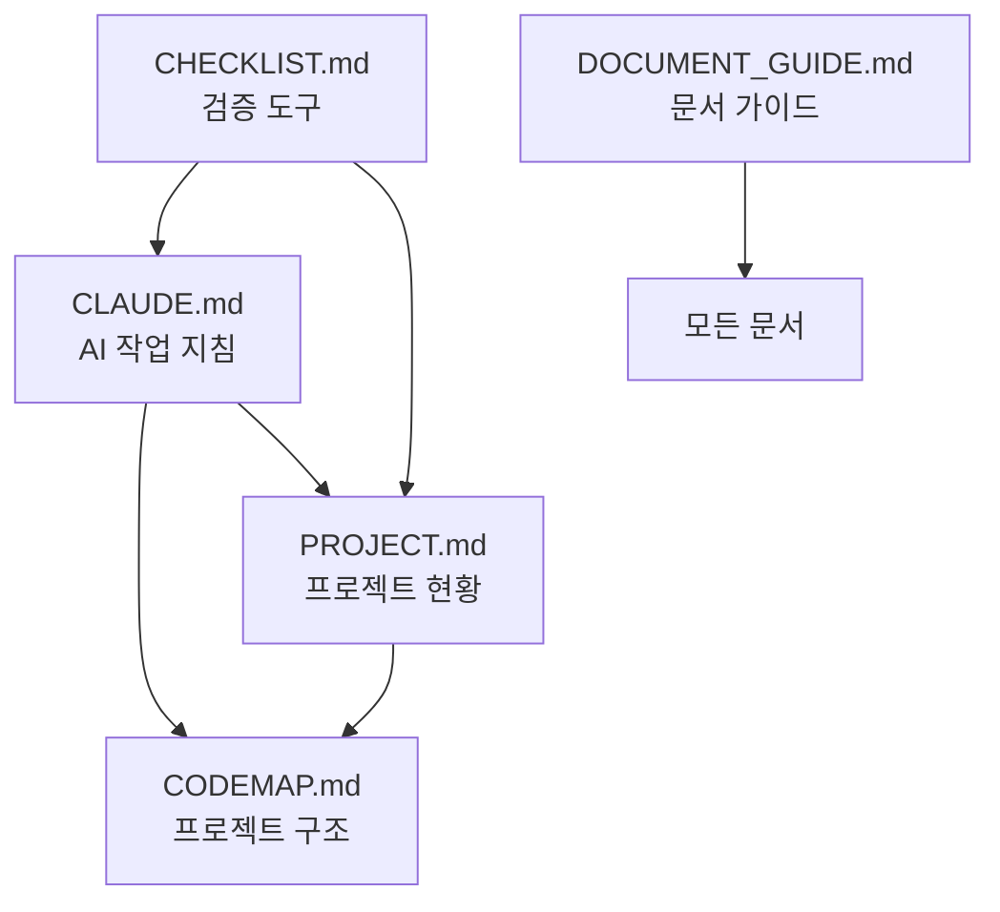

# 📖 디하클(Dhacle) 문서화 가이드라인

*목적: 프로젝트 문서 관리 체계와 작성 규칙*
*작성일: 2025-01-25*

---

## 🎯 문서 체계 개요

프로젝트 문서는 **12개의 핵심 문서**로 구성되며, 각각 명확한 역할과 목적을 가집니다.

* 문서 업데이트 시 반드시 각 문서의 용도와 역할에 맞는 내용만 업데이트 해야 합니다.

### 문서 구조도
```
프로젝트 루트
├── CLAUDE.md              # AI 작업 지침서
├── docs/
│   ├── CODEMAP.md         # 프로젝트 구조 지도
│   ├── PROJECT.md         # 프로젝트 현황판
│   ├── CHECKLIST.md       # 작업 검증 체크리스트
│   ├── DOCUMENT_GUIDE.md  # 문서화 가이드라인 (이 문서)
│   ├── INSTRUCTION_TEMPLATE.md # 지시서 생성 템플릿
│   ├── FLOWMAP.md         # 사용자 플로우맵
│   ├── WIREFRAME.md       # UI-API 연결 명세
│   ├── COMPONENT_INVENTORY.md # 컴포넌트 카탈로그
│   ├── ROUTE_SPEC.md      # 라우트 구조 명세
│   ├── STATE_FLOW.md      # 상태 관리 플로우
│   ├── DATA_MODEL.md      # 데이터 모델 명세
│   └── ERROR_BOUNDARY.md  # 에러 처리 전략
```

---

## 📋 각 문서의 역할과 용도

### 1. CODEMAP.md - "프로젝트 지도" 🗺️
**목적**: 파일과 폴더 구조의 빠른 참조
**핵심 질문**: "어디에 뭐가 있지?"
**주요 내용**:
- 프로젝트 폴더 구조
- 자주 사용하는 명령어
- 자주 수정하는 파일 Top 10
- 기술 스택과 의존성
- API 엔드포인트 목록

**업데이트 시점**:
- 새 폴더/파일 추가 시
- 주요 파일 위치 변경 시
- 새 API 엔드포인트 추가 시

### 2. PROJECT.md - "프로젝트 현황판" 📊
**목적**: 현재 상태와 진행 상황 추적
**핵심 질문**: "지금 프로젝트가 어떤 상태야?"
**주요 내용**:
- 프로젝트 현재 상태
- 최근 변경사항 (최신 7개)
- 진행 중인 이슈
- 환경 설정 현황
- Supabase 마이그레이션 상태

**업데이트 시점**:
- 주요 기능 완료 시
- 새로운 이슈 발생 시
- Phase 완료 시

### 3. CLAUDE.md - "AI 작업 지침서" 🤖
**목적**: AI가 따라야 할 규칙과 프로세스
**핵심 질문**: "AI는 어떻게 작업해야 해?"
**주요 내용**:
- 필수 행동 지침
- 절대 금지 사항
- 코드 작성 규칙
- 보안 프로토콜
- 실패 사례와 안티패턴

**업데이트 시점**:
- 새로운 작업 패턴 발견 시
- 새로운 금지사항 발생 시
- 보안 정책 변경 시

### 4. CHECKLIST.md - "작업 검증 도구" ✅
**목적**: 작업 완료 후 품질 검증
**핵심 질문**: "이거 다 확인했어?"
**주요 내용**:
- 개발 작업 체크리스트
- 보안 검증 항목
- 배포 전 확인사항
- Git 작업 규칙
- 성능 체크포인트

**업데이트 시점**:
- 새로운 검증 항목 필요 시
- 반복되는 실수 발견 시

### 5. DOCUMENT_GUIDE.md - "문서 관리 지침" 📖
**목적**: 문서 체계와 관리 규칙
**핵심 질문**: "문서를 어떻게 관리해?"
**주요 내용**:
- 각 문서의 역할
- 문서 작성 규칙
- 업데이트 지침
- 문서 간 관계

### 6. INSTRUCTION_TEMPLATE.md - "지시서 생성 템플릿" 🎯
**목적**: Claude Code에게 정확한 지시 생성
**핵심 질문**: "어떻게 지시해야 정확히 구현될까?"
**주요 내용**:
- SC 명령어 템플릿
- 3단계 지시 구조
- 작업 유형별 템플릿

**업데이트 시점**:
- 새로운 작업 패턴 발견 시
- 지시 실패 사례 발생 시

### 7. FLOWMAP.md - "사용자 플로우맵" 🔄
**목적**: 페이지 간 이동과 인증 흐름
**핵심 질문**: "사용자가 어떻게 이동하지?"
**주요 내용**:
- 인증 플로우
- 페이지 접근 권한
- 사용자 시나리오
- 에러 시 리다이렉트

**업데이트 시점**:
- 새 페이지 추가 시
- 인증 로직 변경 시

### 8. WIREFRAME.md - "UI-API 연결 명세" 🔌
**목적**: 프론트엔드-백엔드 연결 상태 추적
**핵심 질문**: "이 버튼이 어떤 API를 호출하지?"
**주요 내용**:
- 페이지별 UI 컴포넌트
- API 엔드포인트 매핑
- 구현 상태 (✅/⚠️/❌)
- 데이터 흐름

**업데이트 시점**:
- UI 컴포넌트 추가/수정 시
- API 연결 구현 시
- 상태 변경 시

### 9. COMPONENT_INVENTORY.md - "컴포넌트 카탈로그" 🧩
**목적**: 재사용 가능한 컴포넌트 목록
**핵심 질문**: "이미 만들어진 컴포넌트 있나?"
**주요 내용**:
- shadcn/ui 컴포넌트 목록
- 커스텀 컴포넌트
- Props 정의
- 사용 위치

**업데이트 시점**:
- 새 컴포넌트 생성 시
- 컴포넌트 수정 시

### 10. ROUTE_SPEC.md - "라우트 구조 명세" 📍
**목적**: 전체 라우팅 트리와 가드 정의
**핵심 질문**: "이 경로 접근 권한이 뭐지?"
**주요 내용**:
- 라우트 트리 구조
- 접근 권한 (🔓/🔒/🔐)
- 라우트 가드 구현
- 리다이렉트 규칙

**업데이트 시점**:
- 새 라우트 추가 시
- 권한 변경 시

### 11. STATE_FLOW.md - "상태 관리 플로우" 💾
**목적**: Global/Local/Server 상태 관리
**핵심 질문**: "이 데이터는 어디에 저장되지?"
**주요 내용**:
- Zustand 스토어 정의
- useState 패턴
- 서버 상태 동기화
- 캐싱 전략

**업데이트 시점**:
- 새 스토어 생성 시
- 상태 관리 로직 변경 시

### 12. DATA_MODEL.md - "데이터 모델 명세" 📦
**목적**: Frontend-Backend 타입 매핑
**핵심 질문**: "DB 스키마와 TS 타입이 일치하나?"
**주요 내용**:
- TypeScript 인터페이스
- Supabase 스키마
- 변환 함수
- snake_case ↔ camelCase

**업데이트 시점**:
- 새 테이블 생성 시
- 타입 정의 변경 시

### 13. ERROR_BOUNDARY.md - "에러 처리 전략" 🚨
**목적**: 표준화된 에러 처리
**핵심 질문**: "401 에러 시 어떻게 처리하지?"
**주요 내용**:
- HTTP 에러별 처리
- 토스트 메시지
- 리다이렉트 규칙
- 에러 복구 전략

**업데이트 시점**:
- 새 에러 타입 추가 시
- 처리 전략 변경 시

---

## 🎯 선택적 문서 업데이트 프로세스

### "방금 작업한 내용 문서화해줘" 요청 시

#### 1단계: 작업 분석
```
작업 내용 파악 → 영향 범위 확인 → 관련 문서 식별
```

#### 2단계: 문서 선택 매트릭스

| 작업 유형 | 업데이트 필수 문서 | 선택적 문서 |
|----------|------------------|------------|
| **새 컴포넌트 생성** | COMPONENT_INVENTORY | WIREFRAME (연결 시) |
| **API 엔드포인트 추가** | CODEMAP, WIREFRAME | DATA_MODEL (타입 변경 시) |
| **라우트 추가** | ROUTE_SPEC, FLOWMAP | - |
| **상태 관리 추가** | STATE_FLOW | DATA_MODEL |
| **에러 처리 개선** | ERROR_BOUNDARY | FLOWMAP (리다이렉트) |
| **보안 규칙 변경** | CLAUDE | PROJECT (현황) |
| **UI-API 연결** | WIREFRAME | COMPONENT_INVENTORY |
| **타입 정의 변경** | DATA_MODEL | - |
| **파일/폴더 구조 변경** | CODEMAP | - |
| **주요 기능 완료** | PROJECT | WIREFRAME (상태 변경) |

#### 3단계: 업데이트 실행
- 관련 문서만 선택적 업데이트
- 다른 문서는 건드리지 않음
- 참조 링크로 연결

---

## ⚠️ 문서 업데이트 시 절대 규칙

### 🔴 절대 금지사항
1. **기존 내용 무단 삭제 금지**
   - 문서 업데이트 ≠ 내용 삭제
   - 중요한 내용을 함부로 지우지 않기
   - 삭제가 필요한 경우 반드시 사용자와 협의

2. **중복 제거 시 원본 확인**
   - 중복 내용 제거 시 어느 문서가 원본인지 확인
   - 원본은 유지, 복사본만 제거
   - 참조 링크로 대체

3. **역할 경계 준수**
   - 각 문서의 목적에 맞는 내용만 추가
   - 다른 문서의 영역 침범 금지

### 🚫 문서별 절대 하지 말아야 할 것

| 문서 | 절대 금지 내용 |
|-----|---------------|
| **PROJECT.md** | ❌ 최근 변경사항 7개 초과 누적<br>❌ 완료된 이슈 계속 유지<br>❌ 코드 작성 규칙 추가 |
| **CODEMAP.md** | ❌ 구조도 중복 작성<br>❌ 전체 파일 나열<br>❌ 구현 상태 표시 |
| **CLAUDE.md** | ❌ 프로젝트 진행 상황<br>❌ 파일 구조 설명<br>❌ 임시 작업 내역 |
| **WIREFRAME.md** | ❌ 컴포넌트 구현 코드<br>❌ 라우트 권한 정의<br>❌ 상태 관리 로직 |
| **COMPONENT_INVENTORY.md** | ❌ 컴포넌트 사용 코드<br>❌ API 연결 정보<br>❌ 페이지별 구현 상태 |
| **ROUTE_SPEC.md** | ❌ UI 컴포넌트 매핑<br>❌ API 구현 세부사항<br>❌ 상태 관리 정보 |
| **STATE_FLOW.md** | ❌ 컴포넌트 구현<br>❌ API 엔드포인트<br>❌ 라우트 정의 |
| **DATA_MODEL.md** | ❌ API 라우트 코드<br>❌ UI 컴포넌트<br>❌ 비즈니스 로직 |
| **ERROR_BOUNDARY.md** | ❌ 구체적 구현 코드<br>❌ 컴포넌트 목록<br>❌ 라우트 구조 |

### ⚡ 중복 방지 규칙

1. **최근 작업 내역**
   - PROJECT.md에만 기록 (최신 7개 유지)
   - 오래된 항목은 자동 삭제
   - 다른 문서에 작업 내역 금지

2. **프로젝트 구조**
   - CODEMAP.md에 단일 구조도 유지
   - 세부 구조는 참조 링크 사용
   - 구조도 중복 작성 금지

3. **구현 상태**
   - WIREFRAME.md에만 ✅/⚠️/❌ 표시
   - 다른 문서는 참조만 표시
   - 상태 중복 추적 금지

4. **API 엔드포인트**
   - CODEMAP.md에 목록 유지
   - WIREFRAME.md에 연결 상태
   - 중복 목록 작성 금지

5. **컴포넌트 목록**
   - COMPONENT_INVENTORY.md에만 전체 목록
   - 다른 문서는 참조만
   - 컴포넌트 카탈로그 중복 금지

### 🟢 권장사항
1. **보완과 개선 중심**
   - 기존 내용을 더 명확하게 개선
   - 누락된 정보 추가
   - 오래된 정보 업데이트 (삭제 아님)

2. **참조 관계 유지**
   - 관련 문서 링크 추가
   - "자세한 내용은 X 문서 참조" 형식 사용

3. **버전 관리 의식**
   - 중요한 변경 시 날짜 기록
   - 변경 이유 간단히 명시

---

## 📝 문서 작성 규칙

### 1. 마크다운 형식
- 제목: `#` 사용 (계층 구조 준수)
- 코드: ` ``` ` 블록 사용
- 링크: 상대 경로 사용
- 표: 정렬 맞추기

### 2. 섹션 구성
```markdown
## 섹션 제목
### 소제목
- 항목 1
- 항목 2
  - 세부 항목
```

### 3. 중요도 표시
- ⭐⭐⭐⭐⭐ : 필수, 온보딩 시 반드시 확인
- ⭐⭐⭐ : 중요, 자주 참조
- ⭐ : 선택, 필요시 참조

### 4. 상태 표시
- ✅ 완료
- 🔄 진행 중
- ❌ 실패/금지
- ⚠️ 주의
- 📌 중요

---

## 🔄 문서 간 참조 관계



### 참조 예시
- CLAUDE.md → CODEMAP.md: "상세 구조는 `/docs/CODEMAP.md` 참조"
- PROJECT.md → CLAUDE.md: "AI 작업 규칙은 `/CLAUDE.md` 참조"
- 모든 문서 → CHECKLIST.md: "작업 완료 후 `/docs/CHECKLIST.md` 확인"

---

## 📊 문서 건강도 체크

### 좋은 문서의 특징
- ✅ 역할이 명확함
- ✅ 중복이 없음
- ✅ 최신 정보만 포함
- ✅ 참조 관계가 명확함
- ✅ 찾기 쉬운 구조

### 나쁜 문서의 징후
- ❌ 여러 문서에 같은 내용 반복
- ❌ 오래된 정보 방치
- ❌ 역할 경계 모호
- ❌ 과도한 분량
- ❌ 구조 없는 나열

---

## 🎯 최종 목표

1. **온보딩 효율성**: 새로운 개발자가 30분 내 프로젝트 파악
2. **정보 일관성**: 모든 문서가 같은 사실 공유
3. **유지보수성**: 쉽게 업데이트 가능한 구조
4. **접근성**: 필요한 정보를 빠르게 찾기

---

*이 가이드라인은 프로젝트 문서 품질 유지를 위한 기준입니다.*
*문서 체계 개선 제안은 언제든 환영합니다.*