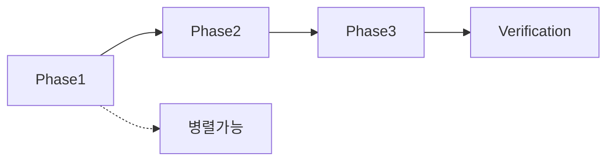

# 🔒 완전 폐쇄형 개발 지시서 템플릿 v3.0 - Claude Code 강제 실행용

**⚠️ 경고**: 이 템플릿은 Claude Code가 **절대 대충 못하도록** 모든 구멍을 막은 템플릿입니다.

---

## 🔥 프로젝트 메인 정신 (절대 변경 불가)

> **"우리의 목표는 단순히 코드를 집어넣어 겉보기에 완성된 프로젝트를 만드는 것이 아니라,**
> **실제로 안정적이게 사용이 가능한 사이트를 구현하는 것이 목표입니다."**
> 
> **단순히 타입 에러를 하나씩 순차적으로 잡아가는 것이 목표가 아니라,**
> **E2E workflow를 고려하여 문제를 하나하나 해결해가며**
> **아무런 문제 없이 사용자들이 사용할 수 있는 온전히 동작하는 사이트를 구현해야 합니다.**

---

## 📝 지시서 작성 템플릿

### 🎯 작업 개요 (큰 그림)
```markdown
/sc:[command] --[flags] --validate --evidence
"[전체 작업 요약 - 한 줄]"

# [작업 제목]

## 전체 작업 범위
- 영향 범위: [파일 X개, API Y개, 컴포넌트 Z개]
- 예상 시간: [총 N시간]
- 복잡도: [Simple/Moderate/Complex]
```

### 📂 Phase 자동 분할 (Claude가 수행 가능한 단위로)

```markdown
## 🗂️ Phase 구조 생성

### 작업 폴더 생성
tasks/
└── [YYYYMMDD]_[작업명]/
    ├── README.md           # 전체 개요
    ├── PHASE_1_[이름].md  # 30분 이하
    ├── PHASE_2_[이름].md  # 30분 이하
    ├── PHASE_3_[이름].md  # 30분 이하
    └── VERIFICATION.md     # 최종 검증

### Phase 분할 기준
- 각 Phase = Claude가 1세션에서 완료 가능한 분량
- 30분 이하 작업량
- 구체적 파일 3-5개 이하
- 의존성 최소화

### Phase 간 관계

```

---

## 📋 개별 Phase 템플릿 (각 .md 파일용)

### Phase 헤더 (필수)
```markdown
/sc:[command] --seq --validate --evidence --no-speculation
"Phase [N]: [구체적 작업] - 30분 이내 완료"

# Phase [N]/[총N]: [작업명]

⚠️ **절대 준수사항**
- [ ] 추측 금지 - 모든 것을 확인 후 진행
- [ ] 임시방편 금지 - TODO, any, 주석처리 절대 금지
- [ ] 테스트 필수 - 작동 확인 없이 완료 보고 금지
```

### 🔍 Step 1: 현재 상태 확인 (강제)
```markdown
## 📍 현재 상태 확인 (필수 실행)

### 파일 존재 확인
\`\`\`bash
# 정확한 파일 경로 확인 (추측 금지)
ls -la src/app/api/[정확한경로]/route.ts
ls -la src/components/[정확한경로]/[파일명].tsx

# 없으면 STOP - 다음 진행 금지
\`\`\`

### 현재 구현 확인
\`\`\`bash
# 실제 코드 확인 (라인 번호 포함)
cat -n src/[경로]/[파일] | sed -n '[시작줄],[끝줄]p'

# 현재 패턴 확인
grep -n "[함수명]" src/[경로]/[파일]
\`\`\`

### 의존성 확인
\`\`\`bash
# DB 테이블 확인
grep -r "from('[테이블명]')" src/ --include="*.ts"

# API 호출 확인  
grep -r "[API경로]" src/ --include="*.tsx"
\`\`\`

❌ **확인 실패 시** → 즉시 중단 및 보고
```

### 🛠️ Step 2: 구체적 수정 (라인 단위)
```markdown
## 🔧 수정 작업 (정확한 위치)

### 파일 1: [전체경로/파일명]
**라인 [N]-[M] 수정**
\`\`\`typescript
// 현재 코드 (정확히 이 코드여야 함)
[실제 코드]

// 수정 후 (정확히 이렇게 변경)
[수정된 코드]
\`\`\`

**수정 이유**: 사용자가 [버튼]을 클릭했을 때 [결과]가 나오도록

### 파일 2: [전체경로/파일명]
**라인 [X] 추가**
\`\`\`typescript
// [X]번 줄 다음에 추가
[추가할 코드]
\`\`\`

⚠️ **수정 금지 사항**
- any 타입 사용 → 타입 오류 발생 시 정확한 타입 찾기
- TODO 주석 → 완전히 구현하거나 삭제
- try-catch로 에러 숨기기 → 근본 원인 해결
```

### ✅ Step 3: 검증 (건너뛸 수 없음)
```markdown
## 🔍 검증 단계 (필수)

### 1. 컴파일 검증
\`\`\`bash
# 타입 체크 (에러 0개 필수)
npm run types:check
# 실패 시 → 수정 단계로 돌아가기

# 빌드 확인
npm run build
# 실패 시 → 에러 메시지 기록 후 수정
\`\`\`

### 2. 실제 동작 검증
\`\`\`bash
# 개발 서버 실행
npm run dev
\`\`\`

**브라우저 테스트 체크리스트**
- [ ] http://localhost:3000/[페이지] 접속
- [ ] [버튼/링크] 클릭
- [ ] Console 에러 0개 확인 (F12)
- [ ] Network 탭에서 API 응답 200/201 확인
- [ ] 실제 동작: [구체적 동작] 확인

### 3. 데이터 검증
\`\`\`bash
# DB 확인 (실제 저장 여부)
npx supabase db dump --data-only | grep "[확인할데이터]"
\`\`\`

❌ **검증 실패** → Phase 실패 보고 및 중단
✅ **검증 성공** → 다음 Phase 진행 가능
```

### 📊 Phase 완료 조건
```markdown
## ✅ Phase [N] 완료 조건

### 필수 (하나라도 실패 시 미완료)
- [ ] 컴파일 에러 0개
- [ ] 런타임 에러 0개  
- [ ] 사용자 기능 실제 작동
- [ ] Console 에러 0개
- [ ] 데이터 실제 저장/조회 확인

### 증거 수집
- 스크린샷: [기능 작동 화면]
- 로그: [API 응답 로그]
- 데이터: [DB 저장 결과]

### 다음 Phase 진행 가능 여부
- ✅ 모든 필수 조건 충족 → Phase [N+1] 진행
- ❌ 조건 미충족 → 수정 후 재검증
```

---

## 🚫 Claude Code 차단 장치 (절대 규칙)

### 금지 사항 (위반 시 작업 중단)
```markdown
## ⛔ 절대 금지 (하나라도 위반 시 STOP)

1. **추측 금지**
   - ❌ "아마 이 파일일 것이다"
   - ❌ "이 패턴을 쓸 것 같다"
   - ✅ grep/cat으로 확인 후 진행

2. **임시방편 금지**
   - ❌ // TODO: 나중에 구현
   - ❌ as any
   - ❌ // @ts-ignore
   - ✅ 완전히 해결하거나 보고

3. **검증 생략 금지**
   - ❌ "빌드 됐으니 될 거야"
   - ❌ "타입 에러 없으니 OK"
   - ✅ 브라우저에서 실제 클릭

4. **대충 넘어가기 금지**
   - ❌ 에러 나도 다음 작업
   - ❌ 일부만 되도 완료
   - ✅ 100% 작동 확인 후 진행
```

### 강제 체크포인트
```markdown
## 🔐 강제 체크포인트 (통과 필수)

### CP1: 시작 전
- [ ] 관련 파일 모두 확인 (ls, cat)
- [ ] 현재 구현 상태 파악 (grep)
- [ ] 의존성 매핑 완료

### CP2: 수정 중
- [ ] 정확한 라인 번호 명시
- [ ] any 타입 0개
- [ ] TODO 주석 0개

### CP3: 수정 후
- [ ] npm run types:check 통과
- [ ] npm run build 성공
- [ ] 브라우저 실제 테스트
- [ ] 데이터 저장 확인

**하나라도 실패 → 다음 단계 진행 불가**
```

---

## 📁 최종 산출물 구조

```markdown
## 📂 작업 완료 시 구조

tasks/
└── 20250827_[작업명]/
    ├── README.md
    │   ├── 전체 작업 개요
    │   ├── Phase 간 의존성
    │   └── 최종 검증 결과
    │
    ├── PHASE_1_[이름].md  ✅ 완료
    │   ├── 작업 내용
    │   ├── 검증 결과
    │   └── 증거 (스크린샷, 로그)
    │
    ├── PHASE_2_[이름].md  ✅ 완료
    ├── PHASE_3_[이름].md  ✅ 완료
    │
    └── VERIFICATION.md
        ├── E2E 테스트 결과
        ├── 성능 측정
        └── 사용자 시나리오 검증
```

---

## 🎯 사용 예시

### 입력: "네이버 카페 인증 기능이 안 돼"

### 출력 구조:
```
tasks/
└── 20250827_naver_cafe_auth/
    ├── README.md
    ├── PHASE_1_DB_VIEW_FIX.md      # profiles VIEW → users 테이블
    ├── PHASE_2_API_ROUTE_FIX.md    # verify-cafe route 수정
    ├── PHASE_3_UI_INTEGRATION.md   # 프론트엔드 연결
    └── VERIFICATION.md              # 전체 플로우 테스트
```

### 각 Phase:
- **Phase 1**: DB 접근 수정 (30분)
  - profiles VIEW 조회 부분 찾기
  - users 테이블로 변경
  - 테스트: API 호출 → 200 응답

- **Phase 2**: API 수정 (30분)
  - route.ts 정확한 라인 수정
  - 에러 처리 추가
  - 테스트: Postman으로 확인

- **Phase 3**: UI 연결 (30분)
  - 버튼 이벤트 핸들러 수정
  - 토스트 메시지 추가
  - 테스트: 실제 클릭 → 성공 메시지

---

## 📋 템플릿 검증 체크리스트

- [ ] /sc 명령어가 최상단에 있는가?
- [ ] Phase가 30분 단위로 분할되었는가?
- [ ] 각 Phase가 독립 실행 가능한가?
- [ ] 강제 체크포인트가 있는가?
- [ ] 추측 여지가 완전히 차단되었는가?
- [ ] 실제 파일 경로가 명시되었는가?
- [ ] 검증 방법이 구체적인가?
- [ ] Claude Code가 대충할 구멍이 없는가?

---

*이 템플릿은 Claude Code가 **절대 대충 못하고** 실제로 작동하는 코드만 만들도록 강제합니다.*