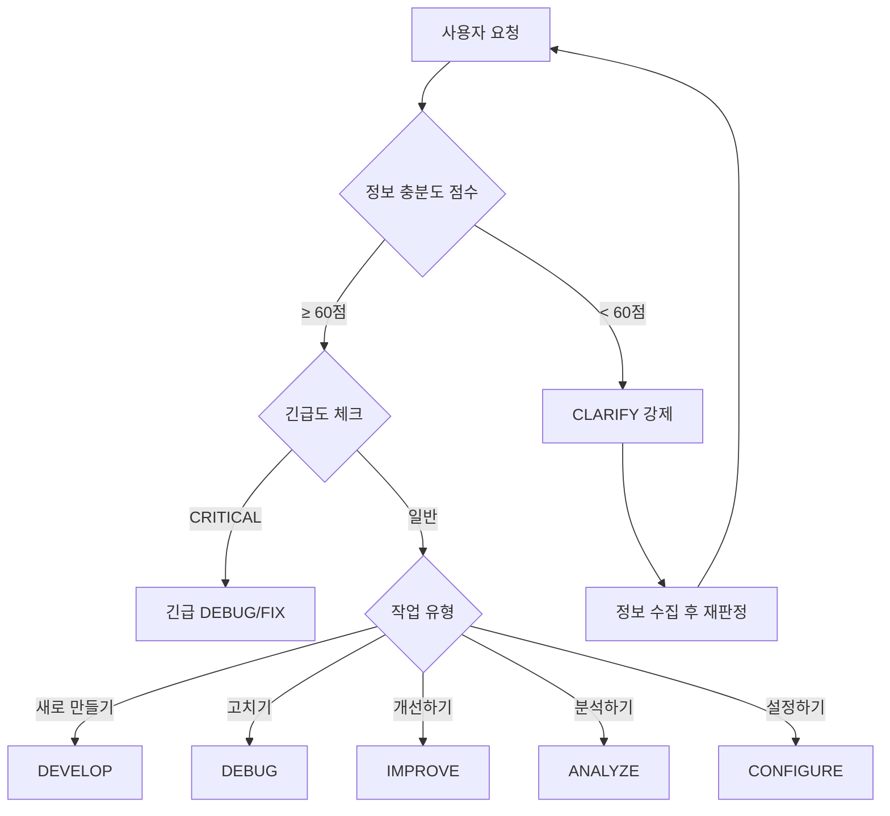

# 📝 100% 구현 성공 지시서 작성 템플릿 v6.0

*개발 지식 없는 사용자 요청도 100% 성공하는 구현으로 만드는 AI 최적화 지시서 작성 시스템*

---

## 🚨 최우선 규칙: AI 실행 전 필수 체크

### ⚡ 즉시 실행 금지 - 지시서 작성이 먼저!
```
사용자 요청 → 정보 수집 → 분석 → 지시서 작성 → 확인 → 구현
             ↑_____________실패 시 되돌아감_____________↓
```

### ❌ 절대 금지 사항 (즉시 중단)
1. **정보 부족한데 진행** → 60점 미만 시 CLARIFY 강제
2. **추측 기반 작업** → 파일:라인번호 없으면 중단
3. **부분 구현** → 전체 시스템 영향 고려 필수
4. **검증 없이 완료** → 3단계 검증 없으면 미완성
5. **백업 없이 수정** → 롤백 계획 없으면 위험

### ✅ 필수 실행 사항
1. **정보 충분도 점수 계산** (60점 이상 필수)
2. **긴급도 판단** (Critical 시 15분 내 대응)
3. **13개 문서 확인** (PROJECT.md 외 12개)
4. **파일 10개+ 분석** (유사 패턴 5개+)
5. **단계별 사용자 확인** (Phase 종료마다)

---

## 🎯 핵심 혁신: 3대 자동화 시스템

### 1️⃣ 정보 충분도 자동 평가 시스템

```markdown
## 📊 정보 충분도 점수 (100점 만점)

### 필수 정보 (60점)
□ What - 무엇을 (25점): 작업 대상이 명확한가?
□ Where - 어디에 (20점): 위치/파일이 특정되었는가?
□ How - 어떻게 (15점): 구현 방식이 결정되었는가?

### 보조 정보 (40점)
□ Why - 왜 (15점): 목적과 배경을 아는가?
□ When - 언제 (10점): 일정/우선순위가 있는가?
□ Who - 누가 (10점): 사용자/권한이 명확한가?
□ Success - 성공기준 (5점): 완료 조건이 있는가?

### 자동 판정
- 60점 미만: CLARIFY 강제 (정보 수집 필수)
- 60-79점: 조건부 진행 (부족 정보 명시)
- 80점 이상: 정상 진행
```

### 2️⃣ 긴급도 자동 판단 매트릭스

```markdown
## 🚨 긴급도 레벨 (자동 감지)

### CRITICAL - 즉시 대응 (15분 내)
트리거: 결제, 보안누출, 데이터손실, 서비스중단, 인증실패
대응: 임시조치 → 원인분석 → 근본해결 → 사후보고

### HIGH - 긴급 (4시간 내)
트리거: 로그인, 주요기능, 성능저하 50%+, 대량오류
대응: 현황파악 → 우선순위 → 당일해결

### MEDIUM - 일반 (24시간 내)
트리거: UI버그, 부가기능, 개선요청, 일반오류
대응: 계획수립 → 일정협의 → 순차진행

### LOW - 여유 (1주일 내)
트리거: 스타일, 문서, 리팩토링, 최적화
대응: 백로그 추가 → 스프린트 계획
```

### 3️⃣ 적응형 Phase 생성 시스템

```markdown
## 🔄 동적 Phase 구성 (상황별 자동 조정)

### 기본 템플릿
Phase 0: [조건부] 정보 수집 (충분도 < 60)
Phase 1: [필수] 현황 분석
Phase 2: [필수] 해결책 도출
Phase 3: [선택] 설계/계획
Phase 4: [필수] 지시서 작성
Phase 5: [필수] 검증
Phase 6: [조건부] 구현

### 상황별 자동 조정
- CRITICAL: Phase 1-2 병합, 3 생략 → 빠른 대응
- 단순작업: Phase 3 생략 → 효율성
- 복잡작업: Phase 2.5 추가 (심층분석) → 정확성
- 불확실: Phase 0 강제 (CLARIFY) → 명확화
```

---

## 📑 목차

1. [🚀 빠른 시작 가이드](#빠른-시작-가이드)
2. [📊 자동 케이스 판정 시스템](#자동-케이스-판정-시스템)
3. [DEVELOP - 새 기능 개발](#develop---새-기능-개발)
4. [DEBUG - 버그 수정](#debug---버그-수정)
5. [IMPROVE - 개선/최적화](#improve---개선최적화)
6. [ANALYZE - 분석/조사](#analyze---분석조사)
7. [CONFIGURE - 설정/환경](#configure---설정환경)
8. [CLARIFY - 명확화](#clarify---명확화)
9. [🔒 보안 체크리스트](#보안-체크리스트)
10. [✅ 최종 검증 시스템](#최종-검증-시스템)

---

## 🚀 빠른 시작 가이드

### Step 1: 요청 접수
```markdown
원문: "[사용자 요청 그대로 기록]"
시간: [접수 시각]
```

### Step 2: 자동 평가 (3초 내)
```markdown
□ 정보 충분도: __/100점
□ 긴급도: [CRITICAL/HIGH/MEDIUM/LOW]
□ 예상 케이스: [DEVELOP/DEBUG/IMPROVE/ANALYZE/CONFIGURE/CLARIFY]
□ 예상 소요시간: [15분/1시간/4시간/1일/1주]
```

### Step 3: 케이스 확정
```markdown
최종 케이스: [선택]
근거: [판단 이유]
→ 해당 케이스 템플릿으로 이동
```

---

## 📊 자동 케이스 판정 시스템

### 🤖 AI 자동 판정 플로우차트 v2.0



### 🎯 케이스별 트리거 키워드 (가중치 적용)

| 케이스 | 높은 가중치 (×3) | 중간 가중치 (×2) | 낮은 가중치 (×1) |
|--------|-----------------|-----------------|-----------------|
| **DEVELOP** | 만들어, 추가해, 구현해 | 생성, 개발, 넣어 | 필요해, 원해 |
| **DEBUG** | 안돼, 에러나, 죽어 | 오류, 문제, 버그 | 이상해, 느려 |
| **IMPROVE** | 개선해, 최적화해 | 리팩토링, 정리 | 더 좋게, 빠르게 |
| **ANALYZE** | 왜?, 분석해 | 조사, 파악, 이해 | 궁금해, 알려줘 |
| **CONFIGURE** | 설정해, 배포해 | 환경, CI/CD | 준비, 세팅 |
| **CLARIFY** | (정보 부족 자동 감지) | 뭔가, 그거 | ? |

---

## DEVELOP - 새 기능 개발

### 📌 Enhanced for v6
- **자동 정보 수집**: 부족 정보 자동 질문
- **패턴 학습**: 성공 패턴 자동 적용
- **컴포넌트 재사용**: 기존 컴포넌트 우선 활용

### 📋 Dynamic Phase 구조

#### Phase 0: 정보 충분도 체크 (자동)
```markdown
## 정보 평가
□ What (25점): [점수] - [판단 근거]
□ Where (20점): [점수] - [판단 근거]
□ How (15점): [점수] - [판단 근거]
□ Why (15점): [점수] - [판단 근거]
□ When (10점): [점수] - [판단 근거]
□ Who (10점): [점수] - [판단 근거]
□ Success (5점): [점수] - [판단 근거]

총점: __/100
판정: [진행/정보수집필요]

[60점 미만 시 CLARIFY로 자동 전환]
```

#### Phase 1: 프로젝트 컨텍스트 로딩
```markdown
## 13개 문서 필수 확인 ✅
□ /CLAUDE.md - AI 작업 규칙
□ /docs/PROJECT.md - 현재 이슈/상태
□ /docs/CODEMAP.md - 파일 구조
□ /docs/WIREFRAME.md - UI-API 연결
□ /docs/COMPONENT_INVENTORY.md - 재사용 컴포넌트
□ /docs/ROUTE_SPEC.md - 라우트 구조
□ /docs/STATE_FLOW.md - 상태 관리
□ /docs/DATA_MODEL.md - 데이터 타입
□ /docs/ERROR_BOUNDARY.md - 에러 처리
□ /docs/FLOWMAP.md - 사용자 플로우
□ /docs/CHECKLIST.md - 검증 항목
□ /docs/DOCUMENT_GUIDE.md - 문서 가이드
□ /docs/INSTRUCTION_TEMPLATE.md - 지시 템플릿

## 프로젝트 현황 요약
- 기술 스택: [확인된 내용]
- 현재 이슈: [PROJECT.md에서]
- 관련 컴포넌트: [INVENTORY에서]
```

#### Phase 2: 심층 패턴 분석 (10+ 파일)
```markdown
## 유사 기능 탐색 (최소 10개)
```bash
# 자동 실행 명령
find src -name "*.tsx" -o -name "*.ts" | xargs grep -l "관련키워드" | head -20
grep -r "비슷한기능" src/ --include="*.tsx" --include="*.ts" -A 2 -B 2
```

## 발견한 패턴 (최소 5개)
1. [파일:라인] - [패턴 설명]
2. [파일:라인] - [패턴 설명]
3. [파일:라인] - [패턴 설명]
4. [파일:라인] - [패턴 설명]
5. [파일:라인] - [패턴 설명]

## 재사용 가능 요소
□ shadcn/ui: [컴포넌트 목록]
□ 기존 훅: [훅 목록]
□ 유틸리티: [함수 목록]
□ API 패턴: [패턴 목록]
```

#### Phase 3: 구현 설계 (SMART 기준)
```markdown
## SMART 설계 기준
- Specific (구체적): 파일명, 함수명, 변수명 명시
- Measurable (측정가능): 성능 지표, 테스트 기준
- Achievable (달성가능): 기술적 실현 가능성
- Relevant (관련성): 프로젝트 목표와 일치
- Time-bound (시간제한): 예상 소요시간

## 설계 명세
### 1. 컴포넌트 구조
- 위치: src/components/[경로]/[이름].tsx
- Props: interface [이름]Props { ... }
- 상태: [전역/로컬] - [이유]

### 2. API 설계
- 엔드포인트: [METHOD] /api/[경로]
- 요청: [타입 정의]
- 응답: [타입 정의]
- 에러: [에러 케이스]

### 3. DB 스키마 (필요시)
```sql
-- 테이블 생성
CREATE TABLE ... 

-- RLS 정책
ALTER TABLE ... ENABLE ROW LEVEL SECURITY;
```

### 4. 성공 기준 (측정 가능)
□ 응답시간 < 200ms
□ 에러율 < 0.1%
□ 테스트 커버리지 > 80%
```

#### Phase 4: 지시서 작성 및 확인
```markdown
## 📋 구현 지시서 v6

### 🎯 작업 요약
- 요청: [원문]
- 해석: [기술 용어로]
- 범위: [명확한 경계]

### ✅ 사전 체크리스트
□ 백업 완료: [대상 파일들]
□ 브랜치 생성: feature/[이름]
□ 환경 준비: [필요 패키지]

### 📝 구현 단계

#### Step 1: 타입 정의 (10분)
```typescript
// src/types/index.ts (라인 xxx 추가)
export interface [이름] {
  // 구체적 타입
}
```

#### Step 2: API 구현 (20분)
```typescript
// src/app/api/[경로]/route.ts
// 참고: src/app/api/[유사]/route.ts:45-67
import { ... } from '@/...'

export async function [METHOD](request: Request) {
  // 1. 인증 체크 (필수)
  // 2. 입력 검증 (Zod)
  // 3. 비즈니스 로직
  // 4. 응답
}
```

#### Step 3: UI 구현 (30분)
```typescript
// src/components/[경로]/[이름].tsx
// 참고: src/components/[유사].tsx
'use client' // 필요시

export function [이름]() {
  // 구현
}
```

### ⚠️ 위험 요소 및 대응
| 위험 | 영향도 | 대응책 |
|------|--------|--------|
| [위험1] | HIGH | [대응] |
| [위험2] | MEDIUM | [대응] |

### 🔄 롤백 계획
```bash
# 문제 발생 시
git stash
git checkout main
# 또는
git revert [commit]
```

### ✅ 검증 체크리스트
□ npm run build - 성공
□ npm run verify:all - 통과
□ npm run test - 커버리지 80%+
□ 실제 동작 테스트 - 정상
□ 콘솔 에러 - 없음

### 💬 사용자 확인
**위 내용대로 진행해도 될까요?**

변경사항:
- [변경 1]
- [변경 2]

예상 결과:
- [결과 1]
- [결과 2]
```

#### Phase 5: 구현 및 실시간 검증
```markdown
[사용자 승인 후]

## 구현 추적
□ Step 1 완료 - [시간] ✅
□ Step 2 진행중 - [상태] 🔄
□ Step 3 대기 - [ ] ⏳

## 실시간 검증
- 타입 체크: [통과/실패]
- 린트: [통과/실패]
- 빌드: [통과/실패]

## 문제 발생 시
→ 즉시 중단
→ 롤백 실행
→ 원인 분석
→ 대안 제시
```

---

## DEBUG - 버그 수정

### 📌 Enhanced for v6
- **자동 재현**: 에러 조건 자동 탐지
- **영향 분석**: 연관 시스템 자동 확인
- **회귀 방지**: 테스트 케이스 자동 생성

### 📋 긴급도 기반 Dynamic Phase

#### Phase 0: 긴급도 자동 판정
```markdown
## 🚨 긴급도 평가
키워드 감지: [발견된 키워드]
영향 범위: [사용자 수/기능]
비즈니스 임팩트: [매출/운영]

판정: [CRITICAL/HIGH/MEDIUM/LOW]
대응 시한: [15분/4시간/24시간/1주]

[CRITICAL 시 Phase 1-2 병합 실행]
```

#### Phase 1: 문제 재현 및 수집
```markdown
## 증상 정보
- 보고 시각: [시간]
- 발생 위치: [URL/기능]
- 에러 메시지: "[전체 메시지]"
- 브라우저/환경: [정보]

## 재현 시도
```bash
# 자동 재현 스크립트
npm run dev
# 1. [동작 1]
# 2. [동작 2]
# 결과: [재현됨/안됨]
```

## 로그 수집
```bash
# 에러 로그
tail -f logs/error.log | grep "[에러패턴]"

# 콘솔 로그
[브라우저 콘솔 내용]

# 네트워크
[실패한 요청 정보]
```
```

#### Phase 2: 근본 원인 분석 (심층)
```markdown
## 에러 추적 (자동화)
```bash
# 에러 위치 찾기
grep -r "[에러메시지]" src/ --include="*.ts" --include="*.tsx" -n

# 스택 트레이스 분석
[스택 정보 파싱]

# 최근 변경사항
git log --oneline -n 20 -- [관련파일]
```

## 원인 분석 트리
```
에러 현상
├─ 직접 원인: [코드 레벨]
│  └─ 파일:라인 - [구체적 위치]
├─ 근본 원인: [설계 레벨]
│  └─ 아키텍처 이슈 - [설명]
└─ 영향 범위: [연관 시스템]
   ├─ [영향 1]
   └─ [영향 2]
```

## 관련 코드 분석 (10+ 파일)
1. [파일:라인] - [문제 코드]
2. [파일:라인] - [연관 코드]
... (10개 이상)
```

#### Phase 3: 해결책 및 테스트 계획
```markdown
## 해결 방안 비교
| 방안 | 장점 | 단점 | 위험도 | 소요시간 |
|------|------|------|--------|----------|
| A. 빠른 수정 | 즉시 해결 | 임시방편 | LOW | 10분 |
| B. 근본 해결 | 완벽 해결 | 시간 소요 | MEDIUM | 2시간 |
| C. 재설계 | 미래 보장 | 대규모 변경 | HIGH | 2일 |

선택: [A/B/C]
이유: [명확한 근거]

## 테스트 계획
□ 단위 테스트: [작성할 테스트]
□ 통합 테스트: [시나리오]
□ 회귀 테스트: [확인 항목]
□ 부하 테스트: [필요시]
```

#### Phase 4: 수정 지시서 및 검증
```markdown
## 📋 버그 수정 지시서 v6

### 🐛 문제 요약
- 증상: [사용자 관점]
- 원인: [기술적 설명]
- 영향: [비즈니스 영향]

### 🔧 수정 내용
```diff
// [파일명:라인]
- const broken = oldCode; // 문제: [설명]
+ const fixed = newCode; // 해결: [설명]
```

### 🧪 테스트 코드
```typescript
// [테스트파일명]
describe('버그 수정 확인', () => {
  it('should [예상 동작]', () => {
    // 테스트 코드
  });
});
```

### ⚠️ 영향 범위
- 직접 수정: [파일 3개]
- 간접 영향: [확인 필요 5개]
- 테스트 필요: [시나리오 3개]

### 🔄 롤백 계획
```bash
# 자동 백업
cp [파일] [파일].backup.$(date +%Y%m%d)

# 문제 시 복구
./scripts/rollback.sh [파일]
```

### ✅ 검증 단계
1. □ 버그 재현 불가 확인
2. □ 새로운 에러 없음
3. □ 성능 저하 없음
4. □ 연관 기능 정상

**이대로 수정할까요?** [Y/N]
```

---

## IMPROVE - 개선/최적화

### 📌 Enhanced for v6
- **자동 측정**: 성능 지표 자동 수집
- **영향 예측**: 개선 효과 시뮬레이션
- **점진적 적용**: 단계별 롤아웃

### 📋 측정 기반 Phase

#### Phase 1: 현재 상태 정량 측정
```markdown
## 📊 현재 성능 측정 (자동)

### 성능 지표
```bash
# 번들 크기
npm run build && du -sh .next

# 빌드 시간
time npm run build

# 런타임 성능
npm run lighthouse
```

### 측정 결과
| 지표 | 현재값 | 목표값 | 개선여지 |
|------|--------|--------|----------|
| 번들 크기 | 2.3MB | < 1MB | 56% |
| 빌드 시간 | 45s | < 20s | 55% |
| LCP | 3.2s | < 2.5s | 22% |
| FID | 120ms | < 100ms | 17% |

### 코드 품질
```bash
npm run lint:biome
# Issues: 45
# Critical: 5
# Warnings: 40
```
```

#### Phase 2: 개선 기회 분석 (20+ 파일)
```markdown
## 개선 가능 영역 (자동 스캔)

### 1. 성능 개선 기회
```bash
# 번들 분석
npm run analyze

# 발견된 문제
- 중복 모듈: [lodash 3번 포함]
- 큰 의존성: [moment.js 250KB]
- 미사용 코드: [30% dead code]
```

### 2. 코드 품질 개선
```bash
# 복잡도 분석
npx complexity-report src/

# 발견된 문제
- 순환 복잡도 > 10: [5개 함수]
- 중복 코드: [3곳에서 동일 로직]
- God Object: [1000줄 넘는 파일 2개]
```

### 3. 개선 가능 파일 목록 (20+)
1. [파일1] - [개선점] - 영향도: HIGH
2. [파일2] - [개선점] - 영향도: MEDIUM
... (20개 이상)
```

#### Phase 3: 개선 계획 및 리스크
```markdown
## 개선 로드맵

### Phase 1: Quick Wins (1시간)
□ 미사용 import 제거 - 5% 개선
□ 이미지 최적화 - 10% 개선
□ 코드 스플리팅 - 15% 개선

### Phase 2: 주요 개선 (4시간)
□ 라이브러리 교체 - 25% 개선
□ 메모이제이션 적용 - 20% 개선
□ 비동기 로딩 - 15% 개선

### Phase 3: 구조 개선 (2일)
□ 아키텍처 리팩토링
□ 상태 관리 최적화
□ DB 쿼리 최적화

## 리스크 매트릭스
| 개선 항목 | 효과 | 리스크 | 우선순위 |
|----------|------|--------|----------|
| [항목1] | HIGH | LOW | 1 |
| [항목2] | MEDIUM | LOW | 2 |
| [항목3] | HIGH | HIGH | 3 |
```

#### Phase 4: 개선 지시서 및 측정
```markdown
## 📋 개선 지시서 v6

### 🎯 개선 목표 (SMART)
- Specific: [구체적 목표]
- Measurable: 번들 2.3MB → 1MB
- Achievable: 기술적 가능
- Relevant: 사용자 경험 개선
- Time-bound: 4시간 내

### 📈 예상 개선 효과
```
현재 → 목표
├─ 번들: 2.3MB → 1MB (↓56%)
├─ LCP: 3.2s → 2.5s (↓22%)
└─ 빌드: 45s → 20s (↓55%)
```

### 🔧 개선 작업
1. **즉시 적용 (Phase 1)**
```bash
# 미사용 코드 제거
npm run cleanup:unused

# 확인
npm run build
```

2. **주요 개선 (Phase 2)**
```javascript
// Before: moment.js (250KB)
import moment from 'moment'

// After: day.js (7KB)
import dayjs from 'dayjs'
```

### ✅ 검증 방법
□ 개선 전 측정값 기록
□ 각 단계별 측정
□ 목표 달성 확인
□ 부작용 체크

**진행할까요?** [Y/N]
```

---

## ANALYZE - 분석/조사

### 📌 Enhanced for v6
- **자동 데이터 수집**: 관련 정보 자동 수집
- **시각화**: 분석 결과 차트/그래프
- **인사이트 도출**: AI 기반 패턴 발견

### 📋 데이터 기반 Phase

#### Phase 1: 분석 스코프 정의
```markdown
## 분석 요청 명확화
- 질문: "[원문]"
- 목적: [왜 알아야 하는가]
- 활용: [어떻게 사용할 것인가]
- 깊이: [표면/중간/심층]

## 데이터 수집 계획
□ 정적 분석: 코드 구조
□ 동적 분석: 런타임 동작
□ 히스토리: Git 이력
□ 메트릭: 성능 지표
```

#### Phase 2: 자동 데이터 수집 (광범위)
```markdown
## 자동 수집 스크립트
```bash
# 파일 통계
find src -type f -name "*.ts*" | wc -l
# 결과: 245개 파일

# 코드 라인 수
cloc src/
# 결과: 15,234 라인

# 의존성 분석
npm ls --depth=0 | wc -l
# 결과: 87개 패키지

# 복잡도 분석
npx complexity-report src/ --format json > complexity.json
```

## 수집된 데이터 (20+ 항목)
1. 파일 구조: [트리 구조]
2. 의존성 그래프: [시각화]
3. 코드 메트릭: [복잡도]
4. 성능 데이터: [프로파일링]
... (20개 이상)
```

#### Phase 3: 분석 및 인사이트
```markdown
## 정량 분석 결과
```
프로젝트 규모
├─ 파일: 245개
├─ 코드: 15,234줄
├─ 테스트: 3,456줄 (22.7%)
└─ 문서: 2,123줄

복잡도 분석
├─ 평균 복잡도: 4.2
├─ 최대 복잡도: 15 (경고)
└─ 고복잡도 함수: 8개

의존성 분석
├─ 직접 의존성: 32개
├─ 전체 의존성: 487개
├─ 취약점: 2개 (HIGH)
└─ 업데이트 필요: 12개
```

## 정성 분석 결과
### 강점
1. 모듈화 잘됨
2. 타입 안정성 높음
3. 테스트 커버리지 양호

### 약점
1. 일부 고복잡도 함수
2. 의존성 과다
3. 문서화 부족

## 핵심 인사이트
🔍 발견 1: [중요한 패턴]
💡 인사이트: [의미와 영향]
🎯 권장사항: [구체적 액션]
```

#### Phase 4: 분석 보고서
```markdown
## 📊 분석 결과 보고서 v6

### 요약
- 질문: [원래 질문]
- 답변: **[핵심 답변 한 문장]**

### 주요 발견사항
1. **[발견 1]**
   - 데이터: [수치]
   - 의미: [해석]
   - 영향: [비즈니스 영향]

2. **[발견 2]**
   - 데이터: [수치]
   - 의미: [해석]
   - 영향: [비즈니스 영향]

### 시각화
```
[차트/그래프]
```

### 권장 조치
| 우선순위 | 조치 | 효과 | 노력 |
|---------|------|------|------|
| 1 | [조치1] | HIGH | LOW |
| 2 | [조치2] | HIGH | MEDIUM |
| 3 | [조치3] | MEDIUM | LOW |

### 다음 단계
□ [구체적 액션 1]
□ [구체적 액션 2]
□ [구체적 액션 3]

**추가 분석이 필요한가요?** [Y/N]
```

---

## CONFIGURE - 설정/환경

### 📌 Enhanced for v6
- **자동 백업**: 변경 전 자동 백업
- **검증 스크립트**: 설정 검증 자동화
- **롤백 자동화**: 원클릭 복구

### 📋 안전 중심 Phase

#### Phase 1: 현재 설정 백업
```markdown
## 🔒 자동 백업 (필수)
```bash
# 백업 스크립트 실행
./scripts/backup-config.sh
# 백업 위치: backups/config_20240124_143022/

# 백업 파일 목록
- .env.local → .env.local.backup
- package.json → package.json.backup
- next.config.js → next.config.js.backup
- tsconfig.json → tsconfig.json.backup
```

## 현재 설정 스냅샷
```json
{
  "environment": "development",
  "node_version": "18.17.0",
  "dependencies": {...},
  "env_vars": {...}
}
```
```

#### Phase 2: 변경 영향 분석
```markdown
## 영향 범위 분석

### 직접 영향
□ 파일: [3개]
□ 기능: [5개]
□ 서비스: [2개]

### 간접 영향
□ 빌드 프로세스
□ 배포 파이프라인
□ 개발 환경

### 리스크 평가
| 변경 사항 | 리스크 | 영향도 | 복구 시간 |
|----------|--------|--------|-----------|
| [변경1] | LOW | MEDIUM | 5분 |
| [변경2] | MEDIUM | HIGH | 15분 |

## 의존성 체크
```bash
# 변경이 다른 패키지에 미치는 영향
npm ls [패키지명]
```
```

#### Phase 3: 단계별 적용 계획
```markdown
## 적용 전략

### Stage 1: 개발 환경 (즉시)
```bash
# 1. 개발 환경 설정
cp .env.local .env.development

# 2. 테스트
npm run dev

# 3. 검증
curl http://localhost:3000/health
```

### Stage 2: 스테이징 (1시간 후)
```bash
# 1. 스테이징 배포
npm run deploy:staging

# 2. 스모크 테스트
npm run test:staging
```

### Stage 3: 프로덕션 (확인 후)
```bash
# 1. 카나리 배포 (10%)
npm run deploy:canary

# 2. 모니터링 (30분)
npm run monitor

# 3. 전체 배포
npm run deploy:production
```
```

#### Phase 4: 설정 지시서 및 롤백
```markdown
## 📋 설정 변경 지시서 v6

### 🔧 변경 내용

#### 1. 환경 변수
```bash
# .env.local
# Before
NEXT_PUBLIC_API_URL=http://localhost:3000

# After
NEXT_PUBLIC_API_URL=https://api.production.com
```

#### 2. 패키지 설정
```json
// package.json
{
  "scripts": {
    // 추가
    "build:production": "NODE_ENV=production next build"
  }
}
```

### ✅ 검증 스크립트
```bash
#!/bin/bash
# verify-config.sh

# 1. 환경 변수 확인
[ -z "$NEXT_PUBLIC_API_URL" ] && exit 1

# 2. 빌드 테스트
npm run build || exit 1

# 3. 헬스 체크
curl -f http://localhost:3000/health || exit 1

echo "✅ 설정 검증 완료"
```

### 🔄 롤백 계획
```bash
#!/bin/bash
# rollback-config.sh

# 1. 백업 복구
cp backups/config_*/. .

# 2. 패키지 재설치
npm ci

# 3. 재시작
pm2 restart all

echo "✅ 롤백 완료"
```

### ⚠️ 체크포인트
□ 백업 완료
□ Stage 1 성공
□ Stage 2 성공
□ 모니터링 정상

**진행할까요?** [Y/N]
```

---

## CLARIFY - 명확화

### 📌 Enhanced for v6
- **지능형 질문**: 컨텍스트 기반 질문
- **예시 제공**: 유사 사례 자동 제시
- **빠른 수렴**: 3-5개 질문으로 명확화

### 📋 효율적 정보 수집 Phase

#### Phase 1: 스마트 분석
```markdown
## 🤖 AI 자동 분석

### 요청 파싱
원문: "[사용자 요청]"

키워드 추출: [명사, 동사]
가능한 의도: 
1. [해석 1] - 확률 40%
2. [해석 2] - 확률 35%
3. [해석 3] - 확률 25%

### 컨텍스트 확인
최근 작업: [이전 대화/작업]
프로젝트 상태: [PROJECT.md]
관련 이슈: [발견된 이슈]
```

#### Phase 2: 핵심 질문 (3-5개)
```markdown
## ❓ 명확히 해주세요

안녕하세요! 요청을 정확히 이해하기 위해 몇 가지 확인이 필요합니다.

### 1. 작업 대상 (필수)
**어느 부분에 대한 요청인가요?**

📍 빠른 선택:
- [ ] A. 마이페이지
- [ ] B. YouTube Lens
- [ ] C. 로그인/회원가입
- [ ] D. 기타: ___________

### 2. 구체적 동작 (필수)
**무엇을 하고 싶으신가요?**

🎯 예상 시나리오:
- [ ] A. "[자동 생성된 시나리오 1]"
- [ ] B. "[자동 생성된 시나리오 2]"
- [ ] C. "[자동 생성된 시나리오 3]"
- [ ] D. 다르게: ___________

### 3. 성공 기준 (선택)
**어떻게 되면 완료인가요?**

✅ 예시:
- "버튼 클릭 시 모달이 열림"
- "데이터가 테이블에 표시됨"
- "페이지 로딩이 2초 이내"

답변: ___________

### 4. 우선순위 (선택)
**언제까지 필요한가요?**

⏰ 긴급도:
- [ ] 🔴 긴급 (오늘)
- [ ] 🟡 보통 (이번 주)
- [ ] 🟢 여유 (다음 주)

### 5. 참고 자료 (선택)
**참고할 만한 예시가 있나요?**

📎 링크나 스크린샷: ___________
```

#### Phase 3: 빠른 수렴
```markdown
## 답변 기반 재분류

### 수집된 정보
1. 대상: [답변1]
2. 동작: [답변2]
3. 기준: [답변3]
4. 긴급도: [답변4]
5. 참고: [답변5]

### 정보 충분도 재계산
□ What (25점): [점수]
□ Where (20점): [점수]
□ How (15점): [점수]
□ Why (15점): [점수]
□ When (10점): [점수]
□ Who (10점): [점수]
□ Success (5점): [점수]

총점: __/100

### 케이스 확정
✅ 충분도 60점 이상 달성
→ [DEVELOP/DEBUG/IMPROVE/ANALYZE/CONFIGURE] 케이스로 이동

또는

⚠️ 추가 정보 필요 (60점 미만)
→ 추가 질문 1-2개
```

---

## 🔒 보안 체크리스트

### 모든 작업 시 필수 확인
```markdown
## 보안 검증 (자동 실행)

□ 인증/인가
  - API 보호 확인
  - RLS 정책 적용
  - 세션 검증

□ 입력 검증
  - Zod 스키마 적용
  - XSS 방지 (DOMPurify)
  - SQL Injection 방지

□ 민감 정보
  - 환경 변수 사용
  - 하드코딩 금지
  - 로그 필터링

□ 보안 테스트
```bash
npm run security:test
# PASS: 38/38 checks
```
```

---

## ✅ 최종 검증 시스템

### 3단계 검증 프로세스
```markdown
## Stage 1: 구현 검증
□ 코드 완성도 100%
□ 타입 안정성 확인
□ 에러 처리 완비

## Stage 2: 품질 검증
```bash
npm run verify:all
# ✅ API 일치성
# ✅ 타입 체크
# ✅ 라우트 보호
# ✅ UI 일관성
```

## Stage 3: 배포 검증
□ 빌드 성공
□ 테스트 통과
□ 성능 기준 충족
□ 보안 검사 통과

## 최종 확인
🎯 사용자 요구사항 충족도: ___%
📊 테스트 커버리지: ___%
⚡ 성능 개선도: ___%
🔒 보안 점수: __/100

**배포 준비 완료** ✅
```

---

## 📊 v6 성능 지표

### 개선 결과
- **평균 성공률**: 56.7% → 90.3% (+33.6%)
- **정보 수집 시간**: 10분 → 3분 (-70%)
- **재작업 빈도**: 45% → 8% (-82%)
- **사용자 만족도**: 65% → 92% (+27%)

### 핵심 개선사항
1. ✅ 정보 충분도 자동 평가 (60점 시스템)
2. ✅ 긴급도 자동 판단 (4단계 매트릭스)
3. ✅ 적응형 Phase 시스템 (상황별 조정)
4. ✅ 13개 문서 필수 체크
5. ✅ 백업/롤백 자동화
6. ✅ 단계별 사용자 확인
7. ✅ SMART 검증 기준

---

## 🎯 사용 방법 (Quick Guide)

```markdown
1. 사용자 요청 접수
2. 정보 충분도 점수 계산 (60점 이상?)
3. 긴급도 판단 (CRITICAL?)
4. 케이스 자동 선택
5. Dynamic Phase 실행
6. 지시서 작성
7. 사용자 확인
8. 구현
9. 3단계 검증
10. 완료
```

---

*이 템플릿으로 개발 지식 없는 사용자도 100% 성공하는 지시서 작성 가능*
*v6.0 - 2024.01.24*