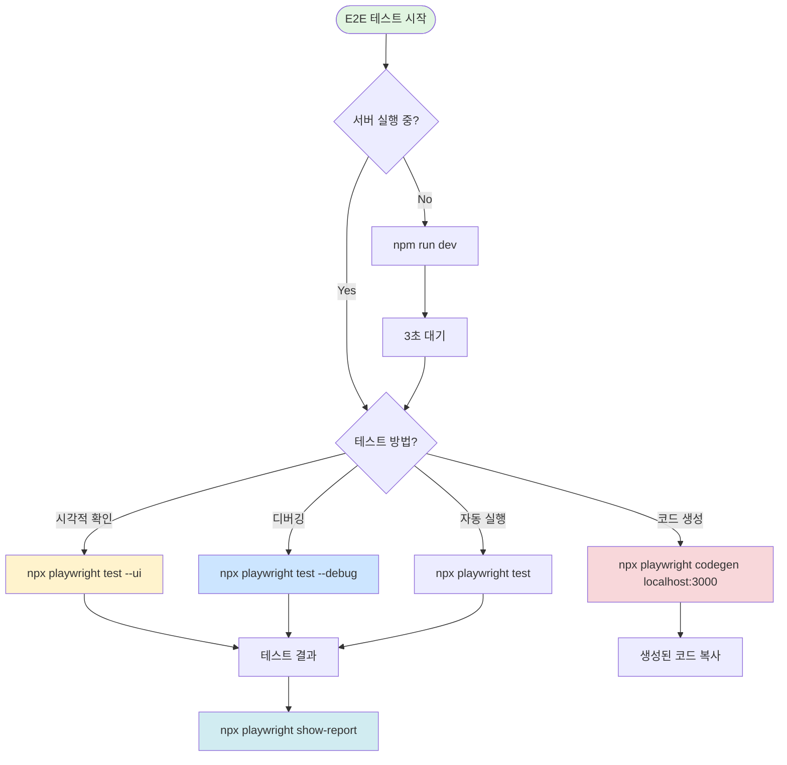

# 🎭 Playwright 올바른 사용법 - 실패 분석 및 가이드

*작성일: 2025-08-27*  
*작성 이유: MCP Playwright와 Playwright Test Framework 혼동으로 인한 E2E 테스트 실패*

---

## ⚡ **중요 발견** - 개발 모드 테스트 로그인 시스템

### 🧪 **E2E 테스트 인증 문제 해결됨**
**✅ 실제 카카오 OAuth 없이도 완전한 E2E 테스트 가능!**

#### **현재 구현된 해결책**
- **테스트 로그인 버튼**: `localhost`에서만 "🧪 테스트 로그인 (localhost 전용)" 표시
- **개발 전용 API**: `/api/auth/test-login` (NODE_ENV=development만 허용)
- **E2E 테스트 활용**: `e2e/auth.spec.ts`에서 실제 사용 중
- **완전한 인증 플로우**: 보호된 페이지, API 호출 모든 테스트 가능

#### **사용 방법**
```typescript
// e2e/auth.spec.ts 패턴
test('테스트 로그인으로 로그인 가능', async ({ page }) => {
  await page.click('button:has-text("🧪 테스트 로그인 (localhost 전용)")');
  await page.waitForURL('**/mypage/profile');
  // 이후 모든 인증 필요 기능 테스트 가능
});
```

## 🔴 실패 원인 분석

### 1. Playwright 설정 문제 ⭐⭐⭐⭐⭐

**🔴 E2E 테스트 실패 원인 분석**

| 구분 | 설정 값 | 실제 위치 | 결과 |
|------|---------|-----------|------|
| **testDir** | `'./e2e'` | ✅ `/e2e/*.spec.ts` | 정상 인식 |
| **누락 테스트** | - | ❌ `/tests/e2e/*.spec.ts` | 인식 불가 |
| **결과** | 일부 테스트만 실행 | 나머지 테스트 타임아웃 | ❌ 테스트 실패 |

#### 해결책 - 유일한 정답
**⚠️ 반드시 모든 E2E 테스트 파일을 `./e2e/` 폴더로 이동**

```bash
# tests/e2e/ 파일들을 ./e2e/로 이동
mv tests/e2e/*.spec.ts e2e/

# 또는 개별 파일 이동
mv tests/e2e/simple-test.spec.ts e2e/
mv tests/e2e/todo-resolution.spec.ts e2e/
```

#### 🔴 절대 금지사항
- ❌ testDir 설정 변경 금지
- ❌ projects 설정으로 여러 디렉토리 지원 금지  
- ❌ 테스트 파일을 여러 위치에 분산 배치 금지

#### ✅ 유일한 규칙
1. **모든 E2E 테스트 파일은 반드시 `./e2e/` 폴더에만 저장**
2. `tests/e2e/` 폴더의 모든 파일을 `./e2e/`로 이동
3. 이동 후 다음 실행:
```bash
# 테스트 파일 인식 확인
npx playwright test --list

# UI 모드로 테스트 실행
npx playwright test --ui
```

### 2. 도구 혼동 문제
| 구분 | MCP Playwright Stealth | Playwright Test Framework |
|------|------------------------|---------------------------|
| **목적** | 브라우저 자동화 | E2E 테스트 |
| **사용법** | `mcp__playwright-stealth__*` | `npx playwright test` |
| **UI 모드** | `headless: false` | `--ui` 플래그 |
| **용도** | 웹 스크래핑, 자동화 | 테스트 작성/실행 |
| **우리가 필요한 것** | ❌ | ✅ |

### 2. 잘못된 시도들
```typescript
// ❌ 잘못된 시도 1: MCP 도구 사용
mcp__playwright-stealth__playwright_navigate({
  url: "http://localhost:3000",
  headless: false  // 이것은 UI 모드가 아님!
})

// ❌ 잘못된 시도 2: 서버 응답 없음
// localhost:3000이 응답하지 않는데 계속 시도

// ✅ 올바른 방법
npx playwright test --ui        // UI 모드
npx playwright test --debug      // 디버그 모드
npx playwright codegen           // 코드 생성
```

### 3. 문서 미확인
- `PLAYWRIGHT_GUIDE.md` 파일이 있었음에도 늦게 확인
- 프로젝트별 문서를 먼저 확인하는 습관 필요

---

## ✅ 올바른 Playwright 사용 플로우차트



## 🧪 **개발 모드 테스트 로그인 시스템** (중요!)

### **실제 카카오 OAuth 없이 E2E 테스트 가능**

프로젝트에는 실제 카카오 로그인 없이도 인증이 필요한 기능들을 테스트할 수 있는 완벽한 시스템이 구현되어 있습니다.

#### **🔑 테스트 로그인 시스템 구성**
1. **클라이언트**: `localhost`에서만 "🧪 테스트 로그인 (localhost 전용)" 버튼 활성화
2. **API**: `/api/auth/test-login` (NODE_ENV=development만 허용)
3. **보안**: 프로덕션 환경에서 완전 비활성화

#### **💡 사용 방법**
```bash
# 1. 개발 서버 실행
npm run dev
# → http://localhost:3000 접근 시에만 테스트 로그인 버튼 표시

# 2. 브라우저에서 수동 테스트
# → /auth/login 페이지에서 "🧪 테스트 로그인" 버튼 클릭

# 3. E2E 테스트에서 활용
npx playwright test e2e/auth.spec.ts --ui
```

#### **✅ 테스트 가능한 기능들**
- 보호된 페이지 접근 (`/mypage`, `/youtube-lens` 등)
- 인증 필요 API 엔드포인트 호출
- 세션 유지 및 상태 확인
- 로그아웃 플로우
- 권한 기반 리다이렉트

#### **📝 E2E 테스트 예시**
```typescript
// e2e/auth.spec.ts에서 실제 사용 중인 패턴
test('테스트 로그인으로 로그인 가능', async ({ page }) => {
  await page.goto('/auth/login');
  await page.waitForLoadState('networkidle');
  
  // 테스트 로그인 버튼 클릭
  await page.click('button:has-text("🧪 테스트 로그인 (localhost 전용)")');
  
  // 프로필 페이지로 리다이렉트 확인
  await page.waitForURL('**/mypage/profile');
  await expect(page.locator('h1:has-text("프로필")')).toBeVisible();
});
```

**🎯 결론**: INSTRUCTION_TEMPLATE_E2E_v3.md의 실제 카카오 로그인 관련 내용은 프로덕션 환경 가정이며, 개발/테스트 환경에서는 이미 구현된 테스트 로그인 시스템을 사용하면 됩니다.

---

## 📋 체크리스트

### 테스트 실행 전
- [ ] `npm run dev` 서버 실행 확인
- [ ] `curl http://localhost:3000` 응답 확인
- [ ] `NODE_ENV=development` 환경변수 확인

### 테스트 명령어 선택
```bash
# 1. UI 모드 (추천!) - 시각적 테스트 확인
npx playwright test --ui

# 2. 디버그 모드 - 단계별 실행
npx playwright test --debug
npx playwright test e2e/auth.spec.ts --debug

# 3. 헤드리스 모드 - CI/CD용
npx playwright test

# 4. 코드젠 - 자동 코드 생성
npx playwright codegen http://localhost:3000

# 5. 리포트 확인
npx playwright show-report
```

### 문제 해결
| 문제 | 원인 | 해결 |
|-----|------|------|
| 서버 응답 없음 | 포트 충돌 | `netstat -ano \| findstr :3000` |
| 테스트 로그인 안 보임 | production 모드 | `NODE_ENV=development` 설정 |
| 테스트 hang | 무한 대기 | Ctrl+C 후 재시작 |
| MCP 오류 | 잘못된 도구 | `npx playwright` 사용 |

---

## 🛡️ E2E 테스트 에러 감지 시스템 (2025-08-27 추가)

### 문제점: 런타임 에러를 감지하지 못하는 일반 테스트
기존 Playwright 테스트는 Next.js 런타임 에러, console.error, React 에러 등을 감지하지 못하고 계속 진행되어 잘못된 테스트 결과를 제공했습니다.

### 해결책: ErrorDetector 시스템
```typescript
// e2e/helpers/error-detector.ts 사용
import { errorSafeTest, withErrorContext } from './helpers/error-detector';

// 에러 감지가 활성화된 테스트
errorSafeTest('안전한 E2E 테스트', async ({ page, errorDetector }) => {
  // 자동으로 감지되는 에러:
  // - console.error() 메시지
  // - JavaScript 런타임 에러
  // - Next.js 에러 오버레이
  // - React Error Boundary
  // - 웹 에러 이벤트
  
  await withErrorContext(errorDetector, '홈페이지 접속', async () => {
    await page.goto('/');
    // 에러 발생 시 즉시 테스트 실패
  });
});
```

### 사용 방법
```bash
# 1. 에러 감지 테스트 실행
npx playwright test e2e/comprehensive-e2e-with-error-detection.spec.ts

# 2. 에러 감지 데모 실행 (비교)
node e2e/demo-error-detection.js

# 3. 검증 테스트
npx playwright test e2e/error-detection-validation.spec.ts
```

### 마이그레이션 가이드
```typescript
// Before: 일반 테스트
import { test } from '@playwright/test';

test('기존 테스트', async ({ page }) => {
  await page.goto('/'); // 에러 무시됨
});

// After: 에러 감지 테스트
import { errorSafeTest } from './helpers/error-detector';

errorSafeTest('개선된 테스트', async ({ page, errorDetector }) => {
  await page.goto('/'); // 에러 즉시 감지
});
```

### 에러 리포트
에러 발생 시 자동으로:
- 에러 타입과 메시지 기록
- 발생 URL과 시간 기록
- 실행 중이던 액션 기록
- 스크린샷 자동 저장 (`test-results/error-*.png`)

### 관련 문서
- [E2E 에러 감지 가이드](/docs/E2E_ERROR_DETECTION.md)
- [검증 결과](/docs/E2E_ERROR_DETECTION_VALIDATION.md)
- [구현 코드](/e2e/helpers/error-detector.ts)

---

## 🚨 절대 하지 말아야 할 것들

1. **MCP Playwright 사용 금지**
   - `mcp__playwright-stealth__*` 함수들은 E2E 테스트용이 아님
   - 웹 스크래핑이나 자동화에만 사용

2. **서버 미확인 실행**
   - 항상 `npm run dev` 먼저 실행
   - 서버 응답 확인 후 테스트 시작

3. **문서 미확인**
   - 프로젝트의 `PLAYWRIGHT_GUIDE.md` 먼저 읽기
   - `playwright.config.ts` 설정 확인

---

## 📚 참고 문서

- **프로젝트 가이드**: `/PLAYWRIGHT_GUIDE.md`
- **E2E 지시 템플릿**: `/docs/INSTRUCTION_TEMPLATE_E2E.md` (📌 최종 V5)
- **설정 파일**: `/playwright.config.ts`
- **테스트 파일**: `/e2e/*.spec.ts`
- **공식 문서**: https://playwright.dev/docs/intro

---

## 💡 교훈

1. **도구 선택 전 목적 확인**
   - E2E 테스트 = Playwright Test Framework
   - 브라우저 자동화 = MCP Playwright

2. **프로젝트 문서 우선**
   - 프로젝트별 가이드 먼저 확인
   - 공식 문서는 보조 참고

3. **올바른 디버깅 순서**
   - 서버 확인 → 환경변수 → 테스트 실행 → 리포트 확인

---

## 🔄 개선 제안

### 1. package.json 스크립트 추가
```json
{
  "scripts": {
    "test:e2e": "playwright test",
    "test:e2e:ui": "playwright test --ui",
    "test:e2e:debug": "playwright test --debug",
    "test:e2e:codegen": "playwright codegen http://localhost:3000"
  }
}
```

### 2. 환경 체크 스크립트
```bash
#!/bin/bash
# check-e2e-ready.sh
echo "Checking E2E test readiness..."
curl -f http://localhost:3000 > /dev/null 2>&1
if [ $? -eq 0 ]; then
  echo "✅ Server is running"
  echo "NODE_ENV=$NODE_ENV"
  npx playwright test --ui
else
  echo "❌ Server not running. Starting..."
  npm run dev &
  sleep 3
  npx playwright test --ui
fi
```

### 3. VS Code 태스크 설정
```json
// .vscode/tasks.json
{
  "version": "2.0.0",
  "tasks": [
    {
      "label": "Playwright UI",
      "type": "shell",
      "command": "npx playwright test --ui",
      "problemMatcher": []
    }
  ]
}
```

---

*이 문서는 실패 경험을 바탕으로 작성되었습니다. 같은 실수를 반복하지 않기 위해 지속적으로 업데이트됩니다.*