# 🎭 Playwright 올바른 사용법 - 실패 분석 및 가이드

*작성일: 2025-08-27*  
*작성 이유: MCP Playwright와 Playwright Test Framework 혼동으로 인한 E2E 테스트 실패*

---

## 🔴 실패 원인 분석

### 1. 도구 혼동 문제
| 구분 | MCP Playwright Stealth | Playwright Test Framework |
|------|------------------------|---------------------------|
| **목적** | 브라우저 자동화 | E2E 테스트 |
| **사용법** | `mcp__playwright-stealth__*` | `npx playwright test` |
| **UI 모드** | `headless: false` | `--ui` 플래그 |
| **용도** | 웹 스크래핑, 자동화 | 테스트 작성/실행 |
| **우리가 필요한 것** | ❌ | ✅ |

### 2. 잘못된 시도들
```typescript
// ❌ 잘못된 시도 1: MCP 도구 사용
mcp__playwright-stealth__playwright_navigate({
  url: "http://localhost:3000",
  headless: false  // 이것은 UI 모드가 아님!
})

// ❌ 잘못된 시도 2: 서버 응답 없음
// localhost:3000이 응답하지 않는데 계속 시도

// ✅ 올바른 방법
npx playwright test --ui        // UI 모드
npx playwright test --debug      // 디버그 모드
npx playwright codegen           // 코드 생성
```

### 3. 문서 미확인
- `PLAYWRIGHT_GUIDE.md` 파일이 있었음에도 늦게 확인
- 프로젝트별 문서를 먼저 확인하는 습관 필요

---

## ✅ 올바른 Playwright 사용 플로우차트

```mermaid
flowchart TD
    Start([E2E 테스트 시작]) --> Check{서버 실행 중?}
    Check -->|No| RunDev[npm run dev]
    Check -->|Yes| TestType{테스트 방법?}
    
    RunDev --> Wait[3초 대기]
    Wait --> TestType
    
    TestType -->|시각적 확인| UI[npx playwright test --ui]
    TestType -->|디버깅| Debug[npx playwright test --debug]
    TestType -->|자동 실행| Headless[npx playwright test]
    TestType -->|코드 생성| Codegen[npx playwright codegen localhost:3000]
    
    UI --> Result[테스트 결과]
    Debug --> Result
    Headless --> Result
    Codegen --> CopyCode[생성된 코드 복사]
    
    Result --> Report[npx playwright show-report]
    
    style Start fill:#e1f5e1
    style UI fill:#fff3cd
    style Debug fill:#cce5ff
    style Codegen fill:#f8d7da
    style Report fill:#d1ecf1
```



---

## 📋 체크리스트

### 테스트 실행 전
- [ ] `npm run dev` 서버 실행 확인
- [ ] `curl http://localhost:3000` 응답 확인
- [ ] `NODE_ENV=development` 환경변수 확인

### 테스트 명령어 선택
```bash
# 1. UI 모드 (추천!) - 시각적 테스트 확인
npx playwright test --ui

# 2. 디버그 모드 - 단계별 실행
npx playwright test --debug
npx playwright test e2e/auth.spec.ts --debug

# 3. 헤드리스 모드 - CI/CD용
npx playwright test

# 4. 코드젠 - 자동 코드 생성
npx playwright codegen http://localhost:3000

# 5. 리포트 확인
npx playwright show-report
```

### 문제 해결
| 문제 | 원인 | 해결 |
|-----|------|------|
| 서버 응답 없음 | 포트 충돌 | `netstat -ano \| findstr :3000` |
| 테스트 로그인 안 보임 | production 모드 | `NODE_ENV=development` 설정 |
| 테스트 hang | 무한 대기 | Ctrl+C 후 재시작 |
| MCP 오류 | 잘못된 도구 | `npx playwright` 사용 |

---

## 🚨 절대 하지 말아야 할 것들

1. **MCP Playwright 사용 금지**
   - `mcp__playwright-stealth__*` 함수들은 E2E 테스트용이 아님
   - 웹 스크래핑이나 자동화에만 사용

2. **서버 미확인 실행**
   - 항상 `npm run dev` 먼저 실행
   - 서버 응답 확인 후 테스트 시작

3. **문서 미확인**
   - 프로젝트의 `PLAYWRIGHT_GUIDE.md` 먼저 읽기
   - `playwright.config.ts` 설정 확인

---

## 📚 참고 문서

- **프로젝트 가이드**: `/PLAYWRIGHT_GUIDE.md`
- **E2E 지시 템플릿**: `/docs/INSTRUCTION_TEMPLATE_E2E.md` (📌 최종 V5)
- **설정 파일**: `/playwright.config.ts`
- **테스트 파일**: `/e2e/*.spec.ts`
- **공식 문서**: https://playwright.dev/docs/intro

---

## 💡 교훈

1. **도구 선택 전 목적 확인**
   - E2E 테스트 = Playwright Test Framework
   - 브라우저 자동화 = MCP Playwright

2. **프로젝트 문서 우선**
   - 프로젝트별 가이드 먼저 확인
   - 공식 문서는 보조 참고

3. **올바른 디버깅 순서**
   - 서버 확인 → 환경변수 → 테스트 실행 → 리포트 확인

---

## 🔄 개선 제안

### 1. package.json 스크립트 추가
```json
{
  "scripts": {
    "test:e2e": "playwright test",
    "test:e2e:ui": "playwright test --ui",
    "test:e2e:debug": "playwright test --debug",
    "test:e2e:codegen": "playwright codegen http://localhost:3000"
  }
}
```

### 2. 환경 체크 스크립트
```bash
#!/bin/bash
# check-e2e-ready.sh
echo "Checking E2E test readiness..."
curl -f http://localhost:3000 > /dev/null 2>&1
if [ $? -eq 0 ]; then
  echo "✅ Server is running"
  echo "NODE_ENV=$NODE_ENV"
  npx playwright test --ui
else
  echo "❌ Server not running. Starting..."
  npm run dev &
  sleep 3
  npx playwright test --ui
fi
```

### 3. VS Code 태스크 설정
```json
// .vscode/tasks.json
{
  "version": "2.0.0",
  "tasks": [
    {
      "label": "Playwright UI",
      "type": "shell",
      "command": "npx playwright test --ui",
      "problemMatcher": []
    }
  ]
}
```

---

*이 문서는 실패 경험을 바탕으로 작성되었습니다. 같은 실수를 반복하지 않기 위해 지속적으로 업데이트됩니다.*