# 📘 PM AI 프레임워크 - 완전 가이드

## 🎯 핵심 목표
PM AI는 프로젝트의 전체 수명주기를 관리하며, 개발자 AI가 명확하고 검증 가능한 작업을 수행할 수 있도록 지원합니다.

프로젝트 피닉스는 **AI가 주도하는 개발 방식**을 채택합니다. PM AI가 상세한 구현 지시서를 작성하고, 개발자 AI가 이를 기계적으로 구현하는 2단계 워크플로우를 따릅니다.

## 🔴 핵심 개발 철학

1. **설계와 구현의 완전한 분리** - 설계 단계에서 모든 모호함을 제거
2. **AI-to-AI 커뮤니케이션 최적화** - 인간의 해석이 필요 없는 명확한 지시
3. **단계적 검증 시스템** - 모든 지시 및 구현 이후 PM AI의 검증 수행
4. **컨텍스트 독립성** - 모든 문서는 그 자체로 완전해야 함
5. **문서의 연속성** - 꼭 필요한 문서만 생성하되 생성된 문서는 연속성이 있어야 합니다

> ⚠️ **중요**: 개발자 AI는 우리가 분석했던 내용이나 나눴던 대화에 대한 context가 없으니 개발자 AI에게 지시할 때 작성하는 지시문은 반드시 명확하고 구체적으로 축약, 요약, 생략, 누락 없이 작성되어야 합니다.

## 🏗️ 프레임워크 아키텍처

### 1️⃣ 작업 계획 단계 (Planning Phase)
- 사용자 요구사항을 30분 단위 작업으로 분해
- 각 작업의 의존성 및 우선순위 정의
- 검증 가능한 완료 기준 설정

### 2️⃣ 작업 실행 단계 (Execution Phase)
- 개발자 AI에게 명확한 지시서 전달
- 실시간 진행 상황 모니터링
- 블로커 및 이슈 즉시 대응

### 3️⃣ 검증 단계 (Verification Phase)
- Zero Trust 기반 구현 검증
- Playwright MCP를 통한 실제 동작 확인
- 증거 기반 완료 판단

### 4️⃣ 문서화 단계 (Documentation Phase)
- 모든 작업 결과 체계적 보관
- 재사용 가능한 지식 베이스 구축
- 지속적 개선을 위한 회고

---

## 🔗 의존성 관리 시스템 (Dependency Management System)

### 의존성 추적 메커니즘

#### 1. 의존성 정의 구조
```yaml
task_dependencies:
  TASK-001:
    id: TASK-001
    name: "데이터베이스 스키마 설정"
    depends_on: []  # 선행 작업 없음
    blocks: [TASK-002, TASK-003]  # 이 작업이 블록하는 작업들
    type: "sequential"  # sequential | parallel | conditional
    priority: "critical"
    estimated_duration: 30  # 분 단위
    
  TASK-002:
    id: TASK-002
    name: "API 엔드포인트 구현"
    depends_on: [TASK-001]
    blocks: [TASK-004]
    type: "parallel"  # TASK-003과 병렬 가능
    priority: "high"
    estimated_duration: 45
```

#### 2. 의존성 충돌 해결 프로토콜

```mermaid
graph TD
    A[의존성 충돌 감지] --> B{충돌 유형}
    B -->|순환 의존성| C[순환 고리 분석]
    B -->|리소스 경합| D[우선순위 기반 조정]
    B -->|시간 충돌| E[일정 재조정]
    
    C --> F[의존성 재구조화]
    D --> G[순차 실행 전환]
    E --> H[버퍼 시간 추가]
    
    F --> I[PM AI 승인]
    G --> I
    H --> I
    I --> J[조정된 실행 계획]
```



##### 충돌 해결 규칙
1. **순환 의존성**: 작업을 더 작은 단위로 분해하여 순환 고리 제거
2. **리소스 경합**: Critical > High > Medium > Low 우선순위로 실행
3. **시간 충돌**: 20% 버퍼 시간 자동 추가

#### 3. 병렬 작업 가능성 판단 기준

```typescript
interface ParallelizationCriteria {
  // 병렬 실행 가능 조건
  canRunInParallel: {
    noSharedResources: boolean;      // 리소스 공유 없음
    noCodeConflicts: boolean;        // 코드 영역 충돌 없음
    noDatabaseLocks: boolean;        // DB 락 충돌 없음
    independentTests: boolean;       // 테스트 독립성 보장
  };
  
  // 병렬화 점수 (0-100)
  parallelizationScore: number;
  
  // 권장 실행 모드
  recommendedMode: 'sequential' | 'parallel' | 'hybrid';
}
```

##### 병렬화 결정 매트릭스
| 조건 | 가중치 | 병렬 가능 |
|------|--------|-----------|
| 파일 충돌 없음 | 30% | ✅ |
| API 독립성 | 25% | ✅ |
| DB 트랜잭션 독립 | 25% | ✅ |
| 테스트 격리 | 20% | ✅ |
| **총점 70% 이상** | - | **병렬 실행** |

#### 4. 의존성 그래프 시각화

```markdown
## 의존성 대시보드 구조
docs/
├── dependency-graphs/
│   ├── current-sprint.mmd      # Mermaid 다이어그램
│   ├── dependency-matrix.csv   # 의존성 매트릭스
│   └── critical-path.json      # 크리티컬 패스 분석
```

##### 실시간 의존성 뷰
```json
{
  "sprint": "SPRINT-001",
  "total_tasks": 10,
  "critical_path": ["TASK-001", "TASK-002", "TASK-004", "TASK-007"],
  "parallel_groups": [
    ["TASK-003", "TASK-005"],
    ["TASK-006", "TASK-008", "TASK-009"]
  ],
  "estimated_completion": "8 hours",
  "bottlenecks": ["TASK-002"],
  "optimization_suggestions": [
    "TASK-003을 TASK-001 완료 즉시 시작 가능",
    "TASK-006을 2개 서브태스크로 분할하여 병렬화"
  ]
}
```

#### 5. 자동 작업 순서 최적화

```python
# 작업 순서 최적화 알고리즘 (의사코드)
class TaskOptimizer:
    def optimize_execution_order(tasks):
        # 1. 토폴로지 정렬로 기본 순서 결정
        base_order = topological_sort(tasks)
        
        # 2. 크리티컬 패스 분석
        critical_path = find_critical_path(tasks)
        
        # 3. 병렬화 기회 식별
        parallel_groups = identify_parallel_opportunities(tasks)
        
        # 4. 리소스 제약 고려
        resource_constraints = analyze_resource_limits()
        
        # 5. 최적화된 실행 계획 생성
        optimized_plan = generate_execution_plan(
            base_order,
            critical_path,
            parallel_groups,
            resource_constraints
        )
        
        return optimized_plan
```

##### 최적화 규칙
1. **크리티컬 패스 우선**: 전체 완료 시간에 영향을 주는 작업 우선
2. **리소스 활용 극대화**: 유휴 리소스 최소화
3. **컨텍스트 스위칭 최소화**: 관련 작업 연속 배치
4. **리스크 분산**: 고위험 작업을 초기에 배치

### 의존성 관리 운영 가이드

#### 작업 등록 시 의존성 체크리스트
- [ ] 선행 작업(depends_on) 명시
- [ ] 후행 작업(blocks) 식별
- [ ] 병렬화 가능성 평가
- [ ] 리소스 요구사항 정의
- [ ] 예상 소요시간 산정 (±20% 버퍼 포함)

#### 일일 의존성 리뷰
```markdown
## Daily Dependency Review
- **날짜**: YYYY-MM-DD
- **블로킹 작업**: [리스트]
- **병렬화 기회**: [리스트]
- **조정 필요 사항**: [리스트]
- **내일 크리티컬 패스**: [작업 순서]
```

---

## 🧪 테스트 전략 계층화 (Test Strategy Layering)

### 테스트 피라미드 구조

```
         /\
        /E2E\        (5-10%) - UI/UX 전체 플로우
       /------\
      /통합 테스트\    (20-30%) - 모듈 간 상호작용
     /------------\
    /  단위 테스트  \  (60-70%) - 개별 함수/컴포넌트
   /----------------\
```

### 1. 단위 테스트 (Unit Testing)

#### 테스트 작성 기준
```typescript
// 테스트 템플릿
describe('ComponentName', () => {
  // 1. Happy Path - 정상 동작
  it('should handle normal input correctly', () => {
    // Given: 초기 상태
    // When: 액션 수행
    // Then: 예상 결과 검증
  });
  
  // 2. Edge Cases - 경계값
  it('should handle edge cases', () => {
    // 최소값, 최대값, 빈 값 등
  });
  
  // 3. Error Cases - 오류 처리
  it('should handle errors gracefully', () => {
    // 예외 상황 처리 검증
  });
});
```

#### 커버리지 목표
| 구분 | 최소 목표 | 권장 목표 |
|------|----------|----------|
| 라인 커버리지 | 70% | 85% |
| 브랜치 커버리지 | 60% | 80% |
| 함수 커버리지 | 80% | 95% |
| Critical Path | 100% | 100% |

### 2. 통합 테스트 (Integration Testing)

#### 통합 테스트 전략
```yaml
integration_test_matrix:
  api_integration:
    scope: "API ↔ Database"
    tools: ["supertest", "jest"]
    mock_strategy: "실제 테스트 DB 사용"
    data_cleanup: "afterEach hook"
    
  service_integration:
    scope: "Service Layer 간 통신"
    tools: ["jest", "nock"]
    mock_strategy: "외부 API만 모킹"
    data_cleanup: "트랜잭션 롤백"
    
  ui_api_integration:
    scope: "Frontend ↔ Backend"
    tools: ["cypress", "msw"]
    mock_strategy: "MSW로 네트워크 레이어 모킹"
    data_cleanup: "테스트별 격리"
```

#### 통합 테스트 체크리스트
- [ ] API 엔드포인트 전체 테스트
- [ ] 데이터베이스 트랜잭션 검증
- [ ] 인증/인가 플로우 검증
- [ ] 에러 전파 및 처리 검증
- [ ] 타임아웃 및 재시도 로직 검증

### 3. E2E 테스트 (End-to-End Testing)

#### E2E 테스트 시나리오
```typescript
// E2E 테스트 구조
class E2ETestScenario {
  // Critical User Journeys
  criticalPaths = [
    "사용자 회원가입 → 로그인 → 프로필 설정",
    "콘텐츠 생성 → 편집 → 발행 → 공유",
    "결제 프로세스 전체 플로우"
  ];
  
  // 테스트 환경 설정
  testEnvironment = {
    browser: ["Chrome", "Firefox", "Safari"],
    viewport: ["desktop", "tablet", "mobile"],
    network: ["fast-3g", "slow-3g", "offline"],
    locale: ["ko-KR", "en-US"]
  };
  
  // 검증 항목
  validations = {
    functional: "기능 정상 작동",
    visual: "UI 렌더링 정확성",
    performance: "응답 시간 < 3초",
    accessibility: "WCAG 2.1 준수"
  };
}
```

#### Playwright E2E 자동화
```javascript
// PM AI의 E2E 검증 스크립트
async function runE2EValidation(taskId) {
  const scenarios = await loadScenarios(taskId);
  
  for (const scenario of scenarios) {
    // 1. 환경 설정
    const context = await browser.newContext({
      viewport: scenario.viewport,
      locale: scenario.locale
    });
    
    // 2. 시나리오 실행
    const page = await context.newPage();
    await page.goto(scenario.startUrl);
    
    // 3. 액션 수행
    for (const action of scenario.actions) {
      await performAction(page, action);
      await captureEvidence(page, `${taskId}-${action.id}`);
    }
    
    // 4. 검증
    const results = await validateScenario(page, scenario.expects);
    
    // 5. 보고서 생성
    await generateE2EReport(taskId, results);
  }
}
```

### 4. 테스트 데이터 관리 시스템

#### 테스트 데이터 계층
```yaml
test_data_layers:
  fixtures:
    location: "tests/fixtures/"
    format: "JSON/YAML"
    usage: "정적 테스트 데이터"
    
  factories:
    location: "tests/factories/"
    tool: "factory-bot / faker.js"
    usage: "동적 테스트 데이터 생성"
    
  seeds:
    location: "tests/seeds/"
    format: "SQL/Migration"
    usage: "데이터베이스 시드 데이터"
    
  snapshots:
    location: "tests/__snapshots__/"
    format: "Jest Snapshots"
    usage: "UI/API 응답 스냅샷"
```

#### 테스트 데이터 생명주기

```mermaid
graph LR
    A[테스트 시작] --> B[데이터 준비]
    B --> C[Fixture 로드]
    B --> D[Factory 생성]
    B --> E[DB Seed]
    
    C --> F[테스트 실행]
    D --> F
    E --> F
    
    F --> G[데이터 검증]
    G --> H[데이터 정리]
    H --> I[테스트 종료]
```


### 5. 성능/부하 테스트 가이드라인

#### 성능 테스트 메트릭
```typescript
interface PerformanceMetrics {
  // 응답 시간
  responseTime: {
    p50: 200,   // ms
    p95: 500,   // ms
    p99: 1000   // ms
  };
  
  // 처리량
  throughput: {
    rps: 1000,  // requests per second
    concurrent: 100  // 동시 사용자
  };
  
  // 리소스 사용률
  resources: {
    cpu: 70,    // %
    memory: 80, // %
    disk_io: 100 // MB/s
  };
  
  // 에러율
  errorRate: {
    threshold: 0.1  // %
  };
}
```

#### 부하 테스트 시나리오
```yaml
load_test_scenarios:
  normal_load:
    users: 100
    duration: "10m"
    ramp_up: "1m"
    
  peak_load:
    users: 500
    duration: "5m"
    ramp_up: "30s"
    
  stress_test:
    users: 1000
    duration: "15m"
    ramp_up: "2m"
    
  spike_test:
    users: [100, 1000, 100]
    duration: ["5m", "1m", "5m"]
```

### 6. 회귀 테스트 자동화

#### 회귀 테스트 전략
```markdown
## Regression Test Strategy

### 자동화 범위
1. **Critical Path**: 100% 자동화
2. **High Priority Features**: 80% 자동화
3. **Medium Priority**: 50% 자동화
4. **Low Priority**: 수동 테스트

### 실행 주기
- **커밋 시**: 단위 테스트 + Critical Path
- **PR 시**: 단위 + 통합 테스트
- **일일**: 전체 회귀 테스트 스위트
- **릴리즈 전**: Full E2E + 성능 테스트

### 실패 처리
1. 즉시 알림 (Slack/Email)
2. 자동 이슈 생성
3. 블로킹 처리 (머지 차단)
4. 롤백 준비
```

#### Visual Regression Testing
```javascript
// Visual Regression 설정
const visualRegressionConfig = {
  threshold: 0.1,  // 10% 차이 허용
  screenshotPath: 'tests/screenshots/base',
  diffPath: 'tests/screenshots/diff',
  failedPath: 'tests/screenshots/failed',
  
  scenarios: [
    { name: 'homepage', url: '/', viewport: [1920, 1080] },
    { name: 'mobile-home', url: '/', viewport: [375, 667] },
    // ... 더 많은 시나리오
  ]
};
```

### 테스트 문서화 및 보고

#### 테스트 보고서 템플릿
```markdown
# 테스트 실행 보고서

## 실행 정보
- **일시**: YYYY-MM-DD HH:mm
- **환경**: [개발/스테이징/프로덕션]
- **실행자**: [PM AI / Developer AI]
- **트리거**: [커밋/PR/일일/수동]

## 실행 결과 요약
| 테스트 유형 | 전체 | 성공 | 실패 | 건너뜀 | 커버리지 |
|------------|------|------|------|--------|----------|
| 단위 | 500 | 495 | 5 | 0 | 85% |
| 통합 | 100 | 98 | 2 | 0 | 72% |
| E2E | 20 | 20 | 0 | 0 | N/A |

## 실패 테스트 상세
| 테스트 | 실패 원인 | 우선순위 | 담당자 |
|--------|----------|----------|--------|
| [테스트명] | [원인] | [Critical/High/Medium] | [AI/Human] |

## 성능 메트릭
- **평균 응답시간**: XXms
- **P95 응답시간**: XXms
- **처리량**: XX RPS

## 액션 아이템
1. [ ] 실패 테스트 수정
2. [ ] 커버리지 개선
3. [ ] 성능 최적화

## 증거 자료
- 로그: `docs/evidence/test-results/[날짜]/`
- 스크린샷: `docs/evidence/screenshots/test-[날짜]/`
- 커버리지 리포트: `coverage/lcov-report/index.html`
```

### 테스트 모범 사례 (Best Practices)

#### 테스트 작성 원칙
1. **AAA 패턴**: Arrange-Act-Assert
2. **테스트 격리**: 각 테스트는 독립적으로 실행 가능
3. **명확한 네이밍**: `should_[예상결과]_when_[조건]`
4. **단일 책임**: 하나의 테스트는 하나의 동작만 검증
5. **테스트 우선**: TDD/BDD 접근법 권장

#### 테스트 유지보수
- **정기적 리팩토링**: 중복 제거, 헬퍼 함수 추출
- **Flaky 테스트 제거**: 불안정한 테스트 즉시 수정 또는 제거
- **테스트 속도 최적화**: 병렬 실행, 선택적 실행
- **테스트 문서화**: 복잡한 테스트에 주석 추가

---

## 📋 작업 관리 시스템 (Task Management System)

### 작업 구조 (Task Structure)
```
docs/
├── tasks/
│   ├── sprint-001/
│   │   ├── TASK-001.md         # 개별 작업 지시서
│   │   ├── TASK-002.md
│   │   └── sprint-summary.md   # 스프린트 요약
│   ├── templates/
│   │   ├── task-template.md    # 작업 템플릿
│   │   └── verification-template.md
│   └── completed/               # 완료된 작업 아카이브
│       └── [날짜별 정리]
├── evidence/
│   ├── logs/                    # 실행 로그
│   ├── screenshots/             # Playwright 스크린샷
│   ├── test-results/            # 테스트 결과
│   └── verification-reports/    # 검증 보고서
└── knowledge-base/              # 재사용 가능한 문서
    ├── patterns/                # 성공 패턴
    ├── troubleshooting/         # 문제 해결 가이드
    └── best-practices/          # 모범 사례
```

## 📖 TCREI 프레임워크 (SuperClaude 통합)

**TCREI 프레임워크**는 PM AI가 Developer AI에게 안정적으로 작업을 맡길 수 있도록 표준화된 작성→실행→검증→반복 흐름입니다.

### TCREI 단계별 가이드

| 단계 | 해야 할 일 | 필수 내용 | 체크포인트 |
|------|-----------|----------|------------|
| **1. T (Task) 정의** | ① **Persona** 지정<br>② **Action**(명령형 동사)<br>③ **Format**(출력 구조·톤·분량) 명시 | 예)<br>• _Persona_: "ASSERTIVE DevOps 엔지니어"<br>• _Action_: "Playwright 1.45로 다운그레이드하고 Storybook 빌드 검증하라"<br>• _Format_: "Markdown 표·`task‑result.json` 파일 생성" | 모호한 동사("알려줘") 금지 |
| **2. C (Context) 제공** | 레포 경로, OS 환경, 브랜치 이름, 시간·리소스 제약 | 예) "Windows PowerShell 환경, branch `fix/coderabbit-critical` 사용, CI 녹색이 필수" | 관련 없는 정보 과다 금지 |
| **3. R (References) 제시** | 성공 로그 예시·출력 예시 등 **Few‑shot** | 예) Turbo build 성공 로그 스니펫 | 예시는 짧게(10~15 줄) |
| **4. E (Evaluate) 정의** | JSON 체크리스트로 **정량 항목**만 명시 | 예) `"turbo_build":"success"`, `"tests_e2e":"0_failed"` | 개수가 10개 이내 |
| **5. I (Iterate) 규칙** | ① 실패 시 "WHY‑ASK"로 중단·질문<br>② PM 승인 후 재시도 | 문장 예)"체크리스트에 FAIL이 있으면 commit/push 금지, WHY‑ASK 출력" | 반드시 포함 |
| **6. Super Claude 명령** | a. **Pre‑flight 매크로** (OS 확인·ExecutionPolicy 우회)<br>b. 작업을 **서브‑Task** 단위로 나눔<br>c. 각 서브‑Task 끝에 `--dod` 검증 + **임시 커밋**<br>d. 마지막에 **self‑evaluate** 스크립트 실행 | 각 `/sc:*` 줄에 `--why`·`--dod` 필수 | `--skip-confirm` 사용 금지 |
| **7. 보고 요구** | 최소 4종:<br>• 로그 요약<br>• diff 중요 파일<br>• CI URL<br>• `task‑result.json` 또는 state.md 업데이트 | 형식 자유(일관성 유지) | — |

### 작업 템플릿 (Task Template)

```markdown
# TASK-[번호]: [작업 제목]

## 📌 메타데이터
- **작업 ID**: TASK-[번호]
- **예상 소요시간**: 30분
- **담당**: Developer AI
- **우선순위**: [Critical/High/Medium/Low]
- **의존성**: [선행 작업 ID 목록]
- **상태**: [대기중/진행중/검토중/완료/보류]

## 🎯 작업 목표
[명확하고 측정 가능한 목표 - 1-2문장]

## 📝 상세 지시사항

### 1. 환경 설정
- **작업 디렉토리**: `C:\My_Claude_Project\9.Dhacle`
- **브랜치**: `feature/[기능명]`
- **필요 도구**: [도구 목록]
- **환경 변수**: [필요한 경우]

### 2. 구현 단계
#### Step 1: [단계 제목]
```bash
# 실행할 명령어
```
- **설명**: [무엇을 하는지]
- **예상 결과**: [어떤 결과가 나와야 하는지]
- **검증 방법**: [결과를 어떻게 확인하는지]

#### Step 2: [단계 제목]
[이하 동일한 구조로 작성]

### 3. 코드 구현
```typescript
// 구현해야 할 코드의 정확한 구조
interface RequiredInterface {
  // 필요한 인터페이스 정의
}

// 구현 예시 또는 스켈레톤 코드
```

## ✅ 완료 기준 (Definition of Done)
- [ ] 모든 코드가 TypeScript 타입 체크 통과
- [ ] 단위 테스트 작성 및 통과
- [ ] 린트 에러 없음
- [ ] 문서 업데이트 완료
- [ ] 실제 동작 검증 완료

## 🔍 검증 체크리스트
```json
{
  "implementation_complete": false,
  "tests_passing": false,
  "lint_clean": false,
  "documentation_updated": false,
  "manual_verification": false,
  "screenshot_captured": false,
  "logs_collected": false
}
```

## 📊 증거 수집 요구사항
1. **실행 로그**: `docs/evidence/logs/TASK-[번호]-execution.log`
2. **스크린샷**: `docs/evidence/screenshots/TASK-[번호]-[설명].png`
3. **테스트 결과**: `docs/evidence/test-results/TASK-[번호]-results.json`
4. **검증 보고서**: `docs/evidence/verification-reports/TASK-[번호]-report.md`

## 🚨 예외 처리
- **실패 시나리오 1**: [상황] → [대응 방법]
- **실패 시나리오 2**: [상황] → [대응 방법]

## 📚 참고 자료
- [관련 문서 링크]
- [API 문서]
- [디자인 가이드]

## 🛠️ Super Claude 명령 블록
```plaintext
/sc:shell …   # Pre‑flight (OS 확인, ExecutionPolicy 우회)
/sc:subtask-1 --dod   # 서브 태스크 1 실행 및 검증
/sc:subtask-2 --dod   # 서브 태스크 2 실행 및 검증
/sc:shell …   # self‑evaluate 스크립트 실행
```

## 💬 PM AI 지시사항
개발자 AI가 이 작업을 수행할 때:
1. 모든 단계를 순차적으로 실행
2. 각 단계마다 결과를 보고
3. 문제 발생 시 즉시 중단하고 보고
4. 완료 후 모든 증거 자료 제출

## 🔧 권장 SuperClaude 명령
```bash
/sc:implement --persona-backend --seq --validate
# 또는
/sc:build --think --c7 --evidence
```

## 📁 생성될 파일 목록
| 파일명 | 경로 | 용도 |
|--------|------|------|
| [파일1] | [전체 경로] | [설명] |
| [파일2] | [전체 경로] | [설명] |
```

---

## 🔍 검증 워크플로우 (Verification Workflow)

### Zero Trust 검증 원칙
1. **로그만으로는 신뢰하지 않음** - 실제 동작 확인 필수
2. **모든 주장은 증거 필요** - 스크린샷, 테스트 결과 등
3. **독립적 검증** - PM AI가 직접 확인
4. **재현 가능성** - 다른 환경에서도 동작 보장

### Playwright 검증 프로세스
```typescript
// PM AI 검증 스크립트 예시
async function verifyTaskImplementation(taskId: string) {
  const browser = await playwright.chromium.launch();
  const page = await browser.newPage();
  
  // 1. 애플리케이션 접속
  await page.goto('http://localhost:3000');
  
  // 2. 구현된 기능 테스트
  const element = await page.$('[data-testid="new-feature"]');
  assert(element !== null, 'Feature not found');
  
  // 3. 스크린샷 캡처
  await page.screenshot({ 
    path: `docs/evidence/screenshots/TASK-${taskId}-verified.png` 
  });
  
  // 4. 성능 메트릭 수집
  const metrics = await page.evaluate(() => performance.getEntriesByType('navigation'));
  
  // 5. 검증 보고서 생성
  generateVerificationReport(taskId, metrics);
  
  await browser.close();
}
```

### 검증 보고서 템플릿
```markdown
# 검증 보고서: TASK-[번호]

## 검증 일시
- **날짜**: [YYYY-MM-DD HH:mm]
- **검증자**: PM AI
- **환경**: [개발/스테이징/프로덕션]

## 검증 항목
| 항목 | 예상 결과 | 실제 결과 | 상태 |
|------|----------|----------|------|
| 기능 구현 | [설명] | [설명] | ✅/❌ |
| UI 렌더링 | [설명] | [설명] | ✅/❌ |
| 성능 기준 | [설명] | [설명] | ✅/❌ |

## 증거 자료
- 스크린샷: [경로]
- 로그 파일: [경로]
- 테스트 결과: [경로]

## 검증 결론
[합격/불합격] - [이유 설명]

## 후속 조치
[필요한 경우 추가 작업 사항]
```

---

## 📂 문서 조직화 전략

### 1. 작업 문서 생명주기

```mermaid
graph LR
    A[신규 작업] --> B[docs/tasks/current]
    B --> C[진행 중]
    C --> D[검증 대기]
    D --> E{검증 결과}
    E -->|통과| F[docs/tasks/completed]
    E -->|실패| G[수정 필요]
    G --> C
    F --> H[docs/knowledge-base]
```


### 2. 증거 자료 관리
- **명명 규칙**: `[TASK-ID]-[날짜]-[타입].[확장자]`
- **보관 기간**: 
  - 로그: 30일
  - 스크린샷: 90일
  - 검증 보고서: 영구 보관
- **백업**: 주간 단위로 압축 백업

### 3. 지식 베이스 구축
```markdown
docs/knowledge-base/
├── patterns/
│   ├── authentication-pattern.md
│   ├── api-integration-pattern.md
│   └── error-handling-pattern.md
├── troubleshooting/
│   ├── common-errors.md
│   ├── debugging-guide.md
│   └── performance-issues.md
└── best-practices/
    ├── code-style.md
    ├── testing-strategy.md
    └── deployment-checklist.md
```

---

## 🤖 개발자 AI 지시 프로토콜

### 명확한 지시를 위한 체크리스트
- [ ] 모든 경로는 절대 경로로 제공
- [ ] 예상 결과를 구체적으로 명시
- [ ] 실패 시나리오와 대응 방법 포함
- [ ] 검증 방법을 단계별로 설명
- [ ] 필요한 모든 컨텍스트 제공

### 지시서 작성 예시
```markdown
## 개발자 AI에게 전달할 지시서

당신은 이제 TASK-001을 수행합니다.

### 즉시 실행할 사항:
1. 작업 디렉토리 확인: `cd C:\My_Claude_Project\9.Dhacle`
2. 현재 브랜치 확인: `git branch`
3. 필요시 새 브랜치 생성: `git checkout -b feature/task-001`

### 구현할 내용:
[정확한 코드와 함께 상세 설명]

### 검증 방법:
1. `npm test` 실행하여 모든 테스트 통과 확인
2. `npm run build` 실행하여 빌드 성공 확인
3. 브라우저에서 http://localhost:3000 접속하여 동작 확인

### 증거 수집:
1. 모든 명령어 실행 결과를 `docs/evidence/logs/TASK-001-execution.log`에 저장
2. 브라우저 동작 스크린샷을 `docs/evidence/screenshots/`에 저장
3. 테스트 결과를 JSON 형식으로 저장

### 보고 형식 (최소 4종):
작업 완료 후 다음 형식으로 보고:
1. **로그 요약**: 주요 실행 결과와 에러 요약
2. **diff 중요 파일**: 변경된 핵심 파일들의 diff
3. **CI URL**: 빌드/테스트 결과 링크
4. **task‑result.json**: 
```json
{
  "task_id": "TASK-001",
  "status": "completed",
  "implementation_complete": true,
  "tests_passing": true,
  "lint_clean": true,
  "evidence_collected": true,
  "issues_found": []
}
```
- 발생한 문제: [있다면 상세 설명]
```

---

## 🔄 지속적 개선 프로세스

### 일일 리뷰
- 완료된 작업 검토
- 블로커 및 이슈 해결
- 다음 날 우선순위 조정

### 주간 회고
- 성공 패턴 문서화
- 실패 사례 분석
- 프로세스 개선 사항 도출

### 월간 최적화
- 지식 베이스 정리
- 템플릿 업데이트
- 도구 및 프로세스 개선

---

## 📋 PM AI 체크리스트

### 작업 생성 시
- [ ] 30분 단위로 적절히 분할되었는가?
- [ ] 주니어 개발자도 이해 가능한가?
- [ ] 모든 필요 정보가 포함되었는가?
- [ ] 검증 기준이 명확한가?

### 작업 할당 시
- [ ] 개발자 AI의 컨텍스트가 충분한가?
- [ ] 필요한 모든 도구가 명시되었는가?
- [ ] 예외 상황 대응 방법이 포함되었는가?

### 검증 시
- [ ] 로그 외 실제 증거가 있는가?
- [ ] 모든 완료 기준이 충족되었는가?
- [ ] 재현 가능한가?
- [ ] 문서화가 완료되었는가?

---

## 🚀 빠른 시작 가이드

### 1. 새 작업 생성
```bash
# 1. 작업 템플릿 복사
cp docs/tasks/templates/task-template.md docs/tasks/sprint-001/TASK-NEW.md

# 2. 작업 내용 작성
# 3. 개발자 AI에게 할당
```

### 2. 작업 검증
```bash
# Playwright로 실제 동작 확인
/sc:playwright-verify --task-id NEW --capture-evidence

# 검증 보고서 생성
/sc:generate-report --task-id NEW
```

### 3. 작업 완료 처리
```bash
# 완료된 작업 아카이브
mv docs/tasks/sprint-001/TASK-NEW.md docs/tasks/completed/

# 지식 베이스 업데이트
/sc:update-kb --from-task NEW
```

---

## 📞 지원 및 참고 자료

- **SuperClaude 명령어 참조**: `/help`
- **Playwright MCP 문서**: [내부 링크]
- **프로젝트 표준**: `docs/standards/`
- **문제 해결**: `docs/troubleshooting/`

---

## 🎯 핵심 성공 지표 (KPIs)

1. **작업 완료율**: 95% 이상
2. **첫 시도 성공률**: 80% 이상
3. **평균 검증 시간**: 10분 이내
4. **문서화 완성도**: 100%
5. **재사용 가능 패턴**: 월 5개 이상 생성

---

## 📝 TCREI 템플릿 (복사용)

````markdown
### T – 과업
- **Persona:** ASSERTIVE DevOps 엔지니어
- **Action:** (여기에 명령형으로)
- **Format:** Markdown + task‑result.json

### C – 맥락
- **Repo & Branch:** C:\My_Claude_Project\9.Dhacle, branch `feature/...`
- **Environment:** Windows PowerShell
- **Constraints:** 30분 내 완료, 모든 테스트 통과 필수

### R – 참조
<details><summary>성공 로그 예시</summary>

```text
✓ build success (4s)
✓ tests passed (5s)
```
</details>

### E – 평가(JSON)
```json
{
  "build": "success",
  "tests": "0_failed",
  "lint": "clean",
  "documentation": "updated"
}
```

### I – 반복 규칙
- 위 JSON 항목 중 **FAIL** → commit/push 금지 → WHY‑ASK 발동

### 🛠 Super Claude 명령 블록
```plaintext
/sc:shell pwd   # Pre‑flight
/sc:implement --dod   # 구현 및 검증
/sc:test --dod   # 테스트 실행
/sc:shell npm run validate   # self‑evaluate
```

### 📑 보고 자료
1. 로그 요약표
2. diff 스니펫
3. 테스트 결과
4. task‑result.json
````

---

*이 문서는 PM AI의 핵심 운영 매뉴얼입니다. 지속적으로 업데이트되며, 모든 프로젝트 관리 활동의 기준이 됩니다.*