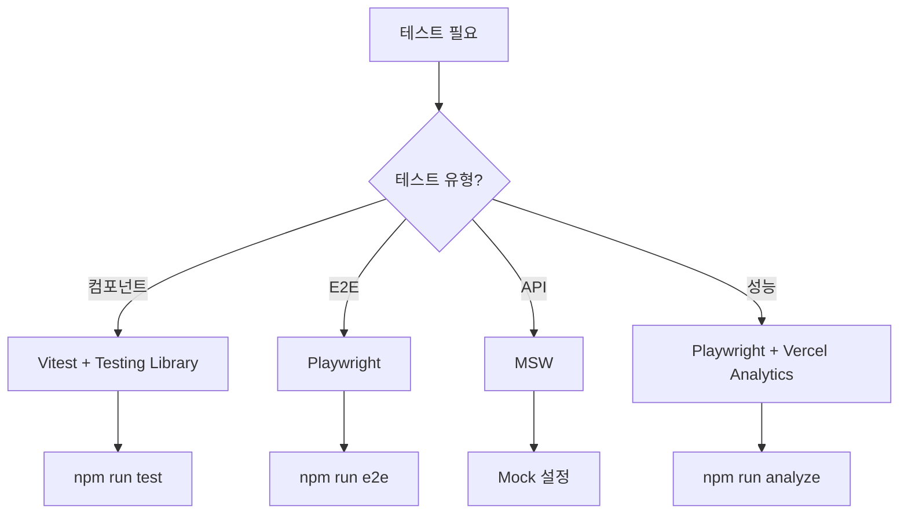
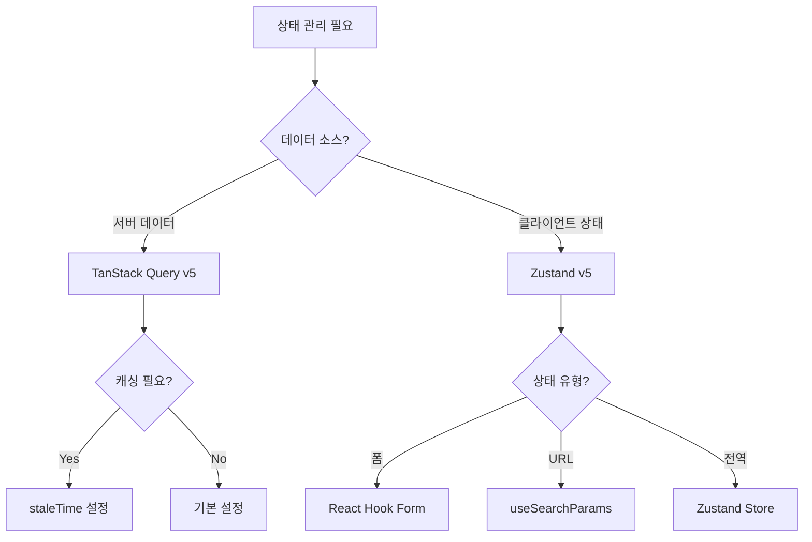
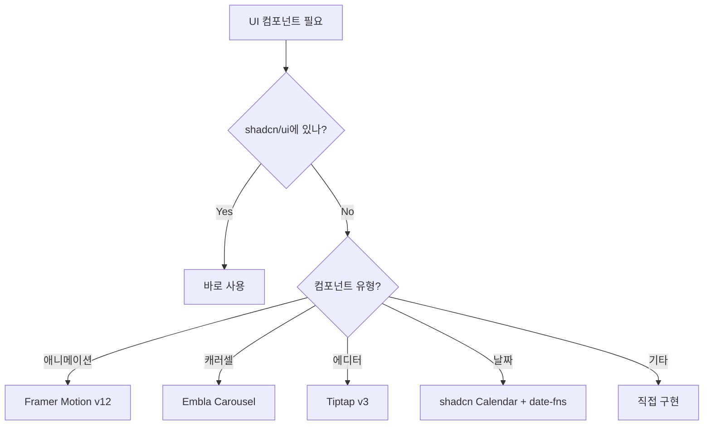
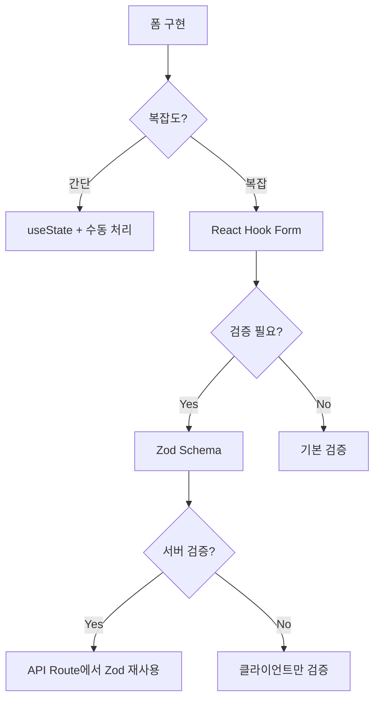
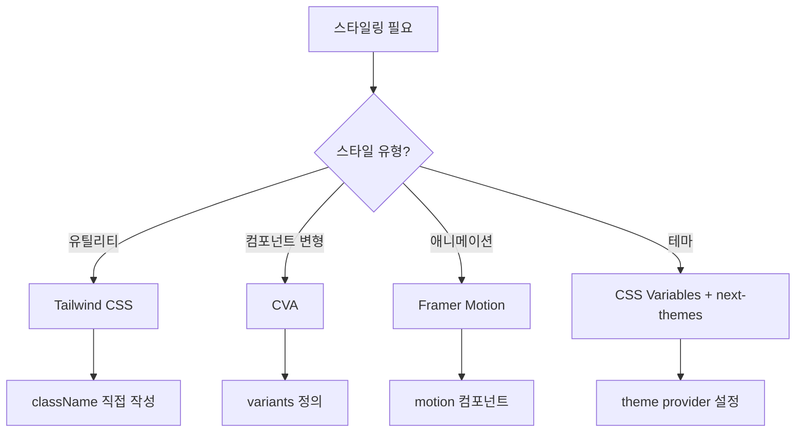
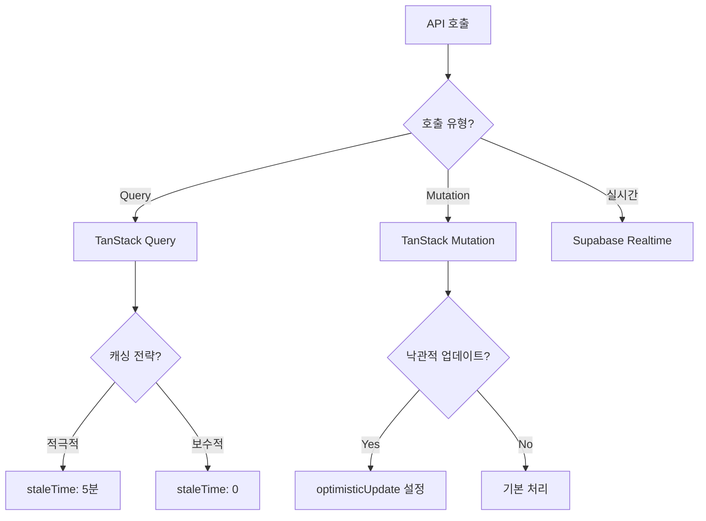
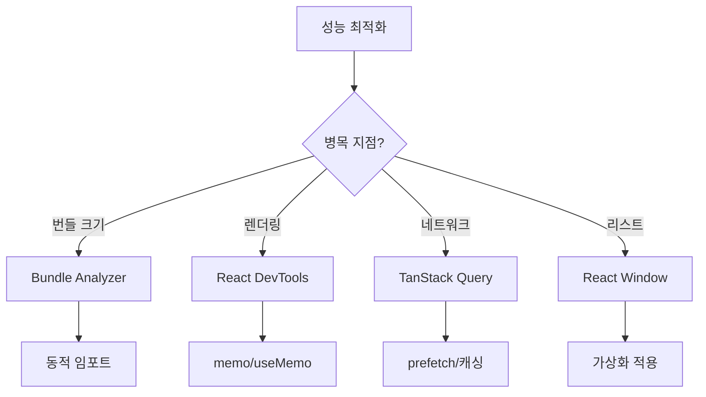
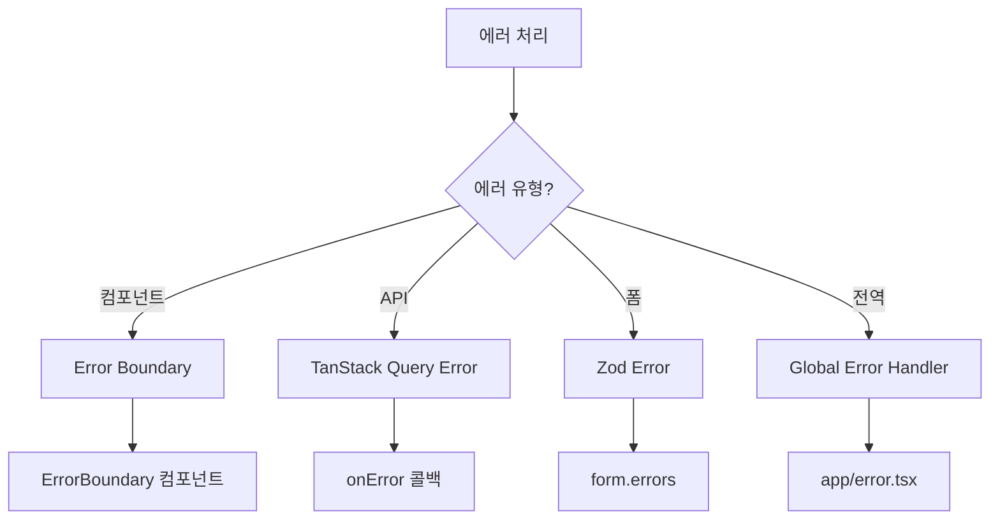
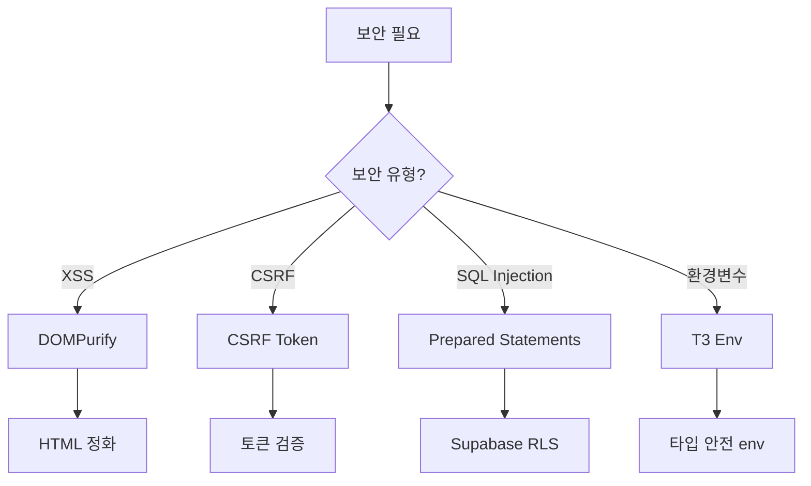
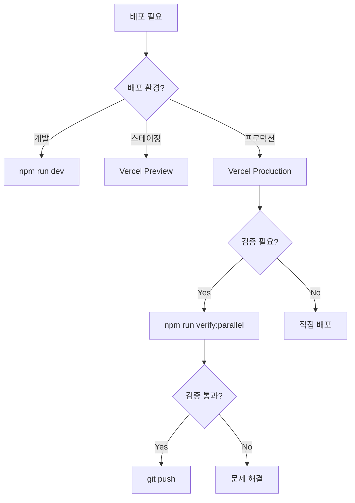

# 🔄 도구 선택 의사결정 트리

> **최종 업데이트**: 2025-02-01  
> **버전**: v1.0  
> **목적**: 개발 상황별 최적 도구 선택 가이드

---

## "테스트를 작성해야 할 때"



### 선택 기준
- **컴포넌트 테스트**: UI 동작, 사용자 상호작용 검증
- **E2E 테스트**: 전체 사용자 플로우 검증
- **API 테스트**: 네트워크 요청/응답 모킹
- **성능 테스트**: 로딩 속도, 번들 크기 분석

---

## "상태 관리가 필요할 때"



### 선택 기준
- **서버 데이터**: API 응답, DB 데이터
- **클라이언트 상태**: UI 상태, 사용자 설정
- **폼 상태**: 입력 검증, 제출 처리
- **URL 상태**: 페이지네이션, 필터링

---

## "UI 컴포넌트가 필요할 때"



### 선택 기준
- **shadcn/ui 우선**: Radix UI + Tailwind 조합
- **특수 컴포넌트**: 전문 라이브러리 사용
- **커스텀 구현**: 프로젝트 특화 요구사항

---

## "폼을 구현해야 할 때"



### 선택 기준
- **간단한 폼**: 1-2개 필드, 간단한 검증
- **복잡한 폼**: 다중 필드, 조건부 로직, 중첩 구조
- **검증 요구사항**: 타입 안전, 에러 메시지, 서버 동기화

---

## "스타일링이 필요할 때"



### 선택 기준
- **유틸리티**: 빠른 프로토타이핑, 일관성
- **변형 관리**: 버튼 크기, 색상 등 다양한 변형
- **애니메이션**: 복잡한 인터랙션, 트랜지션
- **테마**: 다크/라이트 모드, 커스텀 테마

---

## "API를 호출해야 할 때"



### 선택 기준
- **Query**: 데이터 조회, 캐싱 활용
- **Mutation**: 데이터 수정, 생성, 삭제
- **실시간**: 채팅, 알림, 라이브 업데이트

---

## "인증/인가가 필요할 때"

```mermaid
graph TD
    A[인증/인가] --> B{구현 위치?}
    B -->|클라이언트| C[Supabase Auth]
    B -->|서버| D[API Route 미들웨어]
    
    C --> E{보호 방법?}
    E -->|페이지| F[middleware.ts]
    E -->|컴포넌트| G[useAuth Hook]
    
    D --> H{검증 방법?}
    H -->|세션| I[getSession()]
    H -->|토큰| J[verifyToken()]
```

### 선택 기준
- **페이지 보호**: 미들웨어에서 리다이렉트
- **컴포넌트 보호**: 조건부 렌더링
- **API 보호**: 세션 검증 후 처리

---

## "성능 최적화가 필요할 때"



### 선택 기준
- **번들 크기**: 코드 스플리팅, 트리 쉐이킹
- **렌더링**: 메모이제이션, 최적화
- **네트워크**: 캐싱, 프리페칭, 배치 요청
- **대용량 리스트**: 가상 스크롤링

---

## "에러 처리가 필요할 때"



### 선택 기준
- **컴포넌트 에러**: 격리된 에러 처리
- **API 에러**: 재시도, 폴백 UI
- **폼 에러**: 필드별 에러 메시지
- **전역 에러**: 앱 전체 에러 페이지

---

## "보안이 필요할 때"



### 선택 기준
- **XSS 방지**: 사용자 입력 HTML 정화
- **CSRF 방지**: 토큰 기반 검증
- **SQL Injection**: RLS, Prepared Statements
- **환경변수**: 타입 안전, 검증

---

## "배포가 필요할 때"



### 선택 기준
- **개발**: 로컬 개발 서버
- **스테이징**: PR별 프리뷰 배포
- **프로덕션**: main 브랜치 자동 배포

---

## 의사결정 우선순위

### 1. 프로젝트 표준 확인
```
1. shadcn/ui 컴포넌트 존재 여부
2. 기존 패턴 활용 가능 여부
3. package.json 의존성 확인
```

### 2. 성능 vs 개발 속도
```
성능 중요: React Window, 동적 임포트, 캐싱
개발 속도: shadcn/ui, Tailwind, TanStack Query
```

### 3. 유지보수성
```
타입 안전: TypeScript, Zod
테스트 가능: Vitest, Testing Library
문서화: JSDoc, README
```

---

## 빠른 참조 체크리스트

### 새 기능 개발 시
- [ ] shadcn/ui 컴포넌트 확인
- [ ] TanStack Query 훅 작성
- [ ] Zod 스키마 정의
- [ ] 타입 정의 추가
- [ ] 테스트 작성

### 문제 해결 시
- [ ] 에러 바운더리 설정
- [ ] 로딩/에러 상태 처리
- [ ] 폴백 UI 구현
- [ ] 로깅 추가
- [ ] 모니터링 설정

### 최적화 시
- [ ] Bundle Analyzer 실행
- [ ] React DevTools 프로파일링
- [ ] Lighthouse 측정
- [ ] 코드 스플리팅 적용
- [ ] 캐싱 전략 수립

---

## 📚 관련 문서

- [기술 스택 가이드](./TECH_STACK.md) - 전체 기술 스택 개요
- [NPM Scripts 가이드](./NPM_SCRIPTS_GUIDE.md) - 스크립트 명령어
- [컴포넌트 목록](../src/components/CLAUDE.md#🧩-구현된-컴포넌트-목록) - 사용 가능 컴포넌트

---

*의사결정 시 이 문서를 참조하여 최적의 도구를 선택하세요.*