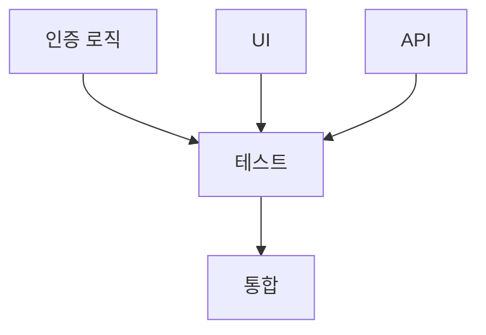

# 🎯 E2E 실행 지시서 템플릿 V7.2 - 테스트 실행 강제화

**핵심**: "사용자가 실제로 사용할 수 있는 안정적인 사이트가 아니면 완료가 아니다"
**V7 철학**: "타입 에러 0개 < 실제 작동 < 안정적 사용 가능"

## 🆕 V7.2 업데이트 - 테스트 즉시 실행 강제화
- **테스트 생성 즉시 실행**: 생성만 하고 끝내는 것 절대 금지
- **Phase 5 진입 차단**: 테스트 실행 없이는 다음 단계 진입 불가
- **실행 보고서 필수**: 실행 결과 증거 없이 완료 선언 금지
- **AI 실수 패턴 방지**: "테스트 작성 완료" 후 실행 없이 넘어가는 것 차단

## 🆕 V7.1 업데이트 - 런타임 에러 감지 강화
- **errorSafeTest**: 런타임 에러 즉시 감지 및 중단
- **withErrorContext**: 에러 발생 위치 정확히 추적
- **에러 감지 헬퍼**: Console/JS/Next.js 에러 모니터링
- **"엄한짓" 방지**: 에러 무시하고 계속 진행하는 것 차단

---

## 🚨 V7 절대 규칙 - 임시방편 = 프로젝트 파괴

### ⛔ 즉시 작업 중단 신호
| 발견 시 | ❌ 절대 금지 | ✅ 유일한 해결책 |
|----------|--------------|--------------|
| 타입 불명확 | any, unknown 사용 | 정확한 타입 확인 후 정의 |
| DB 테이블 없음 | 주석 처리, TODO | CREATE TABLE 즉시 실행 |
| API 미구현 | null/빈 배열 반환 | 완전한 구현 후 진행 |
| 함수 미완성 | TODO, 빈 함수 | 완전히 구현하거나 삭제 |
| 에러 발생 | try-catch로 숨기기 | 근본 원인 해결 |

### 📋 작업 철칙
1. **임시방편 발견 = 즉시 중단**
2. **Context 확인 없는 수정 = 금지**
3. **실제 작동 확인 없는 완료 = 거짓**
4. **프로젝트 규약 위반 = 재작업**

---

## 📁 작업 시작 시 필수 Step 1 - Task 폴더 생성

```bash
# 작업 시작 전 반드시 실행
mkdir -p tasks/$(date +%Y%m%d)_[작업명]
cd tasks/$(date +%Y%m%d)_[작업명]

# 예시
mkdir -p tasks/20250827_login_system
cd tasks/20250827_login_system
```

---

## 📋 작업 시작 시 필수 Step 2 - Task 관리 시스템

### Task 파일 구조
```
tasks/
└── 20250827_login_system/
    ├── instruction.md      # 메인 지시서
    ├── task_01_auth.md     # Task 1: 인증 구현
    ├── task_02_ui.md       # Task 2: UI 구현
    ├── task_03_api.md      # Task 3: API 구현
    ├── task_04_test.md     # Task 4: 테스트 작성
    └── dependencies.md     # Task 의존성 정의
```

### Task 의존성 정의 (dependencies.md)
```markdown
# Task 의존성 매트릭스

## 병렬 실행 가능 (의존성 없음)
- Task 01: 인증 로직
- Task 02: UI 컴포넌트
- Task 03: API 라우트

## 순차 실행 필수 (의존성 있음)
- Task 04: 테스트 (01, 02, 03 완료 후)
- Task 05: 통합 (04 완료 후)

## 의존성 다이어그램


## 실행 전략
1. **Wave 1**: Task 01, 02, 03 (병렬)
2. **Wave 2**: Task 04 (대기)
3. **Wave 3**: Task 05 (대기)
```

### 각 Task 파일 템플릿 (task_XX_[name].md)
```markdown
# Task XX: [작업명]

## 📋 Task 정보
- **난이도**: Low/Medium/High
- **예상 시간**: XX분
- **의존성**: None / Task XX 필요
- **병렬 가능**: Yes/No

## 🎯 목표
[구체적 목표]

## 📂 작업 파일
- src/components/xxx.tsx
- src/app/api/xxx/route.ts

## ✅ 완료 조건
- [ ] 기능 구현
- [ ] 테스트 통과
- [ ] 실제 작동 확인

## 🔧 구현
[실제 코드 및 수정사항]

## 🧪 검증
[테스트 명령어]
```

### Task 작성 규칙
1. **논리적 단위**: 독립적으로 테스트 가능한 단위
2. **크기 제한**: 한 Task는 최대 1시간 작업량
3. **의존성 명시**: 다른 Task 필요 여부 명확히
4. **병렬 표시**: 동시 실행 가능 여부 표시

---

## 🎯 작업 시작 시 필수 Step 3 - SuperClaude 명령어 선택

### 작업 유형별 명령어
```markdown
# 단순 버그 수정
/sc:fix --validate
"[버그명] 수정"

# 기능 구현 (중간 복잡도)
/sc:implement --e2e --validate
"[기능명] 구현"

# 복잡한 시스템 분석 및 구현
/sc:implement --e2e --validate --think-hard --seq
"[복잡한 기능] 완전 구현"

# 아키텍처 레벨 작업
/sc:analyze --think-hard --seq --c7 --validate
"[시스템 전체] 분석 및 개선"

# 성능 최적화
/sc:improve --perf --think --validate
"[기능명] 성능 개선"

# 보안 점검 및 수정
/sc:analyze --security --ultrathink --validate
"[영역] 보안 감사"
```

### Flag 선택 기준
| Flag | 언제 사용 | 효과 |
|------|----------|------|
| `--validate` | 항상 필수 | 안전 검증 |
| `--e2e` | 사용자 기능 작업 | E2E 테스트 중심 |
| `--think` | 중간 복잡도 | 4K 토큰 분석 |
| `--think-hard` | 높은 복잡도 | 10K 토큰 분석 |
| `--ultrathink` | 시스템 재설계 | 32K 토큰 분석 |
| `--seq` | 다단계 문제 | Sequential 분석 |
| `--c7` | 라이브러리 참조 | Context7 문서 |
| `--evidence` | 근거 필요 | 증거 기반 작업 |
| `--perf` | 성능 개선 | 최적화 중심 |
| `--security` | 보안 작업 | 보안 분석 |
| `--uc` | 토큰 부족 시 | 압축 모드 |

### 작업 난이도별 템플릿

#### 🟢 Level 1: 단순 수정 (5분 이내)
```bash
/sc:fix --validate
"[간단한 버그] 수정"

# Phase 1: 문제 확인 및 수정
# Phase 2: 검증
```

#### 🟡 Level 2: 기능 구현 (30분 이내)
```bash
/sc:implement --e2e --validate --think
"[기능명] 구현"

# Phase 0: Context 파악
# Phase 1: 현재 상태
# Phase 2: 구현
# Phase 3: E2E 테스트
# Phase 4: 검증
```

#### 🔴 Level 3: 복잡한 작업 (1시간 이상)
```bash
/sc:implement --e2e --validate --think-hard --seq --c7
"[복잡한 시스템] 완전 구현"

# Phase 0: Context 깊은 분석
# Phase 1-5: 단계별 구현
# 각 Phase마다 안정성 체크포인트
# 테스트 필수
# 전체 플로우 검증
```

#### ⚫ Level 4: 시스템 레벨 (수시간)
```bash
/sc:analyze --ultrathink --seq --c7 --validate --evidence
"[전체 시스템] 재설계"

# 다중 Phase (10개 이상)
# Wave 모드 자동 활성화
# 모든 체크포인트 필수
```

---

## ⚠️ 작업 시작 시 필수 Step 4 - 환경 준비

```bash
# 1. 포트 정리 (필수!)
netstat -ano | findstr :300
taskkill /F /PID [프로세스ID]

# 2. 프로젝트 규약 확인
cat docs/CLAUDE.md | head -50
cat docs/CONTEXT_BRIDGE.md | grep "반복 실수"

# 3. 기존 패턴 파악
grep -r "import.*@/types" src/ | head -5
grep -r "createClient" src/lib/supabase/ | head -5

# 4. 환경 준비
npm run verify:parallel  # 현재 상태 확인
npm run types:check 2>&1 | head -20  # 타입 에러 확인
```

---

## 🎬 사용자 시나리오 (E2E Workflow)

```markdown
## 필수 검증 시나리오
1. **시작**: localhost:3000 접속 → 정상 로드
2. **인증**: 테스트 로그인 → 세션 생성 확인
3. **핵심 기능**: [기능명] 실행 → 실제 동작
4. **데이터 확인**: DB 저장 → 새로고침 후 유지
5. **종료**: 로그아웃 → 세션 정리 확인

## 실패 허용 불가
- Console 에러 1개라도 → 미완료
- 기능 작동 안 함 → 미완료
- 새로고침 후 초기화 → 미완료
```

---

## 🔍 Phase 0: Context 파악 (V7 신규 필수)

```bash
# 1. 프로젝트 구조 이해
ls -la src/app/api/  # API 라우트 확인
ls -la src/components/features/  # 컴포넌트 확인
cat package.json | grep "scripts"  # 사용 가능한 명령어

# 2. 프로젝트 규약 확인
cat src/types/CLAUDE.md  # 타입 시스템 규약
cat src/lib/supabase/CLAUDE.md  # Supabase 패턴
cat src/app/api/CLAUDE.md  # API 패턴

# 3. 기존 구현 패턴 분석
# 예: 다른 API는 어떻게 구현되었나?
cat src/app/api/user/profile/route.ts | head -30

# 4. 연관 파일 매핑
# 작업할 기능과 연결된 모든 파일 파악
find src -name "*login*" -type f
find src -name "*auth*" -type f

# ✅ Context 체크리스트
- [ ] 프로젝트 규약 이해 완료
- [ ] 기존 패턴 파악 완료  
- [ ] 연관 파일 목록 작성
- [ ] DB 스키마 확인 완료
- [ ] 에러 감지 시스템 확인 (e2e/helpers/error-detector.ts)
- [ ] 기존 에러 처리 패턴 분석
```

---

## 📂 Phase별 E2E Workflow 실행

### Phase 1: 현재 상태 정확히 파악

```bash
# Step 1: 서버 실행 및 초기 상태
npm run dev

# Step 2: 브라우저 테스트 (F12 Console 열고)
# localhost:3000 접속
# → 페이지 로드 성공?
# → Console 에러 확인
# → Network 탭 실패 요청 확인

# Step 3: 기능 테스트
# 실제 클릭/입력 테스트
# → 어떤 에러 발생?
# → 어느 단계에서 막힘?

# Step 4: 문제 분류
echo "=== 문제 유형 분류 ==="
echo "[ ] Frontend 렌더링 문제"
echo "[ ] API 응답 문제"  
echo "[ ] DB 연결 문제"
echo "[ ] 인증/세션 문제"
```

### 🚨 안정성 체크포인트 #1

```bash
# 임시방편 감지
grep -r "any" src/ --include="*.ts" --include="*.tsx" | grep -v "// @ts-" | head -10
grep -r "TODO" src/ | head -10
grep -r "console.log" src/ | grep -v "test" | head -10

# ❌ 발견 시 → Phase 0으로 돌아가서 Context 재확인
# ✅ 없으면 → Phase 2 진행
```

### Phase 2: E2E 관점 문제 해결

```markdown
## 2.1 사용자 플로우 역추적
사용자가 버튼 클릭
→ onClick 이벤트
→ API 호출 (/api/xxx)
→ DB 쿼리 실행
→ 응답 반환
→ UI 업데이트

## 2.2 각 단계별 수정
### Frontend (문제 있을 때만)
- 파일: src/components/xxx.tsx
- 수정 전: [문제 코드]
- 수정 후: [해결 코드]
- 규약 준수: @/types 임포트 확인

### API Route (문제 있을 때만)  
- 파일: src/app/api/xxx/route.ts
- 수정 전: [문제 코드]
- 수정 후: [해결 코드]
- 규약 준수: 세션 체크 패턴 확인

### Database (문제 있을 때만)
- 테이블 생성 SQL 실행
- RLS 정책 추가
- 관계 설정
```

### 🚨 안정성 체크포인트 #2

```bash
# 수정 후 즉시 검증
npm run types:check 2>&1 | grep "error TS"

# 실제 작동 테스트
# 1. 서버 재시작 (중요!)
# 2. 브라우저 새로고침
# 3. 기능 재테스트
# 4. Console 에러 0개 확인

# ❌ 에러 있음 → 수정 재시도
# ✅ 정상 작동 → Phase 3 진행
```

### Phase 3: 안정성 확보

```markdown
## 3.1 엣지 케이스 처리
- [ ] 네트워크 느림/끊김
- [ ] 중복 클릭 방지
- [ ] 에러 메시지 사용자 친화적
- [ ] 로딩 상태 표시

## 3.2 데이터 무결성
- [ ] 트랜잭션 처리
- [ ] 중복 방지
- [ ] 유효성 검증 (Zod)

## 3.3 보안 점검
- [ ] 인증 확인
- [ ] 권한 검증
- [ ] XSS 방지
- [ ] SQL Injection 방지

## 3.4 런타임 에러 방어 (신규)
- [ ] Console 에러 모니터링 설정
- [ ] JavaScript 에러 캐치 구현
- [ ] Error Boundary 설정 (React)
- [ ] Next.js 에러 페이지 구성
```

### 🚨 안정성 체크포인트 #3

```bash
# 전체 플로우 테스트
echo "=== E2E 전체 플로우 검증 ==="
echo "1. 로그아웃 상태에서 시작"
echo "2. 로그인 → 기능 사용 → 데이터 저장"
echo "3. 새로고침 → 데이터 유지 확인"
echo "4. 다른 브라우저 → 동일 계정 → 데이터 동일"
echo "5. 로그아웃 → 재로그인 → 데이터 유지"

# 모두 통과해야 Phase 4 진행
```

---

## 🧪 Phase 4: 테스트 작성 및 즉시 실행 (필수!)

### ⚠️ AI가 자주 하는 실수 (이것만큼은 절대 금지!)
```markdown
🤖 AI 실수 패턴:
1. "테스트 파일을 생성했습니다" → Phase 5로 이동 ❌
2. "테스트를 작성했습니다. 이제 검증을..." → 실행 없이 넘어감 ❌
3. "e2e/test.spec.ts 파일 생성 완료" → 실행 안 함 ❌
4. "테스트 코드는 다음과 같습니다..." → 보여만 주고 실행 안 함 ❌

✅ 올바른 AI 행동:
1. 테스트 파일 생성
2. "이제 테스트를 실행하겠습니다"
3. npx playwright test 실행
4. 실행 결과 보고
5. 실패 시 수정 및 재실행
```

### ⛔ STOP! 테스트 생성만 하면 미완료
```markdown
❌ 테스트 파일 생성만 = 작업 미완료
❌ "테스트 작성 완료" 후 Phase 5로 이동 = 실패
✅ 테스트 생성 → 즉시 실행 → 통과 확인 = 완료
```

### 🔴 필수 실행 워크플로우
```bash
# AI는 반드시 다음 순서로 실행해야 함:
1. 테스트 파일 생성
2. 즉시 실행: npx playwright test [파일명]
3. 실패 시 수정
4. 재실행하여 통과 확인
5. 실행 로그와 함께 완료 보고
```

### 🤖 자동 실행 강제화
```bash
# 테스트 파일 생성 직후 바로 실행하는 스크립트
cat > run-test-immediately.sh << 'EOF'
#!/bin/bash
TEST_FILE=$1
echo "🔴 테스트 파일 생성 감지: $TEST_FILE"
echo "⚡ 3초 후 자동 실행됩니다..."
sleep 3
echo "🚀 테스트 실행 시작"
npx playwright test $TEST_FILE --project=chromium
RESULT=$?
if [ $RESULT -ne 0 ]; then
  echo "❌ 테스트 실패! 수정 필요"
  exit 1
else
  echo "✅ 테스트 통과!"
fi
EOF

# AI는 테스트 파일 생성 후 즉시 이 스크립트 실행
chmod +x run-test-immediately.sh
./run-test-immediately.sh e2e/[feature].spec.ts
```

### 4.1 작동 확인된 기능 테스트로 보호

```typescript
// 컴포넌트 테스트
// src/components/features/[feature]/[Component].test.tsx
import { render, screen, fireEvent, waitFor } from '@testing-library/react'
import { [Component] } from './[Component]'

describe('[Component] E2E 동작', () => {
  it('사용자가 실제로 사용할 수 있다', async () => {
    render(<[Component] />)
    
    // 사용자 시나리오 그대로 테스트
    const button = screen.getByRole('button')
    fireEvent.click(button)
    
    await waitFor(() => {
      // 실제 동작 검증
      expect(screen.getByText('성공')).toBeInTheDocument()
    })
    
    // Console 에러 없음 확인
    expect(console.error).not.toHaveBeenCalled()
  })
})
```

```typescript
// API 테스트
// src/app/api/[endpoint]/route.test.ts
import { POST } from './route'

describe('API E2E 동작', () => {
  it('실제 요청을 처리한다', async () => {
    const req = new Request('http://localhost', {
      method: 'POST',
      body: JSON.stringify({ /* 실제 데이터 */ })
    })
    
    const res = await POST(req)
    const data = await res.json()
    
    expect(res.status).toBe(200)
    expect(data).toHaveProperty('success', true)
  })
})
```

### 🔴 4.2 런타임 에러 감지가 강화된 E2E 테스트

```typescript
// 에러 감지가 강화된 E2E 테스트 (권장)
// e2e/[feature].spec.ts
import { errorSafeTest, withErrorContext } from './helpers/error-detector'

// 일반 테스트 대신 errorSafeTest 사용
errorSafeTest('[기능명] 전체 플로우 (에러 감지)', async ({ page, errorDetector }) => {
  // 1. 시작 - 에러 컨텍스트 추적
  await withErrorContext(errorDetector, '홈페이지 접속', async () => {
    await page.goto('/')
    await page.waitForLoadState('networkidle')
  })
  
  // 2. 로그인 - 런타임 에러 즉시 감지
  await withErrorContext(errorDetector, '테스트 로그인', async () => {
    await page.click('text=테스트 로그인')
    await page.waitForURL('/dashboard')
  })
  
  // 3. 기능 사용 - Console/JS 에러 모니터링
  await withErrorContext(errorDetector, '핵심 기능 실행', async () => {
    await page.click('[data-testid="feature-button"]')
    // 에러 발생 시 즉시 테스트 중단
    await expect(page.locator('.success-message')).toBeVisible()
  })
  
  // 4. 데이터 확인 - 안정성 검증
  await withErrorContext(errorDetector, '데이터 영속성 확인', async () => {
    await page.reload()
    await expect(page.locator('.saved-data')).toBeVisible()
  })
})

// 기존 Playwright 테스트도 유지 (호환성)
import { test, expect } from '@playwright/test'

test('[기능명] 전체 플로우 (기본)', async ({ page }) => {
  // 1. 시작
  await page.goto('/')
  
  // 2. 로그인
  await page.click('text=테스트 로그인')
  await page.waitForURL('/dashboard')
  
  // 3. 기능 사용
  await page.click('[data-testid="feature-button"]')
  await expect(page.locator('.success-message')).toBeVisible()
  
  // 4. 데이터 확인
  await page.reload()
  await expect(page.locator('.saved-data')).toBeVisible()
})
```

### 🛡️ 4.3 에러 감지 헬퍼 설정 (필수)

```typescript
// e2e/helpers/error-detector.ts 
// 런타임 에러를 즉시 감지하여 "엄한짓" 방지
export class ErrorDetector {
  async attachToPage(page: Page, testName: string) {
    // 1. Console 에러 감지
    page.on('console', msg => {
      if (msg.type() === 'error') {
        throw new Error(`🔴 Console 에러: ${msg.text()}`)
      }
    })
    
    // 2. JavaScript 런타임 에러 감지
    page.on('pageerror', exception => {
      throw new Error(`🔴 JS 런타임 에러: ${exception.message}`)
    })
    
    // 3. Next.js 에러 오버레이 감지
    page.on('load', async () => {
      const errorOverlay = await page.locator('[data-nextjs-dialog]').count()
      if (errorOverlay > 0) {
        const errorText = await page.locator('[data-nextjs-dialog]').textContent()
        throw new Error(`🔴 Next.js 에러: ${errorText}`)
      }
    })
  }
}
```

### 📊 4.4 에러 감지 효과 비교

```markdown
## 일반 테스트 vs 에러 감지 테스트

### ❌ 일반 테스트 (문제점)
- Console 에러 무시하고 계속 진행
- JavaScript 런타임 에러 감지 못함
- 테스트는 통과하지만 실제로는 에러 존재
- "엄한짓" - 잘못된 요소 찾기 시도

### ✅ 에러 감지 테스트 (해결)
- Console 에러 즉시 감지 및 중단
- JavaScript 에러 즉시 감지 및 중단
- Next.js 에러 오버레이 감지
- 정확한 에러 위치와 컨텍스트 제공
```

### 🔴 4.5 테스트 즉시 실행 (건너뛸 수 없는 단계!)

```bash
# ⚡ 테스트 생성 후 즉시 실행 - 이 단계를 건너뛰면 작업 미완료!

echo "=== 테스트 실행 시작 (필수) ==="

# 1단계: 컴포넌트 테스트 실행
npm run test:component [Component]
# 실패? → 수정 → 재실행 → 통과까지 반복

# 2단계: API 테스트 실행
npm run test:api [endpoint]  
# 실패? → 수정 → 재실행 → 통과까지 반복

# 3단계: E2E 테스트 실행 (가장 중요!)
npx playwright test e2e/[feature].spec.ts --project=chromium
# 실패? → 수정 → 재실행 → 통과까지 반복

# 4단계: 에러 감지 테스트 실행
npx playwright test e2e/error-safe-[feature].spec.ts
# Console 에러 1개라도? → 수정 → 재실행 → 0개까지 반복

echo "=== 모든 테스트 통과 확인 완료 ==="
```

### 🚫 Phase 5 진입 차단 게이트
```markdown
## ⛔ 다음 중 하나라도 해당하면 Phase 5 진입 금지:
- [ ] 테스트 파일만 생성하고 실행 안 함
- [ ] 테스트 실행했지만 실패 무시
- [ ] "나중에 수정하겠다"며 진행
- [ ] 실행 로그 없이 "통과했다"고만 보고

## ✅ Phase 5 진입 조건 (모두 충족 필수):
- [x] 모든 테스트 파일 생성 완료
- [x] 모든 테스트 실행 완료
- [x] 모든 테스트 통과 (0 failures)
- [x] Console 에러 0개 확인
- [x] 실행 로그 제공 완료
```

### 📝 4.6 E2E 테스트 작성 가이드라인

```markdown
## 테스트 작성 시 필수 체크리스트
- [ ] errorSafeTest 사용 (런타임 에러 감지)
- [ ] withErrorContext로 각 단계 감싸기
- [ ] Console 에러 모니터링
- [ ] JavaScript 런타임 에러 감지
- [ ] Next.js 에러 오버레이 체크
- [ ] 에러 발생 시 즉시 중단 확인
- [ ] 정확한 에러 위치 기록

## 테스트 파일 구조
e2e/
├── helpers/
│   └── error-detector.ts     # 에러 감지 헬퍼 (필수)
├── [feature].spec.ts          # 기능별 테스트
├── error-safe-[feature].spec.ts  # 에러 감지 강화 테스트
└── demo-error-detection.js    # 에러 감지 데모
```

---

### 🔴 4.7 필수 테스트 실행 보고서 (Phase 5 진입 전 필수!)

```markdown
# 테스트 실행 완료 보고서
## AI는 다음 보고서를 작성해야 Phase 5 진입 가능

### 📋 테스트 생성 현황
- [ ] 컴포넌트 테스트 파일: [파일경로]
- [ ] API 테스트 파일: [파일경로]
- [ ] E2E 테스트 파일: [파일경로]

### 🚀 테스트 실행 결과
#### 1. 컴포넌트 테스트
- 실행 명령: `npm run test:component [name]`
- 실행 시간: [시간]
- 결과: ✅ Pass / ❌ Fail
- 실패 시 수정 내용: [수정 내역]

#### 2. API 테스트  
- 실행 명령: `npm run test:api [name]`
- 실행 시간: [시간]
- 결과: ✅ Pass / ❌ Fail
- 실패 시 수정 내용: [수정 내역]

#### 3. E2E 테스트
- 실행 명령: `npx playwright test [file]`
- 실행 시간: [시간]
- 결과: ✅ Pass / ❌ Fail
- Console 에러: 0개 확인 ✅

### 📊 최종 확인
- 모든 테스트 통과: ✅
- Console 에러 없음: ✅
- 실행 증거 제공: ✅

### 🎯 Phase 5 진입 승인
위 모든 항목이 완료되어 Phase 5 진입을 승인합니다.
```

---

## ✅ Phase 5: 최종 검증

### 완료 조건 체크리스트

```markdown
## ❌ 이것은 완료가 아님
- TypeScript 에러 0개 (하지만 실제 작동 안 함)
- 빌드 성공 (하지만 사용자가 쓸 수 없음)
- 테스트 통과 (하지만 실제 환경에서 안 됨)

## ✅ 이것이 진짜 완료 
- [ ] 사용자가 실제로 기능을 사용할 수 있음
- [ ] 새로고침 후에도 데이터 유지됨
- [ ] 다른 브라우저에서도 동일하게 작동
- [ ] Console 에러 0개 (경고 포함)
- [ ] Network 실패 요청 0개
- [ ] 모든 엣지 케이스 처리됨
- [ ] 테스트 코드로 보호됨
- [ ] **에러 감지 테스트 통과** (errorSafeTest)
- [ ] **런타임 에러 0개 검증**
- [ ] 프로젝트 규약 100% 준수
```

### 최종 E2E 검증 시퀀스

```bash
# Step 1: 클린 상태 시작
npm run db:reset  # DB 초기화
npm run dev  # 서버 시작

# Step 2: 전체 사용자 플로우
echo "1. 신규 사용자로 회원가입"
echo "2. 로그인"
echo "3. 모든 주요 기능 사용"
echo "4. 데이터 생성/수정/삭제"
echo "5. 로그아웃"
echo "6. 재로그인 → 데이터 확인"

# Step 3: 크로스 브라우저
echo "Chrome, Firefox, Safari에서 동일 테스트"

# Step 4: 성능 체크
echo "- 페이지 로드 < 3초"
echo "- API 응답 < 1초"
echo "- 부드러운 UI 전환"
```

---

## 🔄 문제 발생 시 대응

### 에러 타입별 즉시 대응

```markdown
## Console 에러
1. 정확한 에러 메시지 복사
2. 관련 파일 즉시 확인
3. 스택 트레이스 따라가기
4. 근본 원인 수정 (임시방편 금지)

## API 에러
1. Network 탭에서 실패 요청 확인
2. Request/Response 상세 확인
3. 서버 로그 확인
4. DB 쿼리 직접 테스트

## 타입 에러
1. 정확한 타입 확인 (any 금지)
2. @/types에서 기존 타입 찾기
3. 없으면 새로 정의
4. 관련 파일 모두 업데이트
```

---

## 🚨 작업 종료 시 필수

```bash
# 1. 포트 정리
Ctrl + C  # 서버 종료
netstat -ano | findstr :300
taskkill /F /PID [모든 PID]

# 2. 검증 스크립트 실행
npm run verify:parallel
npm run types:check
npm run security:test

# 3. Git 상태 확인
git status
git diff --stat

# 4. 문서 업데이트 확인
echo "다음 문서 업데이트 필요한가?"
echo "- docs/CONTEXT_BRIDGE.md (새로운 반복 실수?)"
echo "- docs/PROJECT.md (이슈 해결?)"
echo "- 해당 폴더의 CLAUDE.md (패턴 변경?)"
```

---

## 📝 사용 예시 (작업별 지시서)

### 예시 1: 단순 버그 수정
```markdown
/sc:fix --validate
"로그인 버튼 클릭 안 되는 버그 수정"

# 로그인 버튼 버그 수정

## Phase 1: 문제 확인
- Console 에러 확인
- 이벤트 리스너 확인

## Phase 2: 수정 및 검증
- onClick 핸들러 수정
- 실제 클릭 테스트

## Phase 3: 테스트 생성 및 즉시 실행
- 테스트 파일 생성
- ⚡ npx playwright test login-button.spec.ts 즉시 실행
- 실행 결과 확인 및 통과 보고
```

### 예시 2: 중간 복잡도 기능
```markdown
/sc:implement --e2e --validate --think
"YouTube 검색 기능 구현"

# YouTube 검색 기능 E2E 구현

## Phase 0: Context 파악
- API 라우트 패턴 확인
- React Query 훅 확인

## Phase 1-3: 구현
[상세 구현 과정]

## Phase 4: 테스트 작성 및 즉시 실행
- E2E 테스트 파일 생성
- ⚡ npx playwright test youtube-search.spec.ts 즉시 실행
- 실패 시 수정 → 재실행 → 통과까지 반복
- 실행 보고서 작성

## Phase 5: 최종 검증
[테스트 통과 후에만 진입]
```

### 예시 3: 복잡한 시스템 작업
```markdown
/sc:implement --e2e --validate --think-hard --seq --c7
"결제 시스템 전체 구현"

# 결제 시스템 완전 구현

## Phase 0: 깊은 Context 분석
- 결제 프로세스 전체 이해
- Stripe API 문서 참조
- DB 스키마 분석

## Phase 1-N: 단계별 구현
[각 Phase마다 안정성 체크포인트]
```

### 예시 4: 시스템 레벨 재설계
```markdown
/sc:analyze --ultrathink --seq --c7 --validate --evidence
"전체 인증 시스템 재설계"

# 인증 시스템 전면 재설계

[Wave 모드 자동 활성화]
[10개 이상 Phase]
[모든 체크포인트 필수]
```

---

## 📊 V7 핵심 원칙 요약

1. **안정적 사이트 > 기술적 완성** - 사용자가 쓸 수 있어야 완료
2. **E2E Workflow 우선** - 전체 플로우가 작동해야 함
3. **임시방편 절대 금지** - 발견 즉시 작업 중단
4. **Context 파악 필수** - 프로젝트 규약 이해 후 작업
5. **테스트로 보호** - 작동하는 모든 코드는 테스트 필수
6. **안정성 체크포인트** - 각 Phase마다 검증
7. **Task 문서화 필수** - /tasks 폴더에 모든 작업 기록
8. **의존성 관리** - 병렬/순차 실행 전략 명시

---

*V7: 안정적으로 사용 가능한 사이트 구현 | E2E Workflow | 임시방편 금지 | 테스트 필수*
*핵심: 기술적 성공 < 실제 작동 < 안정적 사용*