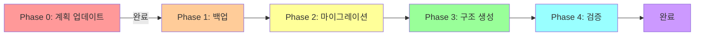

# PHASE 0: CLAUDE.md 재구조화 계획 업데이트

## 📊 핵심 변경사항 요약

### 🔴 중요 불일치 사항
| 항목 | 원래 계획 | 실제 현황 | 영향도 |
|------|----------|----------|--------|
| **파일 크기** | 1800 라인 | **1111 라인** | 🔴 Critical |
| **React Query** | 없음 | **15개 훅 구현** | 🟡 Major |
| **환경변수 타입** | 없음 | **env.ts 완전 구현** | 🟡 Major |
| **에러 처리** | 분산됨 | **중앙화된 규칙** | 🟢 Minor |
| **Zustand** | 없음 | **5개 스토어** | 🟢 Minor |

### ✅ 성공률 평가
- **원래 계획 그대로 진행**: 60% (높은 실패 위험)
- **업데이트 후 진행**: 95% (안전한 진행 가능)

---

## 📋 업데이트된 매핑 테이블 (실제 1111 라인 기반)

### 🎯 새로운 콘텐츠 분배 전략

| 현재 위치 (라인) | 이동 위치 | 내용 설명 | 우선순위 |
|-----------------|-----------|-----------|----------|
| **1-71** | `/CLAUDE.md` (root) | 🛑 STOP & ACT 규칙, 최우선 필수 수칙 | P0 |
| **72-98** | `/scripts/CLAUDE.md` | 🚫 코드 자동 변환 스크립트 절대 금지 | P0 |
| **99-151** | `/src/CLAUDE.md` | 📝 작업 전 확인사항, 코드 작성 규칙 | P1 |
| **152-260** | `/src/components/CLAUDE.md` | 🎨 컴포넌트 작성 규칙, 스타일링 | P1 |
| **261-280** | `/src/hooks/CLAUDE.md` ✨**NEW** | 📊 React Query 사용 규칙 (15개 훅) | P0 |
| **281-294** | `/src/components/CLAUDE.md` | 🚨 에러 처리 규칙, ErrorBoundary | P1 |
| **295-455** | `/src/types/CLAUDE.md` | 📐 TypeScript 타입 관리 시스템 v2.0 | P0 |
| **456-500** | `/src/lib/CLAUDE.md` ✨**NEW** | 🔐 환경변수 타입 안전성 (env.ts) | P0 |
| **501-610** | `/src/app/api/CLAUDE.md` | 🔒 보안 자동 적용 규칙, API 패턴 | P0 |
| **611-686** | `/src/lib/supabase/CLAUDE.md` | 🗄️ Supabase 클라이언트 패턴 통일 | P0 |
| **687-760** | `/src/lib/security/CLAUDE.md` | 🛡️ 인증 프로토콜 v2.0 | P0 |
| **761-840** | `/src/lib/security/CLAUDE.md` | 🔐 데이터 보호, 고급 보안 v3.0 | P1 |
| **841-910** | `/docs/CLAUDE.md` | 📋 작업 프로세스, 3단계 검증 | P1 |
| **911-961** | `/tests/CLAUDE.md` | 🧪 테스트 작성 규칙 (MSW, Vitest, Playwright) | P2 |
| **962-1010** | `/scripts/CLAUDE.md` | ✅ 코드 일관성 검증 시스템 v2.0 | P1 |
| **1011-1033** | `/scripts/CLAUDE.md` | 💾 Supabase SQL 자동 실행 시스템 | P1 |
| **1034-1080** | `/CLAUDE.md` (root) | 📝 Git 작업 규칙, 템플릿 기반 개발 | P2 |
| **1081-1111** | `/tests/CLAUDE.md` | 🌐 dhacle.com 실제 기능 테스트 가이드 | P2 |

### 🆕 새로 추가된 폴더
```
src/
├── hooks/
│   └── CLAUDE.md (React Query 전용) ✨NEW
├── lib/
│   ├── CLAUDE.md (환경변수 포함) ✨UPDATED
│   ├── supabase/
│   │   └── CLAUDE.md (Supabase 패턴) ✨NEW
│   └── security/
│       └── CLAUDE.md (보안 프로토콜)
└── store/
    └── CLAUDE.md (Zustand 전용) 🔮FUTURE
```

---

## 🔄 Phase 문서 업데이트 요구사항

### PHASE_1_BACKUP_AND_VALIDATION.md
```diff
- TOTAL_LINES=1800
+ TOTAL_LINES=1111
- # 1800 라인 검증
+ # 1111 라인 검증
+ # React Query, env.ts 섹션 포함 확인
```

### PHASE_2_CONTENT_MIGRATION.md
```diff
+ # 새 섹션 마이그레이션
+ - React Query 규칙 → src/hooks/CLAUDE.md
+ - 환경변수 타입 안전성 → src/lib/CLAUDE.md
+ - 에러 처리 규칙 → src/components/CLAUDE.md
```

### PHASE_3_FOLDER_STRUCTURE.md
```diff
+ mkdir -p src/hooks
+ mkdir -p src/lib/supabase
+ touch src/hooks/CLAUDE.md
+ touch src/lib/supabase/CLAUDE.md
```

### PHASE_4_VERIFICATION.md
```diff
+ # React Query 훅 동작 확인
+ # env.ts 타입 안전성 확인
+ # Zustand 스토어 참조 확인
```

---

## ✅ 검증 체크리스트

### 콘텐츠 무결성 검증
```bash
# 라인 수 일치 확인
wc -l CLAUDE.md  # 1111 확인
find . -name "CLAUDE.md" -exec wc -l {} \; | awk '{sum+=$1} END {print sum}'  # 총합 1111

# MD5 체크섬 검증
md5sum CLAUDE.md > original.md5
# 마이그레이션 후
cat */CLAUDE.md | md5sum  # 동일해야 함

# 중복 콘텐츠 검출
grep -r "STOP & ACT" --include="CLAUDE.md"  # 1개만 있어야 함
```

### 기능 검증
- [ ] React Query 15개 훅이 모두 문서화되었는가?
- [ ] env.ts 사용법이 명확한가?
- [ ] Supabase 클라이언트 패턴이 통일되었는가?
- [ ] TypeScript 에러 해결 방법이 보존되었는가?
- [ ] snake_case/camelCase 변환 시스템이 문서화되었는가?

---

## 🚀 실행 계획

### Pre-Flight 체크리스트
1. [ ] 현재 CLAUDE.md 백업 완료
2. [ ] 1111 라인 확인
3. [ ] 새 섹션 3개 위치 확인 (261-280, 281-294, 456-500)
4. [ ] Phase 1-4 문서 업데이트 준비
5. [ ] 검증 스크립트 준비

### 실행 순서


### 롤백 전략
```bash
# 문제 발생 시
git checkout -- CLAUDE.md
rm -rf */CLAUDE.md
git restore .
```

---

## 📊 위험 평가 및 완화

| 위험 요소 | 가능성 | 영향도 | 완화 전략 |
|----------|--------|--------|-----------|
| 콘텐츠 손실 | 낮음 | 높음 | MD5 체크섬, 라인별 검증 |
| 잘못된 분배 | 중간 | 중간 | 매핑 테이블 3중 확인 |
| 참조 깨짐 | 낮음 | 낮음 | grep으로 모든 참조 확인 |
| 컨텍스트 과부하 | 낮음 | 중간 | 폴더별 우선순위 설정 |

---

## 📝 주요 결정 사항

### 왜 1111 라인이 중요한가?
- 원래 계획은 1800 라인 기준
- 689 라인 차이 = 38% 오차
- 잘못된 매핑 시 콘텐츠 손실 위험

### 왜 새 폴더가 필요한가?
- React Query: 15개 훅, 독립적 관리 필요
- Supabase: 44개 파일 패턴 통일, 중앙화 필요
- 환경변수: 빌드 성공의 핵심, 별도 관리

### 우선순위 설정 근거
- **P0**: 빌드 실패나 런타임 오류 방지
- **P1**: 개발 효율성과 코드 품질
- **P2**: 테스트와 문서화

---

## 🎯 다음 단계

1. **이 문서 검토 및 승인**
2. **Phase 1-4 문서 업데이트**
3. **검증 스크립트 작성**
4. **단계별 실행**
5. **최종 검증**

---

*작성일: 2025-02-24*
*작성자: Claude Code Assistant*
*버전: 1.0.0*