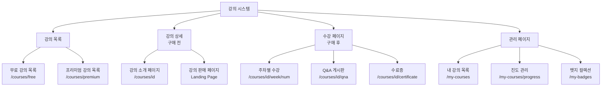
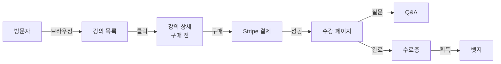
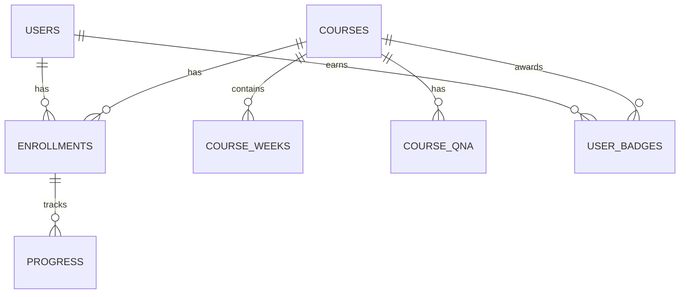

# 📚 디하클 강의 시스템 페이지 개념 정리서
*최종 업데이트: 2025-01-12*

## 🎯 문서 목적
강의 시스템 내 각 페이지의 목적과 역할을 명확히 구분하여 개발 시 혼동을 방지

## 🗺️ 페이지 구조 개요



## 📑 페이지별 상세 정의

### 1️⃣ 강의 목록 페이지 (Course List)

#### 📍 경로
- `/courses/free` - 무료 강의 목록
- `/courses/premium` - 유료 강의 목록

#### 🎯 목적
- 전체 강의를 카드 형태로 표시
- 무료/유료 구분하여 브라우징
- 빠른 강의 선택과 접근

#### 👁️ 주요 구성 요소
```
┌────────────────────────────────┐
│ 탭: [무료] [프리미엄]            │
├────────────────────────────────┤
│ 정렬: [최신순▼] 필터: [4주][8주] │
├────────────────────────────────┤
│ ┌──────┐ ┌──────┐ ┌──────┐    │
│ │ 카드  │ │ 카드  │ │ 카드  │    │
│ └──────┘ └──────┘ └──────┘    │
│ (썸네일, 제목, 강사, 가격, 기간)  │
└────────────────────────────────┘
```

#### ✅ 포함 요소
- 강의 카드 (썸네일, 제목, 강사, 가격)
- 탭 네비게이션 (무료/프리미엄)
- 정렬 옵션
- 페이지네이션

#### ❌ 제외 요소
- 상세 커리큘럼
- Q&A
- 리뷰/평점

---

### 2️⃣ 강의 상세 페이지 (Course Detail - Pre-Purchase)

#### 📍 경로
- `/courses/[id]` - 구매 전 상세 페이지

#### 🎯 목적
- **구매 전 사용자에게 강의 정보 제공**
- **구매 유도 (Sales/Landing Page 역할)**
- 강의 내용과 가치 전달

#### 👁️ 주요 구성 요소
```
┌─────────────────────────────────────┐
│         강의 상세 페이지              │
├────────────────┬────────────────────┤
│ LEFT (65%)     │ RIGHT (35%)        │
│                │                    │
│ [강의 제목]     │ [구매 카드-Sticky] │
│ [부제목]       │  • 가격: ₩99,000   │
│ [미리보기 이미지]│  • [구매하기 버튼]  │
│                │  • 포함 사항        │
│ ▼ 상세 설명    │  • 수강 기한       │
│ [이미지 블록]   │                    │
│ [텍스트 블록]   │                    │
│ [GIF/영상]     │                    │
│                │                    │
│ [탭: 소개|커리큘럼|FAQ]              │
└────────────────┴────────────────────┘
```

#### ✅ 포함 요소
- 강의 제목 및 부제목
- 미리보기 이미지 (영상 아님)
- 콘텐츠 블록 시스템 (이미지, 텍스트, GIF, 영상)
- 가격 정보 및 구매 버튼 (Sticky)
- 탭 메뉴 (소개, 커리큘럼, FAQ)
- 포함 사항 리스트
- 수강 기한

#### ❌ 제외 요소
- Hero 섹션
- 평점/별점
- 수강생 수
- 리뷰/수강후기
- 강사 소개 별도 섹션
- 추천 강의

#### 💡 핵심 차별점
- **판매 중심**: 구매 결정을 위한 정보만 제공
- **심플한 구조**: 복잡한 요소 제거
- **구매 버튼 강조**: 항상 보이는 Sticky 구매 카드

---

### 3️⃣ 수강 페이지 (Course Learning - Post-Purchase)

#### 📍 경로
- `/courses/[id]/week/[num]` - 주차별 수강 페이지

#### 🎯 목적
- **구매 후 실제 강의 콘텐츠 제공**
- 비디오 학습 및 자료 다운로드
- 진도 관리

#### 👁️ 주요 구성 요소
```
┌─────────────────────────────────────┐
│      Week 3: 콘텐츠 최적화           │
├─────────────────────────────────────┤
│  ┌─────────────────────────────┐   │
│  │    VIDEO PLAYER (HLS)       │   │
│  │    워터마크: user@email     │   │
│  └─────────────────────────────┘   │
│                                     │
│  진도: ████░░░░ 34%                │
│                                     │
│  📚 학습 내용                       │
│  📎 다운로드 자료                   │
│                                     │
│  [←이전] [완료] [다음→]             │
└─────────────────────────────────────┘
```

#### ✅ 포함 요소
- HLS 비디오 플레이어
- DRM 보호 (워터마크, 우클릭 방지)
- 진도율 표시
- 학습 내용 요약
- 다운로드 자료
- 주차 네비게이션

#### ❌ 제외 요소
- 구매 버튼
- 가격 정보
- 판매 관련 콘텐츠

---

### 4️⃣ Q&A 게시판

#### 📍 경로
- `/courses/[id]/qna` - 강의별 Q&A

#### 🎯 목적
- 수강생-강사 간 소통
- 학습 관련 질문 해결
- 커뮤니티 형성

#### 👁️ 주요 구성 요소
```
┌─────────────────────────────────────┐
│        💬 Q&A - 강의명               │
├─────────────────────────────────────┤
│ [질문하기]        정렬: [최신순▼]     │
├─────────────────────────────────────┤
│ 📌 질문 제목 [해결됨]                │
│    답변 3 | 조회 124 | 2일 전        │
├─────────────────────────────────────┤
│ 🆕 질문 제목 [강사답변]              │
│    답변 1 | 조회 45 | 5시간 전       │
└─────────────────────────────────────┘
```

---

## 🔄 페이지 간 관계도



## 📊 페이지별 접근 권한

| 페이지 | 비로그인 | 로그인 | 구매자 | 관리자 |
|--------|----------|--------|--------|--------|
| 강의 목록 | ✅ | ✅ | ✅ | ✅ |
| 강의 상세 (구매 전) | ✅ | ✅ | ✅ | ✅ |
| 수강 페이지 | ❌ | ❌ | ✅ | ✅ |
| Q&A 목록 | ✅ | ✅ | ✅ | ✅ |
| Q&A 작성 | ❌ | ❌ | ✅ | ✅ |
| 수료증 | ❌ | ❌ | ✅ | ✅ |
| 내 강의 | ❌ | ✅ | ✅ | ✅ |

## 💾 데이터베이스 구조

### SQL 파일 위치 검토
- **현재 위치**: `/docs/design/course-database-schema.sql`
- **권장 위치**: `/database/schemas/` 또는 `/supabase/migrations/`
- **용도**: Supabase 데이터베이스 스키마 정의
- **내용**: courses, course_weeks, enrollments 등 6개 테이블 정의

### 주요 테이블 관계


## 🎨 디자인 시스템 통합

### 공통 컴포넌트
- **StripeCard**: 모든 카드 UI
- **StripeButton**: CTA 버튼
- **StripeTypography**: 텍스트 스타일
- **Badge**: 뱃지 표시

### 색상 팔레트 (theme.deep.json)
- 배경: `#F7FAFC`
- 카드: `#FFFFFF`
- 주요 텍스트: `#0A2540`
- CTA 버튼: `#635BFF`

## ⚠️ 개발 시 주의사항

### 페이지 구분 명확화
1. **강의 상세 (구매 전)**: 판매 목적, 심플한 구조
2. **수강 페이지 (구매 후)**: 학습 목적, 풍부한 기능
3. **강의 목록**: 탐색 목적, 빠른 브라우징

### 컴포넌트 재사용
```typescript
// 공통 컴포넌트
- CourseCard (목록용)
- PurchaseCard (구매 카드)
- VideoPlayer (HLS 플레이어)
- ContentBlock (콘텐츠 렌더러)
- CourseTabs (탭 네비게이션)
```

### 반응형 고려
- Desktop: 2-column (65% + 35%)
- Tablet: 1-column + floating button
- Mobile: 1-column + fixed bottom button

## 📝 체크리스트

### 강의 상세 페이지 구현 시
- [ ] 구매 전/후 페이지 명확히 구분
- [ ] 판매 중심 레이아웃 적용
- [ ] 불필요한 요소 제거 (Hero, 평점 등)
- [ ] Sticky 구매 카드 구현
- [ ] 콘텐츠 블록 시스템 구현
- [ ] 반응형 레이아웃 적용

### 파일 구조 정리
- [ ] SQL 파일을 적절한 위치로 이동
- [ ] 페이지별 컴포넌트 폴더 구성
- [ ] 공통 컴포넌트 분리

---

*이 문서는 강의 시스템 내 각 페이지의 개념을 명확히 정의하여 개발 시 혼동을 방지하기 위해 작성되었습니다.*