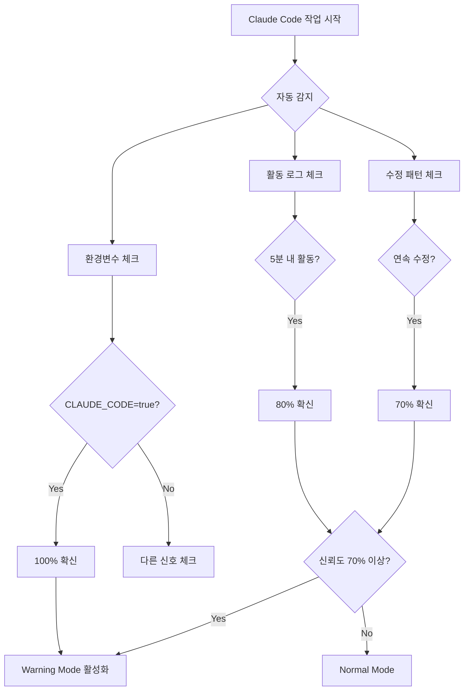

/sc:document --persona-scribe --c7
"Phase 3: Claude Code Collaboration Guide"

# Phase 3: Claude Code 협업 가이드

⚠️ → 상단 '최우선 프로젝트 특화 규칙' 필수 확인

## 📌 Phase 정보
- Phase 번호: 3/3
- 예상 시간: 30분
- 우선순위: HIGH
- **핵심**: Claude Code 즉시 사용 가능한 가이드

## 🚨 현재 문제 (2024-08-26)

### Claude Code가 막히는 이유
1. **58개 TODO** → 모두 Error로 차단
2. **9개 fetch()** → 수정 불가
3. **any 타입** → 외부 SDK 연동 불가

### 실제 영향
- 하루 10회 이상 작업 중단
- 회당 10-30분 지연
- 생산성 30% 저하

## 🚀 즉시 해결 방법

### 1분 내 해결 - 긴급 명령어
```bash
# 방법 1: 환경변수 설정
export CLAUDE_CODE=true
export PROJECT_PHASE=development

# 방법 2: 전체 Warning 전환
cd .claude/hooks
./apply-now.sh

# 방법 3: 1시간 완전 비활성화
export HOOK_OVERRIDE=true
export OVERRIDE_EXPIRES=1h
```

## 📚 Claude Code 작업 가이드

### 🔴 TODO 차단 해결

#### 즉시 해결법
```typescript
// ❌ Error - 작업 차단
// TODO: 나중에 수정

// ✅ Warning - 작업 가능 (날짜 자동 추가)
// TODO[2024-08-26]: 나중에 수정

// ✅ OK - 티켓 번호
// TODO[TASK-123]: Sprint 2에서 처리
```

#### 2일 규칙
- **Day 0**: TODO 작성 → Warning
- **Day 1**: 계속 Warning
- **Day 2**: 오늘까지! Warning
- **Day 3**: Error! 작업 차단

### 🔴 fetch() 차단 해결

#### 즉시 변환
```typescript
// ❌ Error
const res = await fetch('/api/users');

// ✅ Warning → OK
import { apiClient } from '@/lib/api-client';
const res = await apiClient.get('/users');

// 또는
import { apiGet } from '@/hooks/queries';
const { data } = await apiGet('/users');
```

### 🔴 any 타입 해결

#### 외부 SDK 처리
```typescript
// ❌ Error
const stripe = new Stripe(key) as any;

// ✅ src/lib/external/ 폴더 사용 (Warning만)
// src/lib/external/stripe.ts
export const stripe = new Stripe(key) as any; // Warning only

// ✅ 타입 정의
interface StripeClient {
  // 최소 필요 메서드만
  createPaymentIntent: (params: any) => Promise<any>;
}
const stripe = new Stripe(key) as unknown as StripeClient;
```

## 🤖 Claude Code 자동 감지 동작

### 감지 메커니즘


### 실시간 상태 확인
```bash
# Hook 상태 확인
cat .claude/hooks/config.json | grep severity

# Claude Mode 확인
node -e "
const detector = require('./.claude/hooks/claude-detector');
const d = new detector();
console.log(d.getStatus());
"

# 활동 로그
tail -f .claude/activity.log
```

## 📊 작업 플로우

### Phase별 접근
```yaml
Development (현재):
  TODO: Warning (2일 제한)
  fetch(): Warning
  any: Warning
  작업차단: 없음

Production (나중):
  TODO: Error
  fetch(): Error
  any: Error
  작업차단: 완전 해결 필요

Hotfix (긴급):
  TODO: 비활성화
  fetch(): 비활성화
  any: 비활성화
  보안만: Warning
```

### 일일 작업 순서
```bash
# 1. 아침: Development 모드 확인
export PROJECT_PHASE=development
export CLAUDE_CODE=true

# 2. 작업 중: Warning만 표시
# - TODO 발견 → 날짜 자동 추가
# - fetch() 발견 → apiClient 제안
# - any 발견 → 나중 처리

# 3. 커밋 전: 점검
# - 2일 지난 TODO 해결
# - 보안 Error 해결

# 4. Production 배포 전
export PROJECT_PHASE=production
# 모든 Error 해결
```

## 🎯 핵심 정리

### DO ✅
1. **즉시 `export CLAUDE_CODE=true`**
2. **TODO는 2일 내 해결**
3. **보안(Supabase)은 항상 Error**
4. **fetch() → apiClient 점진적 전환**

### DON'T ❌
1. **30일 TODO 금지 (2일!)**
2. **자동 변환 스크립트 금지**
3. **any 타입 남용 금지**
4. **Hook 완전 비활성화 남용**

## 💡 FAQ

**Q: Hook이 계속 차단해요**
```bash
export CLAUDE_CODE=true  # 즉시 해결
```

**Q: TODO를 2일 내 못 끝내면?**
```typescript
// TODO[TASK-123]: 티켓 번호 추가하면 OK
```

**Q: 외부 SDK any 타입은?**
```typescript
// src/lib/external/ 폴더에 넣으면 Warning만
```

**Q: 긴급 상황이에요**
```bash
export HOOK_OVERRIDE=true  # 1시간 비활성화
```

---
*이제 Claude Code 작업 가능합니다! 🎉*