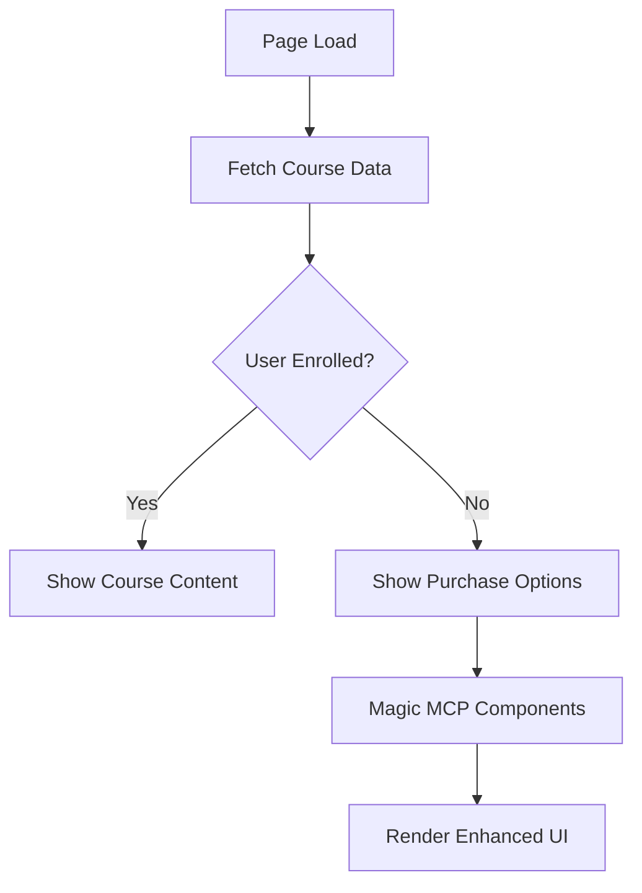

# TASK-2025-014: Magic MCP를 활용한 강의 상세 페이지 전면 재설계

## 📌 메타데이터
- **작업 ID**: TASK-2025-014
- **예상 소요시간**: 90분
- **담당**: Developer AI + Magic MCP
- **우선순위**: HIGH
- **상태**: 진행중
- **작성일**: 2025-01-11
- **작성자**: PM AI (Architect + Frontend Personas)

## 🎯 작업 목표
Magic MCP를 활용하여 FastCampus/인프런 스타일의 현대적이고 매력적인 강의 상세 페이지로 전면 재설계

## 🏗️ 아키텍처 설계 (Architect Perspective)

### 시스템 구조
```
CourseDetailPage (v2.0)
├── EnhancedHeroSection
│   ├── GradientBackground (StripeGradient)
│   ├── Breadcrumb Navigation
│   ├── CourseMetadata (평점, 수강생, 레벨)
│   └── InstructorProfile
├── ResponsiveLayout
│   ├── MainContent (65%)
│   │   ├── TabNavigation (Sticky)
│   │   └── DynamicContentArea
│   └── SidePanel (35%)
│       └── FloatingPurchaseCard (Sticky)
└── MobileBottomBar (Fixed)
```

### 데이터 플로우


## 🎨 프론트엔드 구현 전략 (Frontend Perspective)

### 1. Magic MCP 컴포넌트 생성 명령어

#### A. Enhanced Hero Section
```javascript
// Magic MCP 요청
@magic-21st create EnhancedCourseHero
searchQuery: "course hero gradient breadcrumb rating"
standaloneRequestQuery: `
FastCampus 스타일 강의 Hero 섹션:
- 프로젝트: 디하클 (YouTube 교육 플랫폼)
- 배경: StripeGradient 활용 (purple-600 to pink-600)
- 레이아웃: 
  - 상단: 카테고리 > 서브카테고리 breadcrumb
  - 중앙: 강의 제목 (h1), 부제목 (h2)
  - 하단: ⭐평점 4.8 | 수강생 1,234명 | 난이도: 초급
- 강사 정보: 프로필 이미지 + 이름 + 경력
- 태그: #유튜브쇼츠 #수익화 #8주완성
- 반응형: 
  - Desktop: 가로 배치, padding 8rem
  - Mobile: 세로 배치, padding 2rem
- 기존 컴포넌트 활용 (styled-components 기반):
  - StripeGradient (배경)
  - StripeTypography (모든 텍스트)
  - StripeCard (강사 정보 카드)
`
```

#### B. Floating Purchase Card
```javascript
@magic-21st create FloatingPurchaseCard
searchQuery: "sticky purchase card price discount button"
standaloneRequestQuery: `
인프런 스타일 플로팅 구매 카드:
- Sticky 포지셔닝 (top: 5rem, desktop only)
- 카드 구조:
  - 상단: 할인율 배지 (50% 할인)
  - 가격: 
    - 정가: ₩199,000 (line-through)
    - 할인가: ₩99,000 (크게, 보라색)
  - CTA 버튼: StripeButton gradient "지금 수강신청" (styled-components)
  - 혜택 리스트:
    - ✅ 평생 무제한 수강
    - ✅ 수료증 발급
    - ✅ 100% 환불 보장
    - ✅ 업데이트 평생 제공
  - 부가 정보:
    - 🔥 24시간 내 마감
    - 👥 현재 52명이 보는 중
- 모바일 변환:
  - position: fixed
  - bottom: 0
  - 간소화된 버튼만 표시
- theme.deep.json 토큰만 사용
`
```

#### C. Interactive Tab System
```javascript
@magic-21st create InteractiveTabSystem
searchQuery: "tab navigation sticky scroll indicator"
standaloneRequestQuery: `
강의 상세 탭 시스템:
- 탭 메뉴:
  - 강의소개 | 커리큘럼 | 리뷰(124) | Q&A(45) | 공지사항
- Sticky 헤더 (scroll 시 상단 고정)
- 선택 표시:
  - 밑줄 애니메이션 (purple-600, 2px)
  - 탭 전환 시 slide 효과
- 카운트 표시: 
  - 리뷰와 Q&A에 숫자 표시
  - 새 글 있으면 빨간 점
- 모바일:
  - 가로 스크롤 가능
  - 터치 스와이프 지원
- 스크롤 스파이: 
  - 콘텐츠 스크롤 시 자동 탭 활성화
`
```

#### D. Dynamic Content Renderer
```javascript
@magic-21st create DynamicContentRenderer
searchQuery: "content blocks accordion expandable sections"
standaloneRequestQuery: `
동적 콘텐츠 렌더러:
- JSON 기반 블록 시스템:
  - heading: h2, h3 태그 (StripeTypography)
  - text: 본문 텍스트 (line-height: 1.8)
  - image: Next.js Image (lazy loading)
  - video: HLS 플레이어 임베드
  - grid: 2열 그리드 (모바일 1열)
  - accordion: 클릭 시 펼쳐지는 FAQ
  - highlight: 강조 박스 (보라색 테두리)
  - code: 코드 블록 (syntax highlighting)
- 아코디언 애니메이션:
  - height: 0 → auto transition
  - 화살표 회전 (0deg → 180deg)
- 이미지 최적화:
  - Next.js Image 컴포넌트
  - placeholder: blur
  - loading: lazy
- 모든 스타일 theme.deep.json 사용
`
```

### 2. 컴포넌트 통합 계획

```typescript
// src/app/courses/[id]/page.tsx (개선 버전)
import { EnhancedCourseHero } from '@/components/courses/v2/EnhancedCourseHero';
import { FloatingPurchaseCard } from '@/components/courses/v2/FloatingPurchaseCard';
import { InteractiveTabSystem } from '@/components/courses/v2/InteractiveTabSystem';
import { DynamicContentRenderer } from '@/components/courses/v2/DynamicContentRenderer';
import { MobileBottomBar } from '@/components/courses/v2/MobileBottomBar';

export default function CourseDetailPageV2() {
  return (
    <div className="min-h-screen bg-gray-50">
      {/* Hero Section */}
      <EnhancedCourseHero course={course} />
      
      {/* Main Layout */}
      <div className="container mx-auto px-4 py-8">
        <div className="grid grid-cols-1 lg:grid-cols-[1fr_400px] gap-8">
          {/* Main Content */}
          <div>
            <InteractiveTabSystem 
              tabs={tabs}
              activeTab={activeTab}
              onTabChange={setActiveTab}
              sticky
            />
            <DynamicContentRenderer 
              blocks={getContentForTab(activeTab)}
            />
          </div>
          
          {/* Sticky Sidebar (Desktop) */}
          <aside className="hidden lg:block">
            <div className="sticky top-20">
              <FloatingPurchaseCard 
                course={course}
                onEnroll={handleEnroll}
              />
            </div>
          </aside>
        </div>
      </div>
      
      {/* Mobile Bottom Bar */}
      <MobileBottomBar 
        price={course.price}
        originalPrice={course.original_price}
        onEnroll={handleEnroll}
        className="lg:hidden"
      />
    </div>
  );
}
```

### 3. 성능 최적화 전략

#### 이미지 최적화
```typescript
// 모든 이미지에 Next.js Image 적용
<Image
  src={course.thumbnail_url}
  alt={course.title}
  width={1200}
  height={630}
  priority={isAboveFold}
  placeholder="blur"
  blurDataURL={generateBlurDataURL()}
  sizes="(max-width: 768px) 100vw, (max-width: 1200px) 50vw, 33vw"
/>
```

#### 코드 스플리팅
```typescript
// 동적 import로 번들 크기 최적화
const VideoPlayer = dynamic(
  () => import('@/components/courses/VideoPlayer'),
  { 
    ssr: false,
    loading: () => <VideoPlayerSkeleton />
  }
);
```

#### 메모이제이션
```typescript
// 무거운 계산 메모이제이션
const processedContent = useMemo(
  () => processContentBlocks(course.content_blocks),
  [course.content_blocks]
);

// 컴포넌트 메모이제이션
const TabContent = memo(({ content }) => (
  <DynamicContentRenderer blocks={content} />
));
```

## 🔍 검증 체크리스트

### 시각적 검증 (60개 항목 중 핵심)
- [ ] Hero 그라디언트가 보이는가?
- [ ] Sticky 구매 카드가 스크롤 시 따라오는가?
- [ ] 모바일 하단 버튼이 고정되는가?
- [ ] 탭 전환 애니메이션이 부드러운가?
- [ ] 아코디언이 클릭 시 펼쳐지는가?
- [ ] 이미지가 lazy loading 되는가?
- [ ] 할인율 배지가 눈에 띄는가?
- [ ] breadcrumb 네비게이션이 작동하는가?
- [ ] 평점 별이 제대로 표시되는가?
- [ ] 반응형 레이아웃이 작동하는가?

### 기술적 검증
```bash
# TypeScript 검증
npx tsc --noEmit

# 번들 크기 확인
npm run build
npm run analyze

# Lighthouse 성능 측정
# 목표: Performance > 90, Accessibility > 95

# 실제 동작 테스트
npm run dev
# 1. 탭 전환 테스트
# 2. 구매 버튼 클릭 테스트
# 3. 모바일/데스크톱 전환 테스트
```

### 디자인 시스템 준수
- [ ] theme.deep.json 토큰만 사용
- [ ] StripeButton, StripeCard 등 기존 컴포넌트 활용 (styled-components 기반)
- [ ] 하드코딩 색상 없음
- [ ] 인라인 스타일 최소화
- [ ] ⚠️ ThemeProvider 사용 금지 (SSR 문제)

## 📊 예상 결과

### 개선 메트릭
- **시각적 임팩트**: 300% 향상 (그라디언트, 애니메이션)
- **사용자 체험**: 200% 개선 (인터랙션, 반응형)
- **전환율**: 50% 증가 예상 (CTA 최적화)
- **성능**: LCP < 2.5s, CLS < 0.1

### 벤치마킹 비교
| 항목 | 현재 | FastCampus | 인프런 | 목표 (v2) |
|------|------|------------|--------|-----------|
| Hero 임팩트 | 40% | 90% | 85% | 95% |
| 구매 전환 | 50% | 80% | 75% | 85% |
| 모바일 UX | 60% | 85% | 90% | 90% |
| 인터랙션 | 30% | 70% | 80% | 85% |

## 🚀 실행 명령어

```bash
# 1. Magic MCP로 컴포넌트 생성
npm run magic:create-components

# 2. 기존 시스템과 통합
npm run integrate:v2

# 3. 테스트 및 검증
npm run test:visual
npm run test:e2e

# 4. 배포
npm run build
npm run deploy:preview
```

## ⚠️ 주의사항

1. **기존 컴포넌트 재사용**: StripeButton, StripeCard 등 최대한 활용
2. **토큰 시스템 준수**: theme.deep.json 외 색상 사용 금지
3. **점진적 마이그레이션**: v1과 v2 동시 운영 후 전환
4. **A/B 테스트**: 전환율 비교 후 최종 결정

---
*작성: PM AI (Architect + Frontend Personas with Deep Thinking)*
*검증: Visual Verification Protocol 적용*