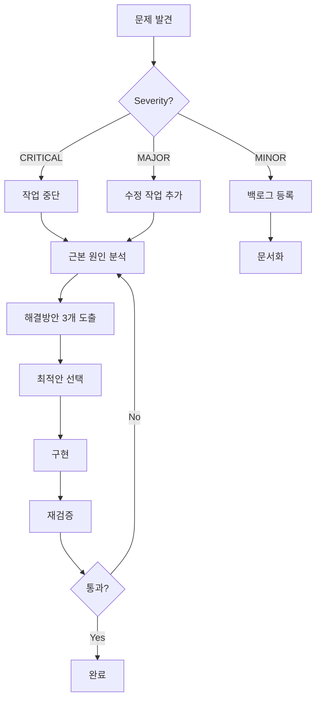

# 🔍 PM AI 작업 검증 프로토콜

## ⚠️ 사용 방법
1. **작업 유형 파악**: Frontend/Backend/Database/Security
2. **해당 섹션만 체크**: 모든 항목 다 하지 말고 필요한 것만
3. **실제 실행으로 검증**: 줄 수 세기 ❌, 실제 명령어 실행 ✅

## 1️⃣ 코드 품질 검증 (Code Quality)
```
□ SOLID 원칙 준수
□ DRY (Don't Repeat Yourself) 
□ KISS (Keep It Simple, Stupid)
□ YAGNI (You Aren't Gonna Need It)
□ 함수 복잡도 (Cyclomatic Complexity < 10)
□ 함수 길이 (< 50줄)
□ 클래스 응집도
□ 결합도 (Loose Coupling)
□ 에러 처리 완전성
□ 엣지 케이스 처리
□ Null/Undefined 안전성
□ 타입 안정성
□ 네이밍 컨벤션 일관성
□ 주석과 문서화
```

## 2️⃣ 의존성 검증 (Dependencies)
```
□ package.json과 실제 import 일치
□ 사용하지 않는 의존성 제거
□ 버전 호환성 매트릭스
□ 보안 취약점 스캔 (npm audit)
□ 순환 의존성 체크
□ Peer Dependencies 충족
□ Dev/Prod 의존성 분리 적절성
□ 라이센스 호환성
□ Bundle 크기 영향도
□ Tree-shaking 가능 여부
```

## 3️⃣ 보안 검증 (Security)
```
□ SQL Injection 방지
□ XSS (Cross-Site Scripting) 방지
□ CSRF 토큰 구현
□ 인증/인가 분리
□ 민감 정보 노출 (API Key, Password)
□ HTTPS 강제
□ Rate Limiting
□ Input Validation
□ Output Encoding
□ 권한 에스컬레이션 방지
□ 세션 관리 적절성
□ CORS 설정
```

## 4️⃣ 성능 검증 (Performance)
```
□ 시간 복잡도 분석
□ 공간 복잡도 분석
□ 데이터베이스 쿼리 최적화
□ N+1 쿼리 문제
□ 인덱스 전략
□ 캐싱 전략
□ 번들 크기
□ 초기 로딩 시간
□ 메모리 누수
□ 불필요한 리렌더링
□ Lazy Loading 구현
□ Code Splitting
```

## 5️⃣ 테스트 가능성 (Testability)
```
□ 단위 테스트 작성 가능
□ 통합 테스트 작성 가능
□ Mocking 가능한 구조
□ 테스트 커버리지 목표 (>80%)
□ E2E 테스트 시나리오
□ 엣지 케이스 테스트
□ 에러 케이스 테스트
□ 성능 테스트
□ 부하 테스트
□ 회귀 테스트
```

## 6️⃣ 유지보수성 (Maintainability)
```
□ 코드 가독성
□ 모듈화 수준
□ 확장 가능성
□ 리팩토링 용이성
□ 기술 부채 평가
□ 문서화 완성도
□ 디버깅 용이성
□ 로깅 전략
□ 모니터링 포인트
□ 버전 관리 전략
```

## 7️⃣ 비즈니스 로직 (Business Logic)
```
□ 요구사항 충족도 (100%)
□ 사용자 스토리 구현 완성도
□ 엣지 케이스 비즈니스 규칙
□ 데이터 검증 규칙
□ 비즈니스 제약사항
□ 도메인 모델 정확성
□ 워크플로우 완전성
□ 에러 시 비즈니스 복구 전략
□ 감사 로그 (Audit Trail)
□ 규정 준수 (Compliance)
```

## 8️⃣ 인프라/배포 (Infrastructure)
```
□ 환경변수 관리
□ 컨테이너화 가능
□ CI/CD 파이프라인 호환
□ 롤백 전략
□ 무중단 배포 가능
□ 로그 수집 전략
□ 모니터링 설정
□ 알람 설정
□ 백업 전략
□ 재해 복구 계획
```

## 9️⃣ 접근성 (Accessibility)
```
□ WCAG 2.1 준수
□ 키보드 네비게이션
□ 스크린 리더 호환
□ 색맹 대응
□ 포커스 관리
□ ARIA 레이블
□ 대체 텍스트
□ 터치 타겟 크기 (44x44px)
□ 명도 대비 (4.5:1)
□ 에러 메시지 명확성
```

## 🔟 크로스 브라우저/디바이스 (Compatibility)
```
□ Chrome/Firefox/Safari/Edge
□ Mobile Safari/Chrome
□ 반응형 디자인
□ 터치 인터페이스
□ 오프라인 지원
□ PWA 가능성
□ Polyfill 필요성
□ CSS Prefix
□ JavaScript 호환성
□ 네트워크 상태 처리
```

---

## 🚨 검증 실패 처리 프로토콜

### Severity Levels
- 🔴 **CRITICAL**: 즉시 중단, 수정 필수
- 🟡 **MAJOR**: 이번 세션 내 수정
- 🟢 **MINOR**: 백로그 등록, 추후 처리

### 자동 대응 프로세스


---

## 📋 검증 보고서 템플릿

```markdown
# 검증 보고서: [작업명]

## 요약
- 총 검증 항목: X개
- 통과: Y개
- 실패: Z개
- Severity: CRITICAL(0), MAJOR(0), MINOR(0)

## 상세 결과

### ✅ 통과 항목
- [항목명]: [증거]

### ❌ 실패 항목
- [항목명]: [이유] | Severity: [LEVEL] | 조치: [계획]

## 증거 자료
- 스크린샷: /evidence/[날짜]/
- 로그: /logs/[날짜]/
- 테스트 결과: /test-results/

## 필수 조치사항
1. [CRITICAL 항목 즉시 수정]
2. [MAJOR 항목 세션 내 수정]

## PM AI 판정
□ PASS - 모든 CRITICAL/MAJOR 해결
□ FAIL - 수정 후 재검증 필요
```