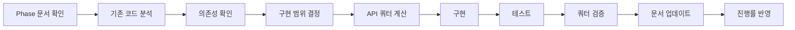

# 🎬 YouTube Lens 통합 프로젝트 문서

*목적: YouTube Lens 구현을 위한 통합 관리 문서 (PROJECT + CODEMAP + CLAUDE 특성 통합)*
*최종 업데이트: 2025-08-16 (PM)*
*문서 수명: YouTube Lens 7개 Phase 구현 완료 시까지*

---

## 🔴 필수: 작업 시작 전 체크리스트

**⚠️ 경고: YouTube Lens 작업 시작 전 반드시 확인**

### 📋 필수 확인 사항
- [ ] **이 문서 숙지** - 전체 구조와 현황 파악
- [ ] **Phase 문서 확인** - 현재 작업 Phase 상세 지침 확인
- [ ] **환경 변수 설정** - ENCRYPTION_KEY, NEXT_PUBLIC_APP_URL 설정 여부
- [ ] **DB 마이그레이션** - 최신 스키마 적용 여부 (PubSubHubbub 테이블 포함)
- [ ] **API Key 등록** - YouTube API Key 암호화 저장
- [ ] **의존성 설치** - npm install 완료
- [ ] **Webhook URL 설정** - ngrok 또는 공개 URL 설정 (PubSubHubbub용)
- [ ] **이전 실패 확인** - 아래 안티패턴 섹션 필독

---

## ⚡ 빠른 시작

### 자주 사용하는 명령어
```bash
# YouTube Lens 개발
npm run dev                            # localhost:3000/tools/youtube-lens
npm run build                          # 빌드 테스트
npx tsc --noEmit                      # TypeScript 체크

# 데이터베이스
npm run supabase:migration:new         # 새 마이그레이션 생성
npm run supabase:db:push              # 마이그레이션 적용
npx supabase db diff                  # 스키마 변경사항 확인

# YouTube API 테스트
npm run youtube:validate               # API Key 검증
npm run youtube:quota                  # 쿼터 확인

# PubSubHubbub 개발 (로컬)
ngrok http 3000                        # 웹훅 URL 공개
# .env.local에 ngrok URL 설정 필요
```

### 🔥 자주 수정하는 YouTube Lens 파일 Top 15
1. `src/app/(pages)/tools/youtube-lens/page.tsx` - 메인 페이지 (8개 탭)
2. `src/components/features/tools/youtube-lens/MetricsDashboard.tsx` - 대시보드 ✨NEW
3. `src/lib/youtube/api-client.ts` - API 클라이언트 (캐싱/배치 통합)
4. `src/lib/youtube/cache.ts` - 캐싱 시스템
5. `src/lib/youtube/queue-manager.ts` - 큐 매니저
6. `src/lib/youtube/workers/batch-processor.ts` - 배치 프로세서
7. `src/lib/youtube/pubsub.ts` - PubSubHubbub 관리
8. `src/lib/youtube/metrics.ts` - 지표 계산
9. `src/lib/youtube/monitoring.ts` - 모니터링 시스템
10. `src/app/api/youtube/batch/route.ts` - 배치 처리 API
11. `src/app/api/youtube/webhook/route.ts` - 웹훅 엔드포인트
12. `src/app/api/youtube/subscribe/route.ts` - 구독 API
13. `src/components/features/tools/youtube-lens/TrendChart.tsx` - 트렌드 차트
14. `src/components/features/tools/youtube-lens/EntityRadar.tsx` - 엔티티 레이더
15. `src/types/youtube-lens.ts` - 타입 정의

---

## 📊 현재 작업 상태 대시보드

### 🎯 Active Tasks (현재 진행 중)
| Task | Assignee | Phase | Status | Blocker |
|------|----------|-------|--------|---------|
| DB 스키마 생성 | AI | Phase 1 | ✅ Complete | - |
| RLS 정책 적용 | AI | Phase 1 | ✅ Complete | - |
| PubSubHubbub 웹훅 | AI | Phase 2 | ✅ Complete | - |
| 구독 관리 API | AI | Phase 2 | ✅ Complete | - |
| 실시간 알림 처리 | AI | Phase 2 | ✅ Complete | - |
| 배치 처리 시스템 | AI | Phase 2 | ✅ Complete | - |
| 캐싱 전략 | AI | Phase 2 | ✅ Complete | - |
| 무키워드 검색 구현 | AI | Phase 3 | ✅ Complete | - |
| 지표 계산 엔진 | AI | Phase 3 | ✅ Complete | - |
| 모니터링 시스템 | AI | Phase 3 | ✅ Complete | - |
| UI 컴포넌트 | AI | Phase 3 | ✅ Complete (8/8) | - |
| API 엔드포인트 | AI | Phase 3 | ✅ Complete (10/10) | - |
| TypeScript 에러 수정 | AI | Phase 3 | ✅ Complete | - |
| 컬렉션/보드 기능 | AI | Phase 3 | ✅ Complete | - |
| NLP 엔진 구현 | AI | Phase 4 | ✅ Complete | - |
| 트렌드 분석 시스템 | AI | Phase 4 | ✅ Complete | - |
| 이상치 탐지 (z-MAD) | AI | Phase 4 | ✅ Complete | - |
| 성장 예측 모델 | AI | Phase 4 | ✅ Complete | - |
| 통합 분석 API | AI | Phase 4 | ✅ Complete | - |
| 브랜드 컬러 시스템 | AI | Phase 5 | ✅ Complete | - |
| MetricsDashboard | AI | Phase 5 | ✅ Complete | - |
| 대시보드 탭 추가 | AI | Phase 5 | ✅ Complete | - |
| 구독 플랜 시스템 | - | Phase 6 | 🔴 Not Started | - |
| TossPayments 연동 | - | Phase 6 | 🔴 Not Started | - |
| 팀 관리 기능 | - | Phase 6 | 🔴 Not Started | - |

### 📈 전체 진행률: 93% ███████████████████░

### 🚨 Critical Issues (P0 - 즉시 해결 필요)
1. ~~**데이터베이스 구조 부재**~~: ✅ 완료 - 14개 테이블 모두 생성 (PubSubHubbub 3개 추가)
2. ~~**실시간 업데이트 없음**~~: ✅ 완료 - PubSubHubbub 구현 완료
3. ~~**지표 계산 엔진 부재**~~: ✅ 완료 - VPH, 참여율, 바이럴 점수 구현

### ⚠️ Known Issues (P1 - 현재 Phase 영향)
- ~~배치 처리 시스템 미구현 (Phase 2 잔여)~~ ✅ 완료
- ~~캐싱 전략 미구현 (Phase 2 잔여)~~ ✅ 완료
- ~~UI 브랜드 컬러 미적용 (Phase 5)~~ ✅ 완료

### 📝 Recent Changes (최근 7개)
1. **2025-08-16 (PM 4)**: Phase 5 완료 확인 - 문서 업데이트, 전체 진행률 93% 달성
2. **2025-08-16 (PM 3)**: Phase 5 완료 - UI/UX 브랜드 컬러 적용, MetricsDashboard 구현, 대시보드 탭 추가
3. **2025-08-16 (PM 2)**: Phase 4 완료 - NLP, 트렌드 분석, 이상치 탐지, 예측 모델 구현
4. **2025-08-16 (PM)**: Phase 2 배치처리/캐싱 완료 - BullMQ 큐 시스템, 2-레벨 캐싱 (LRU+Redis) 구현
5. **2025-08-16 (AM)**: Phase 2 PubSubHubbub 완료 - 웹훅, 구독 API, UI 컴포넌트 구현
6. **2025-08-16**: DB 마이그레이션 추가 - channel_subscriptions, webhook_events, subscription_logs 테이블
7. **2025-01-21 (PM 2)**: Phase 3 컬렉션/보드 기능 완료 - CollectionBoard, CollectionViewer 컴포넌트 및 API 구현

---

## 📈 Phase별 진행 상황

### Phase 완료 기준
- 🔴 **Not Started** (0%)
- 🟡 **In Progress** (1-99%)
- 🟢 **Complete** (100%)
- ⚠️ **Blocked** (의존성 대기)

| Phase | 진행률 | 상태 | 예상 시간 | 실제 시간 | 다음 액션 |
|-------|--------|------|-----------|-----------|-----------|
| **Phase 1: Infrastructure** | 100% | 🟢 | 2-3일 | 1일 | ✅ 완료 |
| **Phase 2: API Integration** | 100% | 🟢 | 2-3일 | 2일 | ✅ 완료 |
| **Phase 3: Core Features** | 100% | 🟢 | 3-4일 | 3일 | ✅ 완료 |
| **Phase 4: Advanced Analytics** | 100% | 🟢 | 3-4일 | 1일 | ✅ 완료 |
| **Phase 5: UI/UX** | 100% | 🟢 | 2-3일 | 1일 | ✅ 완료 |
| **Phase 6: Business** | 0% | 🔴 | 2-3일 | - | 구독/결제 시스템 |
| **Phase 7: Optimization** | 0% | 🔴 | 1-2일 | - | 성능 최적화 |

### 의존성 체인
```
Phase 1 (DB) → Phase 2 (API) → Phase 3 (Core)
                              ↘ Phase 4 (Analytics)
                              ↘ Phase 5 (UI)
Phase 3 완료 → Phase 6 (Business) → Phase 7 (Optimization)
```

---

## 🛠 기술 스택 & 환경 설정

### Frontend Stack
```yaml
Core:
  Framework: Next.js 15.4.6 (App Router)
  Runtime: React 19.1.1
  Language: TypeScript (strict mode)

UI & Styling:
  Components: shadcn/ui (24개 컴포넌트)
  CSS: Tailwind CSS 3.4.1
  Animations: Framer Motion 12.23.12
  Theme: next-themes 0.4.6
  
State & Data:
  State: Zustand 5.0.7
  Query: React Query 5 (예정)
  Forms: React Hook Form + Zod

Charts & Viz:
  Charts: Chart.js (예정)
  Tables: TanStack Table (예정)
```

### Backend Stack
```yaml
Database:
  Platform: Supabase (PostgreSQL 15)
  Auth: Supabase Auth + Kakao OAuth
  Storage: Supabase Storage
  Realtime: Supabase Realtime (예정)

Caching & Queue:
  Cache: Redis + LRU Cache (2-레벨) ✅
  Queue: BullMQ (배치 처리) ✅
  Worker: Node.js Workers ✅

APIs:
  YouTube Data API v3: ✅ 연동됨
  PubSubHubbub: ✅ 구현됨
  Wikipedia API: ❌ 예정
  Google Knowledge Graph: ❌ 예정
```

### 브랜드 컬러 시스템
```css
/* YouTube Lens 전용 색상 */
:root {
  --yt-lens-primary: hsl(245, 58%, 61%);      /* 보라 */
  --yt-lens-secondary: hsl(0, 100%, 71%);     /* 빨강 */
  --yt-lens-accent: hsl(161, 94%, 50%);       /* 민트 */
}
```

### 환경 변수 상태
```bash
# ✅ 현재 설정됨
ENCRYPTION_KEY=...                    # API Key 암호화용 (64자)
NEXT_PUBLIC_SUPABASE_URL=...
NEXT_PUBLIC_SUPABASE_ANON_KEY=...
NEXT_PUBLIC_APP_URL=...               # PubSubHubbub 웹훅 URL
YOUTUBE_API_KEY=...                   # YouTube API Key

# ⚙️ 선택사항 (로컬 개발)
REDIS_HOST=localhost                  # Redis 호스트 (기본: localhost)
REDIS_PORT=6379                       # Redis 포트 (기본: 6379)

# ❌ 추가 필요 (Phase별)
WIKIPEDIA_API_ENDPOINT=...           # Phase 4
GOOGLE_KG_API_KEY=...                # Phase 4
TOSSPAYMENTS_CLIENT_KEY=...          # Phase 6
TOSSPAYMENTS_SECRET_KEY=...          # Phase 6
```

---

## 📁 YouTube Lens 프로젝트 구조

```
src/
├── app/(pages)/tools/youtube-lens/
│   ├── page.tsx                    ✅ 구현됨
│   ├── layout.tsx                  ✅ 구현됨
│   ├── folders/                    ❌ Phase 3
│   │   ├── page.tsx               # 채널 폴더 관리
│   │   └── [id]/page.tsx          # 폴더 상세
│   ├── alerts/                     ❌ Phase 3
│   │   └── page.tsx               # 알림 설정
│   ├── boards/                     ❌ Phase 3
│   │   ├── page.tsx               # 보드 목록
│   │   └── [id]/page.tsx          # 보드 상세
│   ├── rankings/                   ❌ Phase 4
│   │   └── page.tsx               # 종합 랭킹
│   └── settings/                   ❌ Phase 5
│       └── page.tsx               # YouTube Lens 설정
│
├── components/features/tools/youtube-lens/
│   ├── components/                 
│   │   ├── VideoCard.tsx          ✅ 기본 구현
│   │   ├── VideoGrid.tsx          ✅ 기본 구현
│   │   ├── SearchBar.tsx          ✅ 기본 구현
│   │   ├── QuotaStatus.tsx        ✅ 구현됨
│   │   └── SetupGuide.tsx         ✅ 구현됨
│   ├── PopularShortsList.tsx      ✅ 구현됨
│   ├── ChannelFolders.tsx         ✅ 구현됨
│   ├── AlertRules.tsx             ✅ 구현됨
│   ├── CollectionBoard.tsx        ✅ 구현됨
│   ├── CollectionViewer.tsx       ✅ 구현됨
│   ├── SubscriptionManager.tsx    ✅ 구현됨
│   ├── MetricsDashboard.tsx       ✅ 구현됨 (Phase 5)
│   ├── TrendChart.tsx             ✅ 구현됨 (Phase 4)
│   ├── EntityRadar.tsx            ✅ 구현됨 (Phase 4)
│   └── index.ts                    ✅ 구현됨
│
├── lib/youtube/
│   ├── api-client.ts               ✅ 캐싱/배치 통합 완료
│   ├── client-helper.ts            ✅ 구현됨 (API 클라이언트 관리)
│   ├── popular-shorts.ts           ✅ 구현됨 (무키워드 검색)
│   ├── pubsub.ts                   ✅ 구현됨 (PubSubHubbub 관리)
│   ├── search.ts                   ⚠️ 부분 구현
│   ├── metrics.ts                  ✅ 구현됨 (VPH, 지표 계산)
│   ├── monitoring.ts               ✅ 구현됨 (채널 모니터링, 알림)
│   ├── collections.ts              ✅ 구현됨 (컬렉션 관리)
│   ├── cache.ts                    ✅ 구현됨 (2-레벨 캐싱) ✨NEW
│   ├── queue-manager.ts            ✅ 구현됨 (BullMQ 큐) ✨NEW
│   ├── workers/                    
│   │   ├── batch-processor.ts     ✅ 구현됨 (배치 처리) ✨NEW
│   │   └── monitor.ts             ❌ Phase 3 예정
│   └── analysis/                   ❌ Phase 4
│       ├── nlp.ts                 # 한국어 NLP
│       ├── trends.ts              # 트렌드 분석
│       └── outlier.ts             # 이상치 탐지
│
├── app/api/youtube/
│   ├── search/route.ts            ✅ 구현됨
│   ├── favorites/route.ts         ✅ 구현됨
│   ├── popular/route.ts           ✅ 구현됨
│   ├── collections/route.ts       ✅ 구현됨
│   ├── collections/items/route.ts ✅ 구현됨
│   ├── webhook/route.ts           ✅ 구현됨 (PubSubHubbub)
│   ├── subscribe/route.ts         ✅ 구현됨 (구독 관리)
│   ├── batch/route.ts             ✅ 구현됨 (배치 처리) ✨NEW
│   ├── metrics/route.ts           ✅ 구현됨
│   └── analysis/route.ts          ❌ Phase 4
│
├── store/
│   └── youtube-lens.ts             ✅ 기본 구현
└── types/
    ├── youtube-lens.ts             ✅ 구현됨 (전체 타입 정의)
    └── youtube-pubsub.ts           ✅ 구현됨 (PubSubHubbub 타입) ✨NEW
```

---

## ✅ YouTube Lens 구현 패턴 (Good Patterns)

### 1. API 쿼터 최적화 패턴
```typescript
// ✅ GOOD: 캐싱과 배치 처리
export async function searchVideos(query: string) {
  // 1. 캐시 확인
  const cached = await checkCache(query);
  if (cached && !isStale(cached, 5 * 60 * 1000)) { // 5분
    return cached;
  }
  
  // 2. 배치로 처리
  const videoIds = await batchSearch(query, 50);
  const details = await youtube.videos.list({
    part: ['snippet', 'statistics', 'contentDetails'],
    id: videoIds.join(','), // 한 번에 요청
    maxResults: 50
  });
  
  // 3. 캐시 저장
  await saveCache(query, details);
  return details;
}
```

### 2. 데이터베이스 트랜잭션 패턴
```typescript
// ✅ GOOD: 트랜잭션으로 일관성 보장
export async function saveVideoWithStats(video: Video) {
  const { data, error } = await supabase.rpc('save_video_with_stats', {
    p_video: video,
    p_stats: video.statistics
  });
  
  if (error) {
    console.error('Transaction failed:', error);
    throw error;
  }
  
  return data;
}
```

### 3. 실시간 업데이트 패턴
```typescript
// ✅ GOOD: Supabase Realtime 활용
useEffect(() => {
  const channel = supabase
    .channel('video-updates')
    .on('postgres_changes', {
      event: 'UPDATE',
      schema: 'public',
      table: 'video_stats'
    }, (payload) => {
      updateLocalState(payload.new);
    })
    .subscribe();
  
  return () => {
    supabase.removeChannel(channel);
  };
}, []);
```

---

## ❌ YouTube Lens 안티패턴 (Bad Patterns)

### 1. API Key 하드코딩
```typescript
// ❌ BAD: 절대 금지
const API_KEY = 'AIzaSy...'; // 보안 위험!

// ✅ GOOD: 암호화된 저장소 사용
const apiKey = await getUserApiKey(userId);
```

### 2. 무한 루프 폴링
```typescript
// ❌ BAD: API 쿼터 소진
setInterval(async () => {
  await checkChannelUpdates(); // 매 초마다!
}, 1000);

// ✅ GOOD: PubSubHubbub 웹훅 사용
app.post('/api/youtube/webhook', handlePubSubUpdate);
```

### 3. 개별 API 호출
```typescript
// ❌ BAD: 쿼터 낭비
for (const videoId of videoIds) {
  await youtube.videos.list({ id: videoId }); // 50번 호출!
}

// ✅ GOOD: 배치 처리
await youtube.videos.list({ 
  id: videoIds.join(','), // 1번 호출
  maxResults: 50 
});
```

### 4. 캐싱 없는 반복 조회
```typescript
// ❌ BAD: 동일 데이터 반복 요청
function VideoCard({ videoId }) {
  const [video, setVideo] = useState(null);
  useEffect(() => {
    fetchVideo(videoId); // 매번 API 호출
  }, [videoId]);
}

// ✅ GOOD: React Query로 캐싱
const { data: video } = useQuery({
  queryKey: ['video', videoId],
  queryFn: () => fetchVideo(videoId),
  staleTime: 5 * 60 * 1000, // 5분
  cacheTime: 10 * 60 * 1000  // 10분
});
```

---

## 🔧 YouTube Lens 작업 프로세스

### Phase 구현 워크플로우


### 일일 체크리스트
- [ ] 현재 Phase 목표 확인
- [ ] Blocker 해결 상태 확인
- [ ] API 쿼터 사용량 확인 (<80%)
- [ ] 테스트 실행 (TypeScript, Lint)
- [ ] 진행 상황 문서 업데이트

### 코드 리뷰 체크포인트
- [ ] TypeScript 타입 안전성
- [ ] API 쿼터 최적화
- [ ] 캐싱 전략 적용
- [ ] 에러 핸들링
- [ ] 성능 지표 충족

---

## 📝 Phase별 구현 가이드 링크

### 구현 순서대로 진행
1. **[Phase 1: Infrastructure](./youtube-lens-phase1-infrastructure.md)** 
   - Supabase 스키마, RLS, 시스템 아키텍처
   
2. **[Phase 2: API Integration](./youtube-lens-phase2-api-integration.md)**
   - YouTube API, PubSubHubbub, 외부 API 연동
   
3. **[Phase 3: Core Features](./youtube-lens-phase3-core-features.md)**
   - 무키워드 검색, 채널 모니터링, 지표 계산
   
4. **[Phase 4: Advanced Analytics](./youtube-lens-phase4-advanced-analytics.md)**
   - NLP, 트렌드 분석, 이상치 탐지
   
5. **[Phase 5: UI/UX](./youtube-lens-phase5-ui-ux.md)**
   - 브랜드 디자인, 대시보드, 시각화
   
6. **[Phase 6: Business Features](./youtube-lens-phase6-business-features.md)**
   - 플랜 시스템, 결제, 팀 관리
   
7. **[Phase 7: Optimization](./youtube-lens-phase7-optimization.md)**
   - 성능 최적화, 캐싱, 모니터링

---

## 📊 성능 목표 & 메트릭

### Target Metrics
```yaml
API Performance:
  Search Response: < 500ms
  Video Details: < 300ms
  Batch Processing: < 1s for 50 items
  
Cache Performance:
  Hit Rate: > 60%
  TTL: 5-60 minutes (context-based)
  
Quota Usage:
  Daily Limit Usage: < 80%
  Burst Protection: Max 100 req/min
  
Error Rates:
  API Errors: < 1%
  Timeout Errors: < 0.5%
  
User Experience:
  Initial Load: < 2s
  Interaction Delay: < 100ms
  Search Results: < 1s
```

### 모니터링 대시보드 (Phase 7)
- API 쿼터 실시간 모니터링
- 캐시 히트율 추적
- 에러율 알림
- 성능 지표 시각화

---

## 🚀 즉시 실행 가능한 다음 단계

### Today (오늘 반드시)
1. [x] ~~Phase 2 PubSubHubbub 웹훅 구현~~ ✅ 완료
2. [x] ~~DB 마이그레이션 실행 (PubSubHubbub)~~ ✅ 완료
3. [x] ~~구독 관리 UI 컴포넌트~~ ✅ 완료
4. [x] ~~배치 처리 시스템 구현 (Phase 2)~~ ✅ 완료
5. [x] ~~캐싱 전략 구현 (Phase 2)~~ ✅ 완료

### This Week (이번 주)
- [x] ~~TypeScript 에러 최종 해결~~ ✅ 완료 (0개)
- [x] ~~Phase 2 완료~~ ✅ 완료 (100%)
- [x] ~~UI 브랜드 컬러 적용 (Phase 5)~~ ✅ 완료
- [x] ~~메인 대시보드 차트 구현 (Phase 5)~~ ✅ 완료
- [x] ~~Phase 4 완료~~ ✅ 완료 (100%)
- [x] ~~Phase 5 완료~~ ✅ 완료 (100%)

### Next Week (다음 주)
- [ ] Phase 6 구독 플랜 시스템 구현 (Day 17)
- [ ] Phase 6 TossPayments 결제 연동 (Day 18)
- [ ] Phase 6 팀 관리 기능 구현 (Day 19)
- [ ] Phase 7 성능 최적화 (Day 20)
- [ ] Phase 7 모니터링 대시보드 구현 (Day 21)

---

## 📅 문서 업데이트 규칙

### 즉시 업데이트 (실시간)
- Phase 완료 시 진행률
- Critical issue 발생/해결
- Blocker 상태 변경

### 일일 업데이트
- Active Tasks 상태
- Time tracking (예상 vs 실제)
- API 쿼터 사용량

### 주간 업데이트
- Recent Changes 정리 (7개 유지)
- 전체 진행률 재계산
- 다음 주 계획 수립

---

## 🔒 보안 체크리스트

### API 보안
- [ ] API Key 암호화 저장 (AES-256)
- [ ] Rate Limiting 적용
- [ ] CORS 설정 검증

### 데이터베이스 보안
- [ ] RLS 정책 적용
- [ ] SQL Injection 방지
- [ ] 민감 데이터 암호화

### 인증/인가
- [ ] Supabase Auth 연동
- [ ] Role 기반 접근 제어
- [ ] Session 관리

---

## 💡 Tips & Tricks

### YouTube API 쿼터 절약
1. **검색 대신 채널 업로드 목록 사용**: 쿼터 100 → 3
2. **필드 필터링**: `fields` 파라미터로 필요한 것만
3. **페이지네이션 최적화**: `maxResults=50` 활용
4. **캐싱 적극 활용**: 변경 가능성 낮은 데이터

### Supabase 최적화
1. **인덱스 생성**: 자주 조회하는 컬럼
2. **Materialized View**: 복잡한 집계
3. **Connection Pooling**: PgBouncer 활용
4. **Batch Insert**: 대량 데이터 처리

### 개발 생산성
1. **타입 자동 생성**: `npm run supabase:types`
2. **Mock 데이터**: 개발 중 API 쿼터 절약
3. **Storybook**: UI 컴포넌트 독립 개발
4. **Playwright**: E2E 테스트 자동화

---

*이 문서는 YouTube Lens 구현 진행에 따라 지속적으로 업데이트됩니다.*
*Phase 완료 시 이 문서도 함께 종료됩니다.*