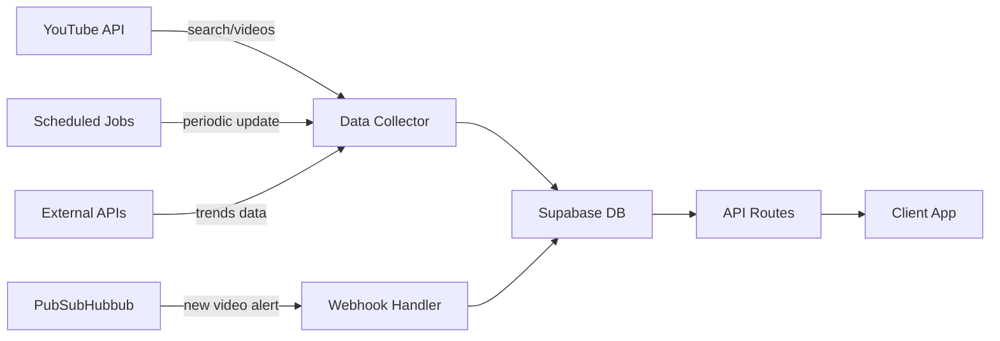

# YouTube Lens Phase 1: 기초 인프라 구축

## 📌 개요
YouTube Shorts 분석 플랫폼의 기초 인프라를 구축하는 단계입니다. Supabase 데이터 모델 설계와 시스템 아키텍처를 정립합니다.

## 🎯 목표
- Supabase 데이터베이스 스키마 설계 및 구현
- Row Level Security (RLS) 정책 수립
- 시스템 아키텍처 확립
- 기술 스택 검증 및 최적화

## 🛠 기술 스택 검증

### Frontend
- **Next.js 15.4.6** + **React 19.1.1** (App Router)
- **TypeScript** (strict mode)
- **Shadcn/UI** + **Tailwind CSS**
- **Zustand 5** (상태 관리)
- **React Query 5** (서버 상태)
- **Framer Motion 12** (애니메이션)

### Backend
- **Supabase** (PostgreSQL 15)
  - Database
  - Auth (카카오 OAuth)
  - Storage
  - Realtime
- **Edge Functions** (Deno)

### 브랜드 컬러 시스템 (HSL)
```css
:root {
  --primary: hsl(245, 58%, 61%);      /* 보라 */
  --primary-dark: hsl(245, 65%, 77%); /* 다크모드 보라 */
  --secondary: hsl(0, 100%, 71%);     /* 빨강 */
  --secondary-dark: hsl(0, 90%, 65%); /* 다크모드 빨강 */
  --accent: hsl(161, 94%, 50%);       /* 민트 */
  --accent-dark: hsl(161, 84%, 45%);  /* 다크모드 민트 */
}
```

## 📊 Supabase 데이터 모델

### 1. 핵심 테이블 구조

```sql
-- 사용자 프로필 확장
CREATE TABLE profiles (
  id UUID REFERENCES auth.users(id) PRIMARY KEY,
  username TEXT UNIQUE,
  display_name TEXT,
  avatar_url TEXT,
  plan_type TEXT DEFAULT 'free', -- 'free', 'pro', 'team'
  plan_expires_at TIMESTAMP WITH TIME ZONE,
  youtube_api_key TEXT ENCRYPTED, -- 사용자별 API 키 (암호화)
  created_at TIMESTAMP WITH TIME ZONE DEFAULT NOW(),
  updated_at TIMESTAMP WITH TIME ZONE DEFAULT NOW()
);

-- 조직 (Team 플랜용)
CREATE TABLE organizations (
  id UUID DEFAULT gen_random_uuid() PRIMARY KEY,
  name TEXT NOT NULL,
  owner_id UUID REFERENCES profiles(id),
  created_at TIMESTAMP WITH TIME ZONE DEFAULT NOW()
);

-- 조직 멤버
CREATE TABLE organization_members (
  id UUID DEFAULT gen_random_uuid() PRIMARY KEY,
  org_id UUID REFERENCES organizations(id) ON DELETE CASCADE,
  user_id UUID REFERENCES profiles(id),
  role TEXT DEFAULT 'member', -- 'owner', 'admin', 'member', 'viewer'
  joined_at TIMESTAMP WITH TIME ZONE DEFAULT NOW(),
  UNIQUE(org_id, user_id)
);

-- YouTube 영상 메타데이터
CREATE TABLE videos (
  video_id TEXT PRIMARY KEY,
  channel_id TEXT NOT NULL,
  title TEXT NOT NULL,
  description TEXT,
  thumbnail_url TEXT,
  published_at TIMESTAMP WITH TIME ZONE,
  duration_seconds INTEGER,
  tags TEXT[], -- 배열로 저장
  category_id INTEGER,
  region_code TEXT,
  is_shorts BOOLEAN DEFAULT FALSE,
  created_at TIMESTAMP WITH TIME ZONE DEFAULT NOW(),
  updated_at TIMESTAMP WITH TIME ZONE DEFAULT NOW()
);

-- 영상 통계 스냅샷
CREATE TABLE video_stats (
  id UUID DEFAULT gen_random_uuid() PRIMARY KEY,
  video_id TEXT REFERENCES videos(video_id),
  view_count BIGINT,
  like_count BIGINT,
  comment_count BIGINT,
  captured_at TIMESTAMP WITH TIME ZONE DEFAULT NOW(),
  vph DECIMAL(10,2), -- Views Per Hour (계산값)
  delta_24h BIGINT,  -- 24시간 조회수 변화
  INDEX idx_video_stats_captured (video_id, captured_at DESC)
);

-- YouTube 채널 정보
CREATE TABLE channels (
  channel_id TEXT PRIMARY KEY,
  title TEXT NOT NULL,
  description TEXT,
  thumbnail_url TEXT,
  subscriber_count BIGINT,
  video_count INTEGER,
  view_count BIGINT,
  country TEXT,
  custom_url TEXT,
  created_at TIMESTAMP WITH TIME ZONE DEFAULT NOW(),
  updated_at TIMESTAMP WITH TIME ZONE DEFAULT NOW()
);

-- 채널 모니터링 폴더
CREATE TABLE folders (
  id UUID DEFAULT gen_random_uuid() PRIMARY KEY,
  user_id UUID REFERENCES profiles(id),
  org_id UUID REFERENCES organizations(id),
  name TEXT NOT NULL,
  description TEXT,
  color TEXT, -- HEX 색상
  created_at TIMESTAMP WITH TIME ZONE DEFAULT NOW(),
  updated_at TIMESTAMP WITH TIME ZONE DEFAULT NOW()
);

-- 폴더-채널 연결
CREATE TABLE folder_channels (
  id UUID DEFAULT gen_random_uuid() PRIMARY KEY,
  folder_id UUID REFERENCES folders(id) ON DELETE CASCADE,
  channel_id TEXT REFERENCES channels(channel_id),
  added_at TIMESTAMP WITH TIME ZONE DEFAULT NOW(),
  UNIQUE(folder_id, channel_id)
);

-- 알림 규칙
CREATE TABLE alert_rules (
  id UUID DEFAULT gen_random_uuid() PRIMARY KEY,
  folder_id UUID REFERENCES folders(id) ON DELETE CASCADE,
  name TEXT NOT NULL,
  min_views BIGINT DEFAULT 100000,
  max_age_hours INTEGER DEFAULT 72, -- 3일
  max_duration_seconds INTEGER DEFAULT 70,
  is_active BOOLEAN DEFAULT TRUE,
  created_at TIMESTAMP WITH TIME ZONE DEFAULT NOW()
);

-- 알림 로그
CREATE TABLE alerts (
  id UUID DEFAULT gen_random_uuid() PRIMARY KEY,
  rule_id UUID REFERENCES alert_rules(id),
  video_id TEXT REFERENCES videos(video_id),
  triggered_at TIMESTAMP WITH TIME ZONE DEFAULT NOW(),
  is_read BOOLEAN DEFAULT FALSE
);

-- 즐겨찾기/보드
CREATE TABLE boards (
  id UUID DEFAULT gen_random_uuid() PRIMARY KEY,
  user_id UUID REFERENCES profiles(id),
  org_id UUID REFERENCES organizations(id),
  name TEXT NOT NULL,
  description TEXT,
  is_public BOOLEAN DEFAULT FALSE,
  created_at TIMESTAMP WITH TIME ZONE DEFAULT NOW()
);

-- 보드 아이템
CREATE TABLE board_items (
  id UUID DEFAULT gen_random_uuid() PRIMARY KEY,
  board_id UUID REFERENCES boards(id) ON DELETE CASCADE,
  video_id TEXT REFERENCES videos(video_id),
  notes TEXT,
  position INTEGER, -- 정렬 순서
  added_at TIMESTAMP WITH TIME ZONE DEFAULT NOW(),
  UNIQUE(board_id, video_id)
);

-- 저장된 검색
CREATE TABLE saved_searches (
  id UUID DEFAULT gen_random_uuid() PRIMARY KEY,
  user_id UUID REFERENCES profiles(id),
  name TEXT NOT NULL,
  search_params JSONB NOT NULL, -- 검색 파라미터 JSON
  created_at TIMESTAMP WITH TIME ZONE DEFAULT NOW()
);

-- API 사용량 추적
CREATE TABLE api_usage (
  id UUID DEFAULT gen_random_uuid() PRIMARY KEY,
  user_id UUID REFERENCES profiles(id),
  endpoint TEXT NOT NULL,
  units_consumed INTEGER DEFAULT 1,
  request_params JSONB,
  response_status INTEGER,
  created_at TIMESTAMP WITH TIME ZONE DEFAULT NOW()
);

-- PubSubHubbub 구독
CREATE TABLE pubsub_subscriptions (
  id UUID DEFAULT gen_random_uuid() PRIMARY KEY,
  channel_id TEXT REFERENCES channels(channel_id),
  topic_url TEXT NOT NULL,
  hub_url TEXT DEFAULT 'https://pubsubhubbub.appspot.com',
  callback_url TEXT NOT NULL,
  lease_seconds INTEGER DEFAULT 432000, -- 5일
  subscribed_at TIMESTAMP WITH TIME ZONE DEFAULT NOW(),
  expires_at TIMESTAMP WITH TIME ZONE,
  UNIQUE(channel_id)
);
```

### 2. 인덱스 전략

```sql
-- 성능 최적화 인덱스
CREATE INDEX idx_videos_published ON videos(published_at DESC);
CREATE INDEX idx_videos_channel ON videos(channel_id);
CREATE INDEX idx_videos_shorts ON videos(is_shorts) WHERE is_shorts = TRUE;
CREATE INDEX idx_video_stats_latest ON video_stats(video_id, captured_at DESC);
CREATE INDEX idx_alerts_unread ON alerts(user_id, is_read) WHERE is_read = FALSE;
CREATE INDEX idx_api_usage_daily ON api_usage(user_id, created_at::DATE);

-- 시계열 데이터 파티셔닝 (선택적)
CREATE TABLE video_stats_2025_01 PARTITION OF video_stats
  FOR VALUES FROM ('2025-01-01') TO ('2025-02-01');
```

### 3. Row Level Security (RLS) 정책

```sql
-- profiles 테이블 RLS
ALTER TABLE profiles ENABLE ROW LEVEL SECURITY;

CREATE POLICY "Users can view own profile" ON profiles
  FOR SELECT USING (auth.uid() = id);

CREATE POLICY "Users can update own profile" ON profiles
  FOR UPDATE USING (auth.uid() = id);

-- folders 테이블 RLS (개인 또는 조직)
ALTER TABLE folders ENABLE ROW LEVEL SECURITY;

CREATE POLICY "Users can view own folders" ON folders
  FOR SELECT USING (
    user_id = auth.uid() OR
    org_id IN (
      SELECT org_id FROM organization_members 
      WHERE user_id = auth.uid()
    )
  );

-- boards 테이블 RLS
ALTER TABLE boards ENABLE ROW LEVEL SECURITY;

CREATE POLICY "Public boards are viewable by all" ON boards
  FOR SELECT USING (is_public = TRUE);

CREATE POLICY "Private boards viewable by owner/org" ON boards
  FOR SELECT USING (
    user_id = auth.uid() OR
    org_id IN (
      SELECT org_id FROM organization_members 
      WHERE user_id = auth.uid()
    )
  );

-- alerts 테이블 RLS
ALTER TABLE alerts ENABLE ROW LEVEL SECURITY;

CREATE POLICY "Users view alerts from their folders" ON alerts
  FOR SELECT USING (
    rule_id IN (
      SELECT ar.id FROM alert_rules ar
      JOIN folders f ON ar.folder_id = f.id
      WHERE f.user_id = auth.uid() OR 
            f.org_id IN (
              SELECT org_id FROM organization_members 
              WHERE user_id = auth.uid()
            )
    )
  );
```

## 🏗 시스템 아키텍처

### 1. 컴포넌트 구조

```
┌─────────────────────────────────────────────────────┐
│                   Client (Next.js)                  │
│  ┌──────────┐ ┌──────────┐ ┌──────────┐           │
│  │   Pages  │ │Components│ │  Stores  │           │
│  └──────────┘ └──────────┘ └──────────┘           │
└─────────────────────────────────────────────────────┘
                           │
                           ▼
┌─────────────────────────────────────────────────────┐
│               Next.js API Routes                    │
│  ┌──────────┐ ┌──────────┐ ┌──────────┐           │
│  │  Auth    │ │ YouTube  │ │ Webhook  │           │
│  └──────────┘ └──────────┘ └──────────┘           │
└─────────────────────────────────────────────────────┘
                           │
                           ▼
┌─────────────────────────────────────────────────────┐
│                    Supabase                         │
│  ┌──────────┐ ┌──────────┐ ┌──────────┐           │
│  │    DB    │ │   Auth   │ │ Storage  │           │
│  └──────────┘ └──────────┘ └──────────┘           │
│  ┌──────────┐ ┌──────────┐                        │
│  │ Realtime │ │   Edge   │                        │
│  └──────────┘ └──────────┘                        │
└─────────────────────────────────────────────────────┘
                           │
                           ▼
┌─────────────────────────────────────────────────────┐
│              External Services                      │
│  ┌──────────┐ ┌──────────┐ ┌──────────┐           │
│  │ YouTube  │ │PubSubHub │ │Wikipedia │           │
│  │   API    │ │   hub    │ │   API    │           │
│  └──────────┘ └──────────┘ └──────────┘           │
└─────────────────────────────────────────────────────┘
```

### 2. 데이터 흐름



## 🔐 보안 고려사항

1. **API 키 관리**
   - 사용자별 YouTube API 키 암호화 저장
   - 환경 변수로 시스템 키 관리
   - Vault 또는 Supabase Secrets 활용

2. **Rate Limiting**
   - API Routes에 rate limiting 미들웨어
   - 사용자별 일일 쿼터 관리
   - DDoS 방어

3. **데이터 격리**
   - RLS로 테넌트 간 데이터 격리
   - 조직 데이터 접근 권한 세분화

## ✅ 구현 체크리스트

- [ ] Supabase 프로젝트 생성 및 설정
- [ ] 데이터베이스 스키마 마이그레이션 작성
- [ ] RLS 정책 구현 및 테스트
- [ ] 인덱스 생성 및 성능 검증
- [ ] Supabase 클라이언트 설정 (browser/server)
- [ ] 기본 CRUD 함수 구현
- [ ] 타입 정의 파일 생성 (TypeScript)

## 📝 다음 단계
Phase 2: YouTube API 통합 강화로 진행