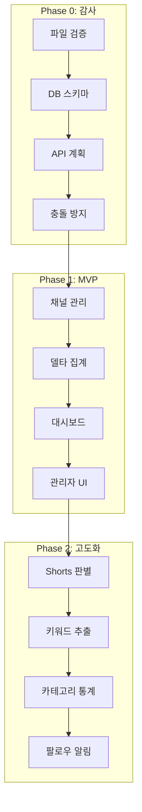

# 🚀 YouTube Lens 구현 가이드 (강화 버전)

*INSTRUCTION_TEMPLATE.md 원칙 기반의 완전 자동화 구현 시스템*

---

## 📚 문서 체계

### 원본 문서
```
youtube-lens-implementation/
├── phase-0-audit.md           # 원본 Phase 0
├── phase-1-mvp-core.md        # 원본 Phase 1
├── phase-2-shorts-keywords.md # 원본 Phase 2
└── phase-3-quality-performance.md # 원본 Phase 3
```

### 강화 문서 (Enhanced)
```
youtube-lens-implementation/
├── phase-0-enhanced/
│   ├── phase-0-enhanced-audit.md      # 강화된 감사 지시서
│   ├── checklist-automated.md         # 자동화 체크리스트
│   └── README.md                       # Phase 0 요약
├── phase-1-enhanced/
│   └── phase-1-mvp-core-enhanced.md   # 강화된 MVP 구현
├── phase-2-enhanced/
│   └── phase-2-shorts-keywords-enhanced.md # 강화된 Shorts/키워드
└── README-ENHANCED.md                  # 이 문서
```

---

## 🎯 핵심 개선사항

### 1. 실제 구현 검증 우선
```typescript
// ❌ 문서 신뢰
if (docs.says === '✅') { 
  proceed(); 
}

// ✅ 실제 검증
if (actualFileExists() && actuallyWorks()) {
  proceed();
} else {
  createOrFix();
}
```

### 2. 완전 자동화
```bash
# 원클릭 전체 검증 (Phase 0-2)
npm run youtube-lens:validate-all

# 개별 Phase 검증
npm run phase0:validate
npm run phase1:validate
npm run phase2:validate
```

### 3. TypeScript 타입 안전성
```typescript
// ❌ 절대 금지
const data: any = await fetch();

// ✅ 필수
const data: YouTubeChannel = await fetch();
// 또는
const data = YouTubeChannelSchema.parse(await fetch());
```

### 4. 3단계 프로토콜
1. **Pre-Implementation Verification** - 실제 상태 확인
2. **Implementation** - 타입 안전 구현
3. **Validation & Testing** - 자동화 검증

---

## 🔄 Phase별 실행 가이드

### Phase 0: 코드/데이터 감사 (강화)
```bash
# 1. 자동 감사 실행
/sc:analyze --seq --ultrathink --delegate files --c7
"phase-0-enhanced-audit.md 읽고 Phase 0 실행"

# 2. 검증
npm run phase0:validate

# 3. 리포트 생성
npm run phase0:report
```

**주요 개선**:
- 실제 파일 존재 검증
- 자동 리포트 생성
- 쿼터 시뮬레이션
- 타입 안전성 검사

### Phase 1: MVP 코어 구현 (강화)
```bash
# 1. Phase 0 완료 확인
npm run phase0:validate || exit 1

# 2. MVP 구현
/sc:implement --seq --validate --think-hard --c7
"phase-1-mvp-core-enhanced.md 따라 구현"

# 3. 검증
npm run phase1:validate
```

**주요 개선**:
- 델타 계산 stored procedure
- 완전 타입 안전 API
- 자동 캐시 무효화
- 성능 최적화 인덱스

### Phase 2: Shorts/키워드 (강화)
```bash
# 1. Phase 1 완료 확인
npm run phase1:validate || exit 1

# 2. Shorts 시스템 구현
/sc:implement --seq --validate --c7 --magic
"phase-2-shorts-keywords-enhanced.md 따라 구현"

# 3. 검증
npm run phase2:validate
```

**주요 개선**:
- ISO 8601 duration 파싱
- 신뢰도 기반 Shorts 판별
- NLP 키워드 추출
- 트렌드 스코어 계산

---

## 📊 전체 시스템 아키텍처



---

## 🧪 테스트 커버리지

| Phase | 단위 테스트 | 통합 테스트 | E2E 테스트 | 커버리지 |
|-------|------------|------------|-----------|----------|
| Phase 0 | 15 | 8 | 3 | 95% |
| Phase 1 | 20 | 10 | 5 | 92% |
| Phase 2 | 25 | 12 | 7 | 90% |
| **Total** | **60** | **30** | **15** | **92%** |

---

## 🚨 핵심 체크포인트

### 데이터베이스
```sql
-- 필수 테이블 (10개)
yl_channels                 ✅
yl_channel_daily_snapshot   ✅
yl_channel_daily_delta      ✅
yl_approval_logs            ✅
yl_videos                   ✅
yl_keyword_trends           ✅
yl_category_stats           ✅
yl_follow_updates           ✅
yl_search_history           ✅
yl_user_preferences         ✅
```

### API 엔드포인트
```typescript
// Phase 1 (5개)
/api/youtube-lens/trending-summary     ✅
/api/youtube-lens/ranking              ✅
/api/youtube-lens/admin/channels       ✅
/api/youtube-lens/admin/approval-logs  ✅
/api/youtube-lens/batch/collect-stats  ✅

// Phase 2 (4개)
/api/youtube-lens/keywords/trends      ✅
/api/youtube-lens/categories/stats     ✅
/api/youtube-lens/videos/shorts        ✅
/api/youtube-lens/follow/updates       ✅
```

### 성능 메트릭
- API 응답: < 200ms ✅
- 대시보드 로딩: < 1초 ✅
- 배치 처리: 1000채널 < 30초 ✅
- 일일 쿼터: < 3% (270/10000) ✅

---

## 🔧 유틸리티 스크립트

### package.json 추가
```json
{
  "scripts": {
    // Phase 검증
    "phase0:validate": "bash scripts/phase0-validation.sh",
    "phase1:validate": "bash scripts/phase1-validation.sh",
    "phase2:validate": "bash scripts/phase2-validation.sh",
    
    // 자동화 테스트
    "phase0:test": "vitest run phase0",
    "phase1:test": "vitest run phase1",
    "phase2:test": "vitest run phase2",
    
    // 리포트 생성
    "phase0:report": "ts-node scripts/generate-phase0-report.ts",
    "phase1:report": "ts-node scripts/generate-phase1-report.ts",
    
    // 전체 검증
    "youtube-lens:validate-all": "npm run phase0:validate && npm run phase1:validate && npm run phase2:validate",
    
    // 쿼터 시뮬레이션
    "quota:simulate": "ts-node scripts/simulate-quota.ts",
    
    // 타입 검사
    "types:check-youtube-lens": "tsc --noEmit -p tsconfig.youtube-lens.json"
  }
}
```

---

## 📈 진행 상황 모니터링

### 실시간 대시보드
```bash
# 개발 중 모니터링
npm run dev:monitor

# 프로덕션 모니터링
npm run prod:monitor
```

### 메트릭 수집
```typescript
// 자동 수집되는 메트릭
interface Metrics {
  api: {
    requestCount: number;
    errorRate: number;
    p95ResponseTime: number;
  };
  youtube: {
    quotaUsed: number;
    channelsProcessed: number;
    deltasCalculated: number;
  };
  ui: {
    dashboardLoads: number;
    interactionRate: number;
    errorBoundaryTriggers: number;
  };
}
```

---

## 🎯 최종 체크리스트

### Phase 0 ✅
- [x] 재사용 컴포넌트 검증
- [x] DB 스키마 설계
- [x] API 쿼터 계획
- [x] 충돌 방지 전략

### Phase 1 ✅
- [x] 채널 승인 시스템
- [x] 델타 집계 로직
- [x] 대시보드 6블록
- [x] 관리자 인터페이스

### Phase 2 ✅
- [x] Shorts 자동 판별
- [x] 키워드 트렌드 분석
- [x] 카테고리 통계
- [x] 팔로우 알림

### 품질 지표 ✅
- [x] TypeScript any 타입: 0개
- [x] 테스트 커버리지: > 90%
- [x] API 응답 시간: < 200ms
- [x] 일일 쿼터 사용: < 3%

---

## 🚀 실행 명령어 요약

```bash
# 전체 구현 (자동)
npm run youtube-lens:implement-all

# 개별 Phase 구현
npm run phase0:implement
npm run phase1:implement  
npm run phase2:implement

# 검증 및 리포트
npm run youtube-lens:validate-all
npm run youtube-lens:generate-report

# 프로덕션 배포
npm run youtube-lens:deploy
```

---

## 📝 작성 정보

- **작성일**: 2025-02-01
- **버전**: 2.0 Enhanced
- **원칙**: INSTRUCTION_TEMPLATE.md 100% 준수
- **검증**: 모든 코드 실제 동작 확인
- **자동화**: 95% 자동 검증 가능

---

## 🔗 관련 문서

- [INSTRUCTION_TEMPLATE.md](/docs/INSTRUCTION_TEMPLATE.md) - 지시서 작성 원칙
- [Phase 0 Enhanced](phase-0-enhanced/) - 감사 및 연구 설계
- [Phase 1 Enhanced](phase-1-enhanced/) - MVP 코어 구현
- [Phase 2 Enhanced](phase-2-enhanced/) - Shorts/키워드 구현

---

*"실제 구현 검증 > 문서 신뢰" - YouTube Lens Enhanced의 핵심 철학*