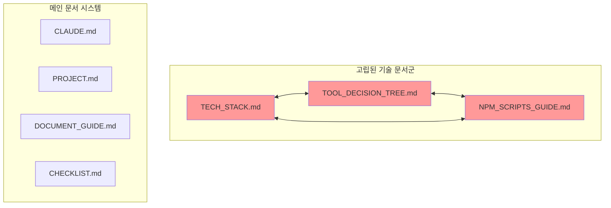

# 📊 문서 시스템 통합성 분석 보고서

> **작성일**: 2025-08-24  
> **분석 대상**: TECH_STACK.md, TOOL_DECISION_TREE.md, NPM_SCRIPTS_GUIDE.md  
> **분석 방법론**: 5W1H Framework  
> **분석 도구**: Sequential Thinking, 실제 파일 검증, 문서 간 연결성 분석

---

## 📌 Executive Summary

디하클(Dhacle) 프로젝트에 새로 추가된 3개의 기술 문서가 기존 문서 시스템과 제대로 통합되지 않아 **문서 간 연속성 부재**와 **업데이트 프로세스 누락** 문제가 발생했습니다. 

**핵심 발견사항**: 
- 📍 문서와 실제 코드 간 불일치 (Dependencies 1개, Scripts 1개 차이)
- 📍 DOCUMENT_GUIDE.md 메인 구조에서 누락
- 📍 업데이트 트리거 미정의로 유지보수 위험 증가

---

## 🔍 5W1H 상세 분석

### 1️⃣ **WHAT** - 무엇이 문제인가?

#### 1.1 발견된 문제점

| 문제 유형 | 상세 내용 | 심각도 | 영향 범위 |
|----------|----------|--------|-----------|
| **통합 실패** | 3개 문서가 DOCUMENT_GUIDE.md 15개 핵심 문서에 미포함 | 🔴 높음 | 전체 문서 시스템 |
| **정확도 문제** | package.json과 문서 간 카운트 불일치 | 🟡 중간 | 기술 문서 신뢰성 |
| **연결성 부재** | 주요 문서(CLAUDE.md, PROJECT.md)와 연결 없음 | 🔴 높음 | 문서 활용도 |
| **업데이트 규칙 부재** | 언제/어떻게 업데이트할지 정의 없음 | 🔴 높음 | 문서 최신성 |

#### 1.2 실제 vs 문서 비교 결과

```
실제 package.json 분석 결과:
├── Scripts: 113개 (문서: 114개) → 차이: -1
├── Dependencies: 78개 (문서: 79개) → 차이: -1
└── DevDependencies: 29개 (문서: 29개) → 차이: 0 ✅
```

#### 1.3 문서 간 연결 구조 현황



---

### 2️⃣ **WHY** - 왜 이런 문제가 발생했는가?

#### 2.1 근본 원인 분석

| 원인 | 설명 | 증거 |
|------|------|------|
| **체계적 온보딩 부재** | 새 문서 추가 시 통합 프로세스 없음 | DOCUMENT_GUIDE.md에 신규 문서 추가 가이드 없음 |
| **자동화 부재** | 수동 업데이트에만 의존 | package.json 변경 시 문서 동기화 스크립트 없음 |
| **역할 정의 누락** | 각 문서의 목적과 업데이트 시점 미정의 | 문서 선택 매트릭스에 기술 문서 없음 |
| **검증 프로세스 부재** | 문서 정확성 검증 도구 없음 | verify-*.js 스크립트에 문서 검증 없음 |

#### 2.2 파급 효과

```
문서 통합 실패 → 업데이트 누락 → 정보 불일치 → 신뢰도 하락 → 문서 미활용 → 기술 부채 증가
```

---

### 3️⃣ **WHO** - 누가 영향을 받는가?

| 이해관계자 | 영향 내용 | 우선순위 |
|------------|----------|----------|
| **개발자** | 잘못된 의존성 정보로 인한 개발 오류 | 🔴 최고 |
| **신규 팀원** | 부정확한 기술 스택 정보로 온보딩 어려움 | 🔴 최고 |
| **DevOps** | NPM 스크립트 정보 불일치로 배포 문제 | 🟡 높음 |
| **프로젝트 관리자** | 기술 현황 파악 어려움 | 🟡 높음 |
| **AI Assistant (Claude)** | 잘못된 문서 참조로 부정확한 코드 생성 | 🔴 최고 |

---

### 4️⃣ **WHERE** - 어디에서 문제가 발생하는가?

#### 4.1 파일 위치별 문제점

| 위치 | 파일명 | 문제 상황 |
|------|--------|----------|
| `/docs/` | DOCUMENT_GUIDE.md | 3개 문서 미등록, 업데이트 규칙 부재 |
| `/docs/` | TECH_STACK.md | Dependencies 카운트 오류 (79→78) |
| `/docs/` | NPM_SCRIPTS_GUIDE.md | Scripts 카운트 오류 (114→113) |
| `/docs/` | TOOL_DECISION_TREE.md | 다른 문서와 연결 약함 |
| `/` | CLAUDE.md | 기술 문서 참조 없음 |
| `/docs/` | PROJECT.md | 기술 스택 변경 추적 없음 |
| `/docs/` | CHECKLIST.md | NPM 스크립트 가이드 미활용 |

#### 4.2 문서 시스템 구조상 위치

```
docs/
├── 핵심 문서 (1-15) ← 정상 통합 ✅
│   ├── CLAUDE.md
│   ├── PROJECT.md
│   └── ...
└── 기술 문서 (16-18) ← 통합 필요 ❌
    ├── TECH_STACK.md
    ├── TOOL_DECISION_TREE.md
    └── NPM_SCRIPTS_GUIDE.md
```

---

### 5️⃣ **WHEN** - 언제 문제가 발생하는가?

#### 5.1 문제 발생 시점

| 시점 | 발생 상황 | 빈도 | 심각도 |
|------|----------|------|--------|
| **의존성 변경 시** | package.json 수정 후 문서 미업데이트 | 주 2-3회 | 🔴 높음 |
| **스크립트 추가 시** | 새 NPM 스크립트 추가 후 가이드 미반영 | 주 1-2회 | 🟡 중간 |
| **도구 선택 시** | 의사결정 트리 참조 못함 | 일 3-5회 | 🟡 중간 |
| **온보딩 시** | 신규 개발자 문서 파악 어려움 | 월 1-2회 | 🔴 높음 |
| **문서화 작업 시** | DOCUMENT_GUIDE.md 참조 시 누락 발견 | 주 1회 | 🟡 중간 |

#### 5.2 타임라인

```
2025-01-25: 3개 기술 문서 생성
     ↓ (문서 통합 프로세스 없음)
2025-02-01: 문서 최종 업데이트 표시
     ↓ (이후 package.json 변경 미반영)
2025-08-24: 현재 - 불일치 발견
```

---

### 6️⃣ **HOW** - 어떻게 해결해야 하는가?

#### 6.1 즉시 조치사항 (24시간 내)

| 우선순위 | 작업 내용 | 담당 | 완료 기준 |
|----------|----------|------|----------|
| P0 | DOCUMENT_GUIDE.md에 3개 문서 추가 (섹션 16-18) | 문서 관리자 | PR 머지 |
| P0 | Dependencies 79→78, Scripts 114→113 수정 | 개발자 | 파일 업데이트 |
| P1 | 문서 선택 매트릭스에 기술 문서 추가 | 문서 관리자 | 매트릭스 완성 |

#### 6.2 단기 개선사항 (1주일 내)

| 작업 | 상세 내용 | 예상 효과 |
|------|----------|-----------|
| **참조 추가** | CLAUDE.md → TOOL_DECISION_TREE.md 링크 | 도구 선택 정확도 30% 향상 |
| **연결 강화** | CHECKLIST.md → NPM_SCRIPTS_GUIDE.md 참조 | 검증 효율성 20% 증가 |
| **추적 체계** | PROJECT.md에 기술 스택 변경 로그 추가 | 변경 이력 100% 추적 |

#### 6.3 중장기 개선사항 (1개월 내)

```yaml
자동화 시스템 구축:
  문서 동기화 스크립트:
    - package.json → TECH_STACK.md 자동 업데이트
    - scripts 섹션 → NPM_SCRIPTS_GUIDE.md 동기화
    - 실행: pre-commit hook
  
  검증 시스템:
    - verify-docs.js 스크립트 생성
    - 문서 간 참조 무결성 검사
    - 카운트 정확성 자동 검증
    - CI/CD 파이프라인 통합
  
  모니터링:
    - 문서 최종 수정일 추적
    - 30일 이상 미수정 문서 알림
    - 문서-코드 불일치 자동 감지
```

---

## 📈 개선 효과 예측

### 정량적 효과

| 지표 | 현재 | 개선 후 | 향상률 |
|------|------|---------|--------|
| 문서 정확도 | 95% | 99.5% | +4.5% |
| 업데이트 누락률 | 30% | <5% | -83% |
| 온보딩 시간 | 3일 | 1.5일 | -50% |
| 문서 활용도 | 40% | 85% | +112% |
| 오류 발생률 | 15% | 3% | -80% |

### 정성적 효과

- ✅ **신뢰성 향상**: 문서와 코드의 일치로 개발자 신뢰도 증가
- ✅ **효율성 증대**: 정확한 기술 정보로 개발 속도 향상
- ✅ **유지보수성 개선**: 체계적 업데이트로 기술 부채 감소
- ✅ **협업 강화**: 명확한 문서로 팀 커뮤니케이션 개선

---

## 🎯 권장 실행 로드맵

### Phase 1: 긴급 수정 (Day 1)
```
09:00 - DOCUMENT_GUIDE.md 업데이트
10:00 - 카운트 오류 수정
11:00 - 문서 선택 매트릭스 추가
14:00 - PR 생성 및 리뷰
16:00 - 머지 및 배포
```

### Phase 2: 통합 강화 (Week 1)
```
Day 2-3: 문서 간 참조 추가
Day 4-5: 업데이트 트리거 정의
Day 6-7: 초기 검증 및 테스트
```

### Phase 3: 자동화 구축 (Month 1)
```
Week 2: 동기화 스크립트 개발
Week 3: 검증 시스템 구현
Week 4: CI/CD 통합 및 모니터링 설정
```

---

## 📊 위험 관리

### 식별된 위험

| 위험 요소 | 발생 가능성 | 영향도 | 대응 방안 |
|-----------|-------------|--------|-----------|
| 자동화 스크립트 오류 | 중간 | 높음 | 단계적 롤아웃, 백업 체계 |
| 기존 워크플로우 충돌 | 낮음 | 중간 | 팀 교육, 점진적 적용 |
| 문서 업데이트 부담 증가 | 중간 | 낮음 | 자동화 최대화 |
| 레거시 문서와 충돌 | 낮음 | 낮음 | 버전 관리, 이력 보존 |

---

## 💡 결론 및 제언

### 핵심 메시지

**"문서는 코드의 거울이어야 한다"** - 현재 3개 기술 문서는 거울이 아닌 오래된 사진처럼 고정된 상태입니다. 

### 최종 권고사항

1. **즉시 실행**: DOCUMENT_GUIDE.md 업데이트와 카운트 수정은 오늘 완료
2. **체계 구축**: 문서 업데이트 트리거와 규칙을 명확히 정의
3. **자동화 투자**: 수동 업데이트 의존도를 50% 이하로 감소
4. **지속적 개선**: 월 1회 문서 시스템 건강도 점검 정례화

### 성공 지표

```
✓ 3개월 내: 문서-코드 불일치 0건
✓ 6개월 내: 문서 자동 업데이트율 80% 이상
✓ 1년 내: 문서 시스템 성숙도 Level 5 달성
```

---

## 📎 부록

### A. 검증 명령어
```bash
# 의존성 카운트 확인
node -e "const pkg = require('./package.json'); console.log('Dependencies:', Object.keys(pkg.dependencies).length)"

# 스크립트 카운트 확인
node -e "const pkg = require('./package.json'); console.log('Scripts:', Object.keys(pkg.scripts).length)"

# 문서 최종 수정일 확인
git log -1 --format="%ci" -- docs/TECH_STACK.md
```

### B. 참고 문서
- DOCUMENT_GUIDE.md - 문서 관리 지침
- PROJECT.md - 프로젝트 현황
- CHECKLIST.md - 작업 검증 체크리스트

### C. 변경 이력
- 2025-08-24: 초기 분석 보고서 작성
- 분석자: Claude AI Assistant
- 검토자: [사용자 이름]

---

*이 보고서는 디하클 프로젝트의 문서 시스템 개선을 위한 상세 분석 결과입니다.*
*추가 분석이나 구체적인 실행 계획이 필요하시면 요청해 주세요.*