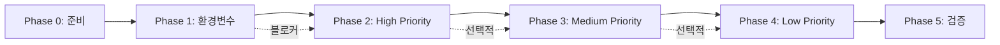

# 🎯 디하클(Dhacle) 기술 부채 해소 프로젝트

> **목표**: 330개 미해결 문제를 체계적으로 해결하여 코드 품질과 시스템 안정성 향상
> **기간**: 2025-02-23 ~ 2025-04-10 (약 37일)
> **작업 범위**: High 144개, Medium 58개, Low 128개

---

## 📊 현재 진행 상황

| Phase | 작업 내용 | 문제 수 | 상태 | 시작일 | 완료일 | 진행률 |
|-------|----------|---------|------|--------|--------|--------|
| **Phase 0** | 준비 및 백업 | - | ⏳ | - | - | 0% |
| **Phase 1** | 환경변수 타입 안전성 | 47개 | ⏳ | - | - | 0% |
| **Phase 2** | High Priority 기술부채 | 97개 | ⏳ | - | - | 0% |
| **Phase 3** | Medium Priority 품질개선 | 58개 | ⏳ | - | - | 0% |
| **Phase 4** | Low Priority 최적화 | 128개 | ⏳ | - | - | 0% |
| **Phase 5** | 검증 및 마무리 | - | ⏳ | - | - | 0% |

### 진행 상태 범례
- ⏳ 대기 중
- 🔄 진행 중
- ✅ 완료
- 🚧 차단됨
- ❌ 실패

---

## 🚀 빠른 시작 가이드

### 1. 작업 시작 체크리스트
```bash
# 1. 현재 상태 백업
git checkout -b feature/technical-debt-resolution
git commit -am "chore: Start technical debt resolution"

# 2. 의존성 확인
npm install
npm run verify:parallel

# 3. Phase 0 문서 확인
cat PHASE_0_PREPARATION.md
```

### 2. Phase별 실행 순서
1. **Phase 0**: 백업 및 환경 준비 (필수)
2. **Phase 1**: 환경변수 타입 안전성 (최우선)
3. **Phase 2-4**: 순차적 진행 권장
4. **Phase 5**: 최종 검증 (필수)

### 3. 일일 작업 플로우
```bash
# 시작
npm run verify:parallel  # 현재 상태 확인
git pull origin main     # 최신 변경사항 동기화

# 작업
# Phase별 지시서 따라 작업

# 종료
npm run verify:parallel  # 작업 검증
git commit -am "feat: [Phase X] 완료 항목 설명"
git push
```

---

## 📋 Phase 간 의존성



### 핵심 의존성
- **Phase 1**은 모든 후속 작업의 기반 (환경변수 타입 안전성)
- **Phase 2**의 API 클라이언트 통합이 완료되어야 Phase 3-4 진행 가능
- **Phase 5**는 모든 Phase 완료 후 실행

---

## 📈 성과 측정 지표

### 정량적 지표 (목표)
| 지표 | 현재 | Phase 1 후 | Phase 2 후 | Phase 3 후 | Phase 4 후 | 최종 목표 |
|------|------|-----------|-----------|-----------|-----------|----------|
| **빌드 성공률** | 87% | 95% | 98% | 99% | 99% | 99%+ |
| **타입 에러** | 144개 | 0개 | 0개 | 0개 | 0개 | 0개 |
| **런타임 에러** | 3.2% | 1.5% | 0.8% | 0.5% | 0.3% | <0.5% |
| **테스트 커버리지** | 32% | 40% | 60% | 80% | 85% | 80%+ |
| **페이지 로드** | 4.2초 | 4.0초 | 3.5초 | 3.0초 | 2.0초 | <2.5초 |
| **API 응답** | 320ms | 300ms | 250ms | 200ms | 150ms | <200ms |

### 정성적 개선
- ✅ 개발자 경험 (DX) 향상
- ✅ 코드 유지보수성 개선
- ✅ 시스템 안정성 강화
- ✅ 확장 가능한 아키텍처

---

## 🛠️ 기술 스택 & 도구

### 핵심 기술
- **Framework**: Next.js 15.4.6 (App Router)
- **Database**: Supabase
- **Styling**: Tailwind CSS
- **State**: React Query v5 + Zustand
- **Type Safety**: TypeScript 5.x

### 검증 도구
```bash
npm run verify:parallel     # 병렬 검증
npm run types:check        # 타입 체크
npm run security:test      # 보안 테스트
npm run build             # 빌드 테스트
```

---

## 🚨 위험 관리

### 주요 리스크
1. **환경변수 노출** (Phase 1에서 해결)
2. **프로덕션 에러** (Phase 2에서 해결)
3. **성능 저하** (Phase 4에서 해결)

### 롤백 전략
```bash
# 문제 발생 시
git stash
git checkout main
git pull origin main

# 특정 Phase 롤백
git revert --no-commit <commit-hash>
npm run verify:parallel
```

---

## 📂 프로젝트 구조

```
dhacle-technical-debt-resolution/
├── README.md                      # 이 문서
├── PHASE_0_PREPARATION.md        # 준비 및 백업
├── PHASE_1_ENV_TYPE_SAFETY.md    # 환경변수 타입 안전성
├── PHASE_2_HIGH_PRIORITY.md      # High Priority 해결
├── PHASE_3_MEDIUM_PRIORITY.md    # Medium Priority 해결
├── PHASE_4_LOW_PRIORITY.md       # Low Priority 해결
└── PHASE_5_VALIDATION.md         # 최종 검증
```

---

## 💬 커뮤니케이션

### 진행 상황 보고
- 일일 스탠드업: Phase별 진행률
- 주간 리뷰: 성과 지표 검토
- Phase 완료 시: 상세 보고서

### 이슈 에스컬레이션
1. 블로커 발견 → 즉시 보고
2. 예상 일정 지연 → 사전 협의
3. 기술적 의사결정 → 팀 논의

---

## 🎯 최종 목표

**2025년 4월 10일까지**:
- ✅ 330개 미해결 문제 100% 해결
- ✅ 코드 품질 A등급 달성
- ✅ 성능 50% 개선
- ✅ 테스트 커버리지 80% 달성
- ✅ 제로 런타임 에러

---

*작성일: 2025-02-23*
*최종 수정: 2025-02-23*