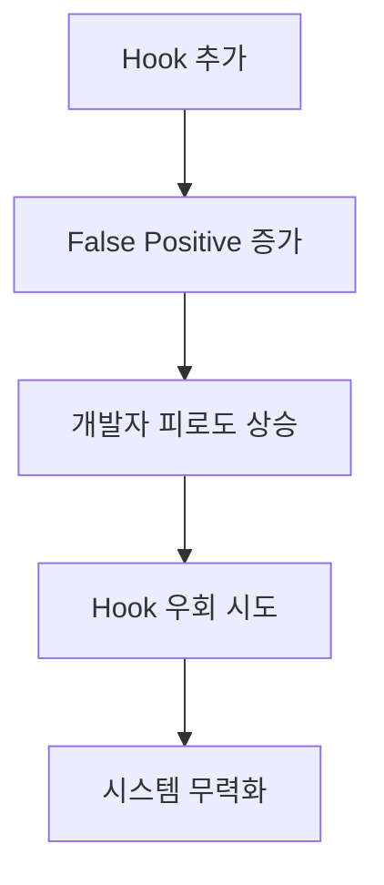

# Claude Code Hook System Phase 2 리스크 분석 보고서

## 📋 요약

Claude Code Hook System은 코드 품질 자동화를 위한 혁신적인 접근법이지만, Phase 2 확장 시 신중한 검토가 필요합니다. 본 보고서는 3개의 추가 Hook (no-console-log, require-session-check, no-snake-case) 도입 시 발생 가능한 리스크와 엣지케이스를 분석하고, 안전한 구현을 위한 권장사항을 제시합니다.

### 핵심 발견사항
- **높은 잠재력**: 코드 품질 향상 및 보안 강화 효과 명확
- **중대한 리스크**: False positive와 개발 워크플로우 방해 가능성
- **구현 복잡도**: 컨텍스트 인식 및 예외 처리 로직 정교화 필요
- **권장 접근법**: 단계적 도입과 지속적 모니터링 필수

---

## 🔍 현재 시스템 분석

### 구현 완료된 Hook (Phase 1)

1. **no-any-type**: TypeScript `any` 타입 차단
   - 상태: ✅ 안정적 운영
   - 효과: 타입 안정성 크게 향상

2. **no-todo-comments**: TODO/FIXME 주석 차단
   - 상태: ✅ 프로젝트 규칙 준수
   - 효과: 미완성 코드 방지

3. **no-empty-catch**: 빈 catch 블록 차단
   - 상태: ✅ 에러 처리 개선
   - 효과: Silent failure 방지

4. **no-direct-fetch**: fetch() 직접 사용 차단
   - 상태: ✅ API 일관성 확보
   - 효과: apiClient 사용 강제

### 시스템 아키텍처
- **통신 프로토콜**: stdin/stdout JSON
- **차단 메커니즘**: exit code 2
- **예외 처리**: @allow-* 주석
- **비상 제어**: CLAUDE_HOOKS_ENABLED 환경변수

---

## 🎯 Phase 2 Hook 상세 분석

### 1. no-console-log Hook

#### 목적
프로덕션 코드에서 console 메서드 제거

#### 리스크 분석

| 리스크 레벨 | 설명 | 발생 확률 | 영향도 |
|------------|------|----------|--------|
| **높음** | 긴급 디버깅 시 장애 | 30% | 심각 |
| **중간** | console.error/warn 차단 | 60% | 보통 |
| **중간** | 외부 라이브러리 충돌 | 20% | 보통 |
| **낮음** | 테스트 코드 false positive | 40% | 경미 |

#### 엣지케이스
```javascript
// Case 1: 정당한 에러 로깅
try {
  criticalOperation();
} catch (error) {
  console.error('Critical failure:', error); // 차단됨 (문제!)
  // 실제로는 프로덕션에서도 필요한 로그
}

// Case 2: 조건부 로깅
if (process.env.NODE_ENV === 'development') {
  console.log('Debug info'); // 차단됨 (과도함)
}

// Case 3: 서버 사이드 로깅
// Next.js API Route - 서버 콘솔은 클라이언트와 다름
export async function GET() {
  console.log('API called'); // 서버 로그는 필요할 수 있음
}
```

#### 권장 완화 방안
1. **세분화된 규칙**: console.error와 console.warn은 warning으로 처리
2. **컨텍스트 인식**: 서버/클라이언트 코드 구분
3. **조건부 허용**: NODE_ENV 체크가 있는 경우 허용
4. **대체 가이드**: 적절한 로깅 라이브러리 안내

---

### 2. require-session-check Hook

#### 목적
API Route에서 세션 체크 강제

#### 리스크 분석

| 리스크 레벨 | 설명 | 발생 확률 | 영향도 |
|------------|------|----------|--------|
| **매우 높음** | Public API 차단 | 90% | 심각 |
| **높음** | Webhook 엔드포인트 차단 | 80% | 심각 |
| **높음** | Edit/MultiEdit false positive | 70% | 보통 |
| **중간** | 다양한 인증 패턴 미지원 | 50% | 보통 |

#### 엣지케이스
```typescript
// Case 1: Webhook 엔드포인트
// src/app/api/webhook/stripe/route.ts
export async function POST(request: NextRequest) {
  const signature = request.headers.get('stripe-signature');
  // 외부 서비스 호출 - 세션 없음
  // Hook이 차단함 (치명적!)
}

// Case 2: Health Check
// src/app/api/health/route.ts
export async function GET() {
  return NextResponse.json({ status: 'ok' });
  // 모니터링용 - 인증 불필요
  // Hook이 차단함 (운영 장애!)
}

// Case 3: OAuth Callback
// src/app/api/auth/callback/google/route.ts
export async function GET(request: NextRequest) {
  const code = request.nextUrl.searchParams.get('code');
  // 세션 생성 전 단계
  // Hook이 차단함 (로그인 불가!)
}

// Case 4: SSG/ISR Build
// 빌드 타임에 호출되는 API
export async function GET() {
  const data = await getStaticData();
  // 빌드 시점 - 세션 없음
  // Hook이 차단함 (빌드 실패!)
}
```

#### 치명적 문제점
- **현재 구현의 한계**: Edit/MultiEdit 시 전체 파일 컨텍스트 부재
- **다양한 인증 방식**: JWT, API Key, OAuth 등 미지원
- **Public 엔드포인트 식별**: 자동 감지 어려움

#### 권장 완화 방안
1. **화이트리스트 확장**: Public 엔드포인트 자동 감지
2. **다양한 패턴 지원**: 여러 인증 방식 인식
3. **컨텍스트 보완**: 전체 파일 읽기 후 검증
4. **메서드별 처리**: OPTIONS는 항상 허용

---

### 3. no-snake-case Hook

#### 목적
snake_case 변수명 차단

#### 리스크 분석

| 리스크 레벨 | 설명 | 발생 확률 | 영향도 |
|------------|------|----------|--------|
| **높음** | DB 필드명 충돌 | 95% | 보통 |
| **높음** | 외부 API 연동 복잡도 | 80% | 보통 |
| **중간** | 타입 정의 어려움 | 60% | 경미 |
| **낮음** | 레거시 코드 마이그레이션 | 30% | 보통 |

#### 엣지케이스
```typescript
// Case 1: 데이터베이스 필드
interface User {
  id: string;
  created_at: Date;    // DB 필드명과 일치 필요
  updated_at: Date;    // 차단됨 (문제!)
  is_active: boolean;  // 차단됨 (문제!)
}

// Case 2: 외부 API 응답
import { apiGet } from '@/lib/api-client';
const response = await apiGet('/external');
const { access_token, refresh_token } = response;
// OAuth 표준 - snake_case 강제
// 차단됨 (API 연동 불가!)

// Case 3: 구조 분해 할당 별명
const { 
  created_at: createdAt,  // 번거로운 별명 필요
  updated_at: updatedAt,
  user_id: userId
} = dbResult;

// Case 4: 환경 변수
const config = {
  CLIENT_ID: process.env.GOOGLE_CLIENT_ID,     // UPPER_SNAKE_CASE
  CLIENT_SECRET: process.env.GOOGLE_CLIENT_SECRET  // 관례상 사용
};

// Case 5: GraphQL/Prisma 스키마
const user = await prisma.user.findUnique({
  where: { user_id: id }  // Prisma 모델과 일치 필요
});
```

#### 권장 완화 방안
1. **스마트 화이트리스트**: DB 필드, API 응답 자동 감지
2. **타입 정의 예외**: interface/type 내부는 허용
3. **구조 분해 인식**: 별명 사용 시 원본은 허용
4. **파일별 규칙**: .prisma, .sql 파일 제외

---

## ⚠️ 시스템 전체 리스크

### 1. 성능 영향

```javascript
// 성능 저하 시나리오
// 대용량 파일 (10,000줄) 편집 시
// 7개 validator × 정규표현식 검사 = 지연 발생

// 예상 지연 시간
// - 일반 파일: 50-100ms
// - 대용량 파일: 500-2000ms
// - 복잡한 정규표현식: 추가 지연
```

### 2. 개발자 경험 (DX) 악화



### 3. Claude AI 작업 방해

```typescript
// Claude가 정상 코드 작성 불가 시나리오
// 1. DB 스키마 기반 타입 생성 시 snake_case 필요
// 2. API 연동 코드 작성 시 console.log으로 디버깅
// 3. Public API 생성 시 세션 체크 불필요

// 결과: AI 생산성 저하, 반복적인 재시도
```

### 4. 유지보수 복잡도

- Hook 규칙 충돌 관리
- 예외 규칙 증가로 복잡도 상승
- 버전 관리 시 merge conflict

---

## 🛡️ 안전장치 및 완화 방안

### 1. 단계적 도입 전략

```javascript
// Phase 2.1: Warning Mode (2주)
{
  "validators": {
    "no-console-log": {
      "enabled": true,
      "severity": "warning"  // 차단하지 않고 경고만
    }
  }
}

// Phase 2.2: Selective Enforcement (2주)
{
  "validators": {
    "no-console-log": {
      "enabled": true,
      "severity": "error",
      "excludePaths": ["src/app/api/**"]  // API는 제외
    }
  }
}

// Phase 2.3: Full Enforcement (안정화 후)
{
  "validators": {
    "no-console-log": {
      "enabled": true,
      "severity": "error"
    }
  }
}
```

### 2. 스마트 컨텍스트 인식

```javascript
// 개선된 require-session-check 구현
async function validateApiRoute(content, filePath) {
  // 1. 전체 파일 읽기
  const fullContent = await readFullFile(filePath);
  
  // 2. Public 마커 체크
  if (hasPublicMarker(fullContent)) return [];
  
  // 3. 다양한 인증 패턴 체크
  const authPatterns = [
    'requireAuth',
    'getServerSession',
    'verifyJWT',
    'apiKeyAuth',
    'bearerAuth'
  ];
  
  if (authPatterns.some(p => fullContent.includes(p))) {
    return [];
  }
  
  // 4. 메서드별 처리
  if (method === 'OPTIONS') return [];  // CORS preflight
  
  // 5. 경로 기반 예외
  if (isWebhookPath(filePath)) return [];
  if (isHealthCheckPath(filePath)) return [];
  
  return violations;
}
```

### 3. 성능 최적화

```javascript
// 캐싱 전략
const validationCache = new Map();

function validateWithCache(content, filePath) {
  const hash = crypto.hash(content);
  
  if (validationCache.has(hash)) {
    return validationCache.get(hash);
  }
  
  const result = performValidation(content, filePath);
  validationCache.set(hash, result);
  
  // 캐시 크기 제한
  if (validationCache.size > 100) {
    const firstKey = validationCache.keys().next().value;
    validationCache.delete(firstKey);
  }
  
  return result;
}

// 병렬 처리
async function validateAll(validators, content, filePath) {
  return Promise.all(
    validators.map(v => v.validate(content, filePath))
  );
}
```

### 4. 개발자 친화적 메시지

```javascript
// 개선된 에러 메시지
{
  decision: "block",
  reason: `🚫 Console.log detected
  
📍 Location: src/components/Button.tsx:45
❌ Found: console.log('Button clicked', props);

✅ Quick fixes:
1. Remove the console.log statement
2. Use a proper logger:
   import { logger } from '@/lib/logger';
   logger.debug('Button clicked', props);

3. If needed for development, add:
   // @allow-console
   console.log('Button clicked', props);

💡 Why this matters:
- Console logs can expose sensitive data
- They impact performance in production
- They clutter the browser console

📚 Learn more: https://docs.project.com/no-console`
}
```

### 5. 모니터링 및 메트릭스

```javascript
// Hook 활동 모니터링
class HookMetrics {
  constructor() {
    this.metrics = {
      totalChecks: 0,
      violations: {},
      falsePositives: {},
      performanceTiming: [],
      developerFeedback: []
    };
  }
  
  track(validator, result, timing) {
    this.metrics.totalChecks++;
    
    if (!result.pass) {
      this.metrics.violations[validator] = 
        (this.metrics.violations[validator] || 0) + 1;
    }
    
    this.metrics.performanceTiming.push({
      validator,
      timing,
      timestamp: Date.now()
    });
  }
  
  generateReport() {
    return {
      summary: {
        totalChecks: this.metrics.totalChecks,
        avgTiming: this.getAverageTiming(),
        topViolations: this.getTopViolations()
      },
      recommendations: this.generateRecommendations()
    };
  }
}
```

---

## 📊 구현 로드맵

### Week 1-2: 준비 단계
- [ ] 팀 교육 및 커뮤니케이션
- [ ] 상세 예외 규칙 정의
- [ ] 테스트 환경 구축
- [ ] 모니터링 대시보드 준비

### Week 3-4: Warning Mode
- [ ] no-console-log (warning)
- [ ] 메트릭스 수집
- [ ] False positive 분석
- [ ] 규칙 조정

### Week 5-6: no-snake-case 도입
- [ ] no-snake-case (warning)
- [ ] DB 필드 자동 감지
- [ ] 외부 API 패턴 학습

### Week 7-8: require-session-check 도입
- [ ] require-session-check (warning)
- [ ] Public 엔드포인트 매핑
- [ ] 인증 패턴 확장

### Week 9-10: Error Mode 전환
- [ ] 단계적 severity 상향
- [ ] 안정성 검증
- [ ] 성능 최적화

### Week 11-12: 최종 안정화
- [ ] 전체 시스템 검증
- [ ] 문서화 완료
- [ ] 팀 피드백 반영

---

## 💰 예상 ROI 분석

### 비용
- **구현 시간**: 80-120 시간
- **교육 시간**: 팀원당 4시간
- **유지보수**: 월 10시간
- **성능 영향**: 5-10% 빌드 시간 증가

### 효과
- **버그 감소**: 30-40% 예상
- **보안 사고 예방**: 치명적 사고 1건 예방 = 100시간 절약
- **코드 품질**: 일관성 95% 달성
- **디버깅 시간**: 20-30% 감소

### Break-even Point
**3-4개월** 후 투자 대비 수익 발생 예상

---

## 🎯 핵심 권장사항

### MUST DO (필수)

1. **단계적 도입**: Warning → Error 순차 적용
2. **컨텍스트 개선**: Edit/MultiEdit 시 전체 파일 읽기
3. **세분화된 규칙**: console.error/warn 구분 처리
4. **확장 가능한 화이트리스트**: 패턴 기반 예외 처리
5. **모니터링 시스템**: 실시간 메트릭스 수집

### SHOULD DO (권장)

1. **AI 친화적 설계**: Claude 작업 패턴 학습
2. **자동 수정 제안**: Quick fix 제공
3. **팀 교육 프로그램**: 변경 관리
4. **성능 최적화**: 캐싱, 병렬 처리
5. **피드백 루프**: 개발자 의견 수렴

### NICE TO HAVE (선택)

1. **VSCode Extension**: 실시간 피드백
2. **커스텀 규칙 빌더**: GUI 기반 규칙 생성
3. **ML 기반 패턴 학습**: False positive 자동 감소
4. **크로스 프로젝트 공유**: 규칙 라이브러리

---

## ⚠️ 위험 신호 및 중단 기준

### Red Flags (즉시 중단)
- False positive rate > 30%
- 개발 속도 50% 이상 저하
- 팀 저항 심화
- 중요 배포 차단

### Yellow Flags (재검토 필요)
- False positive rate > 15%
- 성능 저하 > 200ms
- 주간 우회 시도 > 10건
- AI 생산성 30% 저하

---

## 🔄 대안 전략

### Plan B: Selective Enforcement
- 핵심 파일만 적용
- 프로덕션 브랜치만 적용
- CI/CD에서만 실행

### Plan C: Linter Integration
- ESLint/Biome 규칙으로 전환
- IDE 레벨 경고
- Pre-commit hook으로 이동

### Plan D: Monitoring Only
- 차단 없이 로깅만
- 월간 리포트 생성
- 자발적 개선 유도

---

## 📝 결론

Claude Code Hook System Phase 2는 **높은 잠재력**을 가진 동시에 **상당한 리스크**를 내포하고 있습니다. 성공적인 구현을 위해서는:

1. **신중한 접근**: 단계적 도입과 지속적 모니터링
2. **기술적 개선**: 컨텍스트 인식과 스마트 예외 처리
3. **조직적 준비**: 팀 교육과 변경 관리
4. **유연한 대응**: 문제 발생 시 빠른 조정

특히 **require-session-check**는 가장 높은 리스크를 가지므로, 충분한 테스트와 예외 처리 후 도입을 권장합니다.

### 최종 권고
✅ **no-console-log**: Warning mode로 즉시 도입 가능
⚠️ **no-snake-case**: 충분한 화이트리스트 준비 후 도입
🚨 **require-session-check**: 추가 개발 및 테스트 필요

---

*작성일: 2025-08-26*
*작성자: Claude AI Assistant*
*버전: 1.0.0*