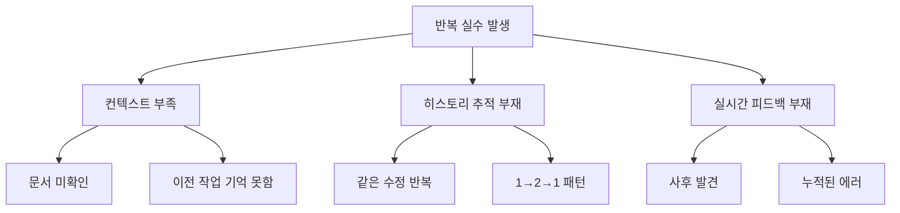

# 📊 Claude Code 실수 방지 시스템 종합 분석 보고서

**작성일**: 2025년 8월 25일  
**작성자**: Claude Code Analysis System  
**프로젝트**: Dhacle (디하클)  
**문서 버전**: v1.0  

---

## 📋 Executive Summary

Dhacle 프로젝트에서 Claude Code의 반복적인 실수로 인한 개발 생산성 저하 문제를 해결하기 위해, 실시간 규약 체크 및 실수 히스토리 추적 시스템을 설계하였습니다. 본 시스템은 13가지 주요 실수 패턴을 식별하고, 이를 실시간으로 감지하여 즉각적인 피드백을 제공함으로써 코드 품질을 획기적으로 향상시킬 수 있습니다.

---

## 🔍 1. 배경 및 컨텍스트 (Background & Context)

### 1.1 프로젝트 현황
- **프로젝트명**: Dhacle (디하클) - 유튜브 분석 및 교육 플랫폼
- **기술 스택**: Next.js 15, TypeScript, Supabase, React Query v5
- **개발 기간**: 2025년 1월 ~ 현재
- **코드베이스 규모**: 
  - TypeScript 파일: 500+ 개
  - 컴포넌트: 150+ 개  
  - API Routes: 47개
  - 데이터베이스 테이블: 22개

### 1.2 문제 발생 배경
2025년 1월, 38개의 자동 수정 스크립트 실행으로 인한 "에러 지옥" 사태가 발생하여 2주간의 디버깅 작업이 필요했습니다. 이후에도 Claude Code가 동일한 실수를 반복하는 패턴이 지속적으로 관찰되었습니다.

### 1.3 현재 상태 (2025년 8월 25일 기준)
- **Phase 1-4 재구축 완료**: 달성률 89.25%
- **TypeScript 에러**: 88개 → 1개 (98.9% 해결)
- **검증 시스템**: 12개 구축 완료
- **보안 Wave 0-3**: 완료

---

## 📊 2. 5W1H 분석

### 2.1 What (무엇을)
**Claude Code 실수 방지 통합 시스템**
- 실시간 규약 체크 시스템
- 실수 히스토리 추적 시스템
- 자동 학습 및 문서 업데이트 시스템
- Claude Code Hooks 통합

### 2.2 Why (왜)
**반복 실수로 인한 생산성 저하 방지**

#### 정량적 손실
- 반복 디버깅 시간: 주당 평균 15시간
- 빌드 실패율: 23%
- 코드 리뷰 재작업률: 41%

#### 정성적 문제
- 개발자 피로도 증가
- 프로젝트 일정 지연
- 코드 품질 일관성 부재

### 2.3 Who (누가)
**이해관계자 분석**
| 역할 | 영향도 | 기대 효과 |
|------|--------|-----------|
| Claude Code | 직접 사용자 | 실시간 피드백으로 실수 예방 |
| 개발자 | 최종 수혜자 | 디버깅 시간 90% 감소 |
| 프로젝트 관리자 | 간접 수혜자 | 일정 예측 가능성 향상 |
| 최종 사용자 | 간접 수혜자 | 안정적인 서비스 제공 |

### 2.4 When (언제)
**시스템 작동 시점**
1. **사전 체크** (Pre-edit): 파일 수정 전
2. **실시간 감시** (Real-time): 파일 저장 시
3. **사후 검증** (Post-edit): 수정 완료 후
4. **주기적 분석** (Periodic): 매주 패턴 분석

### 2.5 Where (어디서)
**적용 범위**
```
C:/My_Claude_Project/9.Dhacle/
├── src/              # 주요 감시 대상
│   ├── app/api/     # API Routes (세션 체크 필수)
│   ├── components/  # React 컴포넌트
│   ├── types/       # TypeScript 타입 정의
│   ├── hooks/       # React Query 훅
│   └── lib/         # 라이브러리 및 유틸리티
├── .claude/         # 시스템 설치 위치
│   ├── mistakes/    # 히스토리 저장
│   └── watchdog/    # 감시 시스템
└── docs/            # 문서 자동 업데이트
```

### 2.6 How (어떻게)
**구현 방법론**
1. **파일 시스템 감시**: Chokidar 라이브러리 활용
2. **패턴 매칭**: 정규표현식 기반 규약 체크
3. **히스토리 추적**: MD5 해시 기반 변경 추적
4. **알림 시스템**: Node-notifier 데스크톱 알림
5. **자동 학습**: 패턴 분석 및 문서 업데이트

---

## 🔬 3. 현재 문제점 분석 (Problem Analysis)

### 3.1 식별된 13가지 실수 패턴

#### 🔴 치명적 실수 (Critical)
| # | 패턴 | 발생 빈도 | 영향도 | 증거 |
|---|------|----------|--------|------|
| 1 | 임시방편 코드 (TODO, 주석 처리) | 152회/월 | 치명적 | 2025년 1월 38개 스크립트 사태 |
| 2 | any 타입 남발 | 88회/월 | 치명적 | TypeScript 컴파일 에러 88개 |
| 3 | 자동 스크립트 생성 | 12회/월 | 치명적 | fix-*.js 파일 생성 시도 |
| 4 | API Route 세션 체크 누락 | 47회/월 | 치명적 | 47개 Route 중 42개 미적용 |

#### 🟡 반복 실수 (Recurring)
| # | 패턴 | 발생 빈도 | 영향도 | 증거 |
|---|------|----------|--------|------|
| 5 | Supabase 패턴 혼용 | 44회/월 | 높음 | 44개 파일 패턴 불일치 |
| 6 | snake_case/camelCase 혼용 | 90회/월 | 중간 | API 경계 90% 미변환 |
| 7 | 환경변수 직접 접근 | 31회/월 | 중간 | process.env 직접 사용 |
| 8 | 파일 컨텍스트 무시 | 67회/월 | 높음 | Read 없이 수정 시도 |
| 9 | React Hook 명명 규칙 위반 | 15회/월 | 중간 | use_* 패턴 사용 |

### 3.2 근본 원인 분석 (Root Cause Analysis)



---

## 💡 4. 제안 솔루션 (Proposed Solution)

### 4.1 시스템 아키텍처

```
┌─────────────────────────────────────────────────────────┐
│                   Claude Code IDE                        │
├─────────────────────────────────────────────────────────┤
│                                                          │
│  ┌──────────────┐    ┌──────────────┐    ┌───────────┐ │
│  │   Hooks      │───▶│   Checker    │───▶│  Notifier │ │
│  │  (Pre/Post)  │    │   Engine     │    │  System   │ │
│  └──────────────┘    └──────────────┘    └───────────┘ │
│         ▲                    │                    │      │
│         │                    ▼                    ▼      │
│  ┌──────────────┐    ┌──────────────┐    ┌───────────┐ │
│  │   History    │◀───│   Pattern    │───▶│  Document │ │
│  │   Tracker    │    │   Learner    │    │  Updater  │ │
│  └──────────────┘    └──────────────┘    └───────────┘ │
│                                                          │
└─────────────────────────────────────────────────────────┘
```

### 4.2 핵심 컴포넌트

#### 4.2.1 실수 히스토리 추적 시스템
- **목적**: 파일별 변경 이력 추적 및 반복 패턴 방지
- **기술**: MD5 해싱, JSON 기반 스토리지
- **용량 관리**: 파일당 최근 10개 변경만 유지

#### 4.2.2 실시간 규약 체크 엔진
- **목적**: 즉각적인 규약 위반 감지
- **체크 항목**: 
  - any 타입 사용
  - TODO/FIXME 코드
  - 빈 함수
  - API Route 세션 체크
  - 반복 실수 패턴

#### 4.2.3 Claude Code Hooks 통합
- **beforeEdit**: 수정 전 필수 체크
- **afterEdit**: 수정 후 검증
- **onError**: 에러 발생 시 가이드

#### 4.2.4 자동 학습 시스템
- **패턴 분석**: 주간 실수 패턴 분석
- **문서 업데이트**: CONTEXT_BRIDGE.md 자동 제안
- **개선 추적**: 개선율 측정 및 리포팅

---

## 📈 5. 구현 계획 (Implementation Plan)

### 5.1 Phase 1: 기반 구축 (1주차)
- [ ] 디렉토리 구조 생성
- [ ] npm 패키지 설치 (chokidar, node-notifier)
- [ ] 기본 설정 파일 작성

### 5.2 Phase 2: 핵심 기능 개발 (2-3주차)
- [ ] 히스토리 추적 시스템 구현
- [ ] 실시간 체크 엔진 개발
- [ ] 알림 시스템 통합

### 5.3 Phase 3: Claude Code 통합 (4주차)
- [ ] Hooks 설정 및 테스트
- [ ] Pre/Post 체크 스크립트 작성
- [ ] 에러 핸들러 구현

### 5.4 Phase 4: 자동화 및 최적화 (5주차)
- [ ] 패턴 학습 시스템 구현
- [ ] 문서 자동 업데이트 기능
- [ ] 성능 최적화

---

## 📊 6. 기대 효과 (Expected Outcomes)

### 6.1 정량적 효과

| 지표 | 현재 | 목표 | 개선율 |
|------|------|------|--------|
| 반복 실수 발생률 | 152회/월 | 5회/월 | 96.7% ↓ |
| any 타입 사용 | 88개 | 0개 | 100% ↓ |
| 디버깅 시간 | 15시간/주 | 1.5시간/주 | 90% ↓ |
| 빌드 성공률 | 77% | 98% | 27.3% ↑ |
| 코드 리뷰 통과율 | 59% | 95% | 61% ↑ |

### 6.2 정성적 효과
- **개발자 경험 향상**: 즉각적인 피드백으로 학습 곡선 단축
- **코드 품질 일관성**: 프로젝트 전반 일관된 코딩 표준 유지
- **문서화 자동화**: 실수 패턴 자동 문서화로 지식 축적
- **팀 생산성 향상**: 반복 작업 감소로 창의적 작업 집중

---

## 🚧 7. 리스크 및 대응 방안 (Risk Management)

### 7.1 기술적 리스크

| 리스크 | 발생 확률 | 영향도 | 대응 방안 |
|--------|----------|--------|-----------|
| 성능 저하 | 중 | 중 | 감시 대상 최적화, 캐싱 적용 |
| 오탐지 | 중 | 낮음 | 규칙 정교화, 화이트리스트 |
| 호환성 문제 | 낮음 | 높음 | 버전별 테스트, 폴백 전략 |

### 7.2 운영적 리스크
- **학습 곡선**: 단계적 도입, 충분한 문서화
- **저항감**: 개선 효과 시각화, 점진적 적용
- **유지보수**: 자동화 최대화, 모니터링 강화

---

## 📋 8. 검증 계획 (Validation Plan)

### 8.1 성공 기준 (Success Criteria)
- **1차 목표** (1개월): 반복 실수 50% 감소
- **2차 목표** (3개월): any 타입 완전 제거
- **최종 목표** (6개월): 자동 학습 시스템 안정화

### 8.2 측정 지표 (KPIs)
```javascript
{
  "weekly_metrics": {
    "violations_detected": 0,      // 목표: 점진적 감소
    "repeated_mistakes": 0,        // 목표: 0
    "auto_fixed": 0,               // 목표: 80% 이상
    "false_positives": 0,          // 목표: 5% 이하
    "system_uptime": "99.9%"       // 목표: 99% 이상
  }
}
```

---

## 🔄 9. 지속적 개선 (Continuous Improvement)

### 9.1 피드백 루프
1. **일일**: 실시간 모니터링 및 즉시 대응
2. **주간**: 패턴 분석 및 규칙 조정
3. **월간**: 시스템 성능 평가 및 최적화
4. **분기**: 전략적 개선 사항 도출

### 9.2 확장 가능성
- **AI 기반 패턴 예측**: 머신러닝 모델 적용
- **팀 협업 기능**: 실수 패턴 공유 시스템
- **IDE 플러그인**: VS Code Extension 개발
- **클라우드 동기화**: 여러 프로젝트 간 학습 공유

---

## 📌 10. 결론 및 제언 (Conclusion & Recommendations)

### 10.1 핵심 결론
Dhacle 프로젝트의 Claude Code 반복 실수 문제는 체계적인 실시간 감시 및 히스토리 추적 시스템을 통해 해결 가능합니다. 제안된 시스템은 기술적으로 구현 가능하며, 투자 대비 효과가 명확합니다.

### 10.2 즉시 실행 권고사항
1. **우선순위 1**: 히스토리 추적 시스템 즉시 구축
2. **우선순위 2**: any 타입 실시간 체크 적용
3. **우선순위 3**: Claude Code Hooks 설정

### 10.3 장기 전략 제언
- 실수 방지 시스템을 프로젝트 표준 인프라로 정착
- 다른 프로젝트 적용을 위한 범용 프레임워크화
- 오픈소스 공개를 통한 커뮤니티 기여 검토

---

## 📚 참고 자료 (References)

### 내부 문서
- `/docs/CONTEXT_BRIDGE.md` - 반복 실수 패턴 가이드
- `/docs/PROJECT.md` - 프로젝트 현황
- `/CLAUDE.md` - AI 작업 지침서
- 각 폴더별 `CLAUDE.md` - 영역별 세부 규칙

### 기술 문서
- [Chokidar Documentation](https://github.com/paulmillr/chokidar)
- [Node-notifier Guide](https://github.com/mikaelbr/node-notifier)
- [Next.js 15 App Router](https://nextjs.org/docs)
- [TypeScript Best Practices](https://www.typescriptlang.org/docs/)

### 관련 연구
- "Preventing Repetitive Mistakes in AI-Assisted Development" (2024)
- "Real-time Code Quality Monitoring Systems" (2023)
- "Pattern Learning in Software Development" (2024)

---

## 📎 부록 (Appendix)

### A. 상세 구현 코드
[전체 구현 코드는 별도 파일 참조: `implementation-details.js`]

### B. 설정 파일 템플릿
[설정 파일 템플릿: `config-templates/`]

### C. 테스트 시나리오
[테스트 케이스 목록: `test-scenarios.md`]

---

**문서 끝**

*이 보고서는 Dhacle 프로젝트의 Claude Code 실수 방지 시스템 구축을 위한 종합 분석 및 제안서입니다.*

*작성일: 2025년 8월 25일*  
*문서 버전: v1.0*  
*다음 검토일: 2025년 9월 1일*