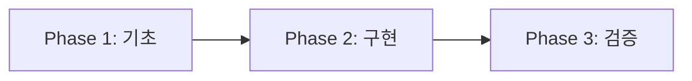

# 🛡️ Claude Code 실수 방지 시스템 구현 프로젝트

> 2025년 1월 "38개 자동 스크립트 재앙"을 영원히 방지하는 실시간 감지 시스템

## 📊 현재 진행 상황

| Phase | 작업 내용 | 상태 | 예상 시간 | 완료일 |
|-------|----------|------|----------|--------|
| Phase 1 | 기초 설치 및 설정 | ⏳ | 30분 | - |
| Phase 2 | 핵심 시스템 구현 | ⏳ | 1시간 | - |
| Phase 3 | 실행 및 검증 | ⏳ | 30분 | - |

## 🎯 프로젝트 목표

### 핵심 목표
- **반복 실수 0회/월** 달성
- **any 타입 0개** 유지
- **빌드 성공률 98%+** 보장
- **38개 스크립트 재앙 영구 방지**

### 해결할 문제
1. Claude Code의 반복적인 실수 패턴 (13가지)
2. 임시방편 코드로 인한 2주간 디버깅 지옥
3. any 타입 88개 누적 문제
4. API Route 세션 체크 누락

## 🚀 빠른 시작 가이드

### 1단계: Phase 1 - 기초 설정
```bash
# PHASE_1_FOUNDATION.md 참조
npm install -D chokidar node-notifier chalk
mkdir -p .claude/mistakes/history
```

### 2단계: Phase 2 - 핵심 구현
```bash
# PHASE_2_CORE_IMPLEMENTATION.md 참조
# 구현 파일 복사 및 설정
```

### 3단계: Phase 3 - 실행 검증
```bash
# PHASE_3_VALIDATION.md 참조
npm run watch:conventions
```

## 📋 Phase 간 의존성



- **Phase 1**: 필수 패키지, 디렉토리, Git 설정
- **Phase 2**: 핵심 로직, 감지 엔진, Hook 통합
- **Phase 3**: 시스템 시작, 테스트, 성능 측정

## 🏗️ 시스템 아키텍처

### 핵심 컴포넌트
1. **MistakeHistoryTracker**: MD5 해시 기반 변경 추적
2. **ConventionChecker**: 13가지 패턴 감지 엔진
3. **RealtimeWatchdog**: Chokidar 기반 실시간 감시
4. **DashboardUI**: 실시간 통계 및 알림

### 감지 패턴 (13가지)

#### 🔴 Critical (즉시 중단)
1. 임시방편 코드 (TODO, FIXME)
2. any 타입 사용
3. 자동 스크립트 생성 (fix-*.js)
4. API Route 세션 체크 누락

#### 🟡 Recurring (경고)
5. Supabase 패턴 혼용
6. snake_case/camelCase 혼용
7. 환경변수 직접 접근
8. 파일 컨텍스트 무시
9. React Hook 규칙 위반
10. createServerComponentClient 사용
11. database.generated.ts 직접 import
12. getSession() 사용
13. fetch() 직접 호출

## ⚠️ 중요 제약사항

### 절대 규칙
```javascript
// 이 설정은 절대 변경 금지
autoFix: false  // 자동 수정 비활성화 (38개 스크립트 재앙 방지)
```

### Git 충돌 방지
```bash
# .gitignore에 필수 추가
.claude/mistakes/
.claude/watchdog/*.log
.claude/logs/
```

### 성능 설정
```javascript
throttle: 500,  // ms (과도한 리소스 사용 방지)
ignored: ['node_modules/**', '.next/**', 'dist/**']
```

## 📊 성과 측정 기준

### 정량적 지표
| 지표 | Before | After (목표) | 측정 방법 |
|------|--------|-------------|-----------|
| 반복 실수 | 15회/주 | 0회/주 | 히스토리 로그 |
| any 타입 | 88개 | 0개 | grep 카운트 |
| 빌드 실패율 | 23% | < 2% | CI/CD 통계 |
| 디버깅 시간 | 15시간/주 | < 1시간/주 | 작업 로그 |

### 정성적 지표
- 개발자 스트레스 감소
- 코드 품질 향상
- 팀 생산성 증가

## 🔍 현재 상태 확인

```bash
# 현재 any 타입 개수
grep -r ": any" src/ --include="*.ts" | wc -l  # 현재: 88개

# TODO/FIXME 개수
grep -r "TODO\|FIXME" src/ | wc -l

# 금지 패턴 확인
grep -r "createServerComponentClient" src/ | wc -l  # 목표: 0개

# 자동 스크립트 확인
ls scripts/fix-*.js 2>/dev/null  # 없어야 함
```

## 📁 파일 구조

```
tasks/2025-08-25_mistake-prevention-system/
├── README.md                        # 이 문서
├── PHASE_1_FOUNDATION.md           # Phase 1: 기초 설치 및 설정
├── PHASE_2_CORE_IMPLEMENTATION.md  # Phase 2: 핵심 구현
└── PHASE_3_VALIDATION.md           # Phase 3: 실행 및 검증
```

## 🚨 트러블슈팅

### 권한 오류
```bash
chmod 755 .claude/mistakes/
chmod 755 .claude/watchdog/
```

### 프로세스 중단
```bash
pkill -f "watch:conventions"
```

### 완전 제거
```bash
rm -rf .claude/watchdog
rm -rf .claude/mistakes
npm uninstall chokidar node-notifier chalk
```

## 📝 체크리스트

- [ ] Phase 1 완료 (패키지 설치, 디렉토리 생성)
- [ ] Phase 2 완료 (코드 구현, 설정 파일)
- [ ] Phase 3 완료 (실행 테스트, 검증)
- [ ] 13가지 패턴 모두 감지 확인
- [ ] 데스크톱 알림 작동 확인
- [ ] 성능 영향 최소화 확인
- [ ] 문서화 완료

---

**성공 기준**: 38개 스크립트 재앙 같은 일이 다시는 발생하지 않음