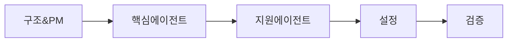

# 🚀 디하클 프로젝트 서브에이전트 시스템 구축

## 📋 작업 개요
- **작업명**: 서브에이전트 시스템 구축
- **날짜**: 2025-01-01
- **목표**: 12개 전문 서브에이전트 시스템 구축 (PM Agent + 11개 영역별 에이전트)
- **복잡도**: Moderate
- **예상 시간**: 총 2시간

## 🎯 핵심 목표

> **"우리의 목표는 단순히 코드를 집어넣어 겉보기에 완성된 프로젝트를 만드는 것이 아니라,**
> **실제로 안정적이게 사용이 가능한 사이트를 구현하는 것이 목표입니다."**

## 📂 Phase 구조

```
tasks/20250101_subagent_system/
├── README.md                    # 전체 개요 (이 파일)
├── PHASE_1_STRUCTURE_SETUP.md   # 디렉토리 구조 및 PM 에이전트
├── PHASE_2_CORE_AGENTS.md       # 핵심 5개 에이전트 생성
├── PHASE_3_SUPPORT_AGENTS.md    # 지원 6개 에이전트 생성
├── PHASE_4_CONFIGURATION.md     # 설정 및 검증
└── VERIFICATION.md               # 최종 검증
```

## 🔄 Phase 간 관계



## 📝 Phase별 요약

### Phase 1: 구조 설정 및 PM 에이전트 (30분)
- `.claude/agents` 디렉토리 생성
- PM 에이전트 (pm-dhacle.md) 생성
- 프로젝트 총괄 조정자 역할 설정

### Phase 2: 핵심 5개 에이전트 (30분)
1. API Route Agent - API 엔드포인트 전문가
2. Component Agent - React 컴포넌트 전문가
3. Type Agent - TypeScript 타입 시스템 수호자
4. Database Agent - Supabase DB 전문가
5. Security Agent - 보안 수호자

### Phase 3: 지원 6개 에이전트 (30분)
6. Query Agent - React Query 전문가
7. Test Agent - E2E 테스트 전문가
8. Script Agent - 스크립트 관리자
9. Doc Agent - 문서 관리자
10. Lib Agent - 라이브러리 관리자
11. Page Agent - Next.js 페이지 전문가

### Phase 4: 설정 및 검증 (30분)
- `settings.json` 구성
- 설치 스크립트 생성
- 전체 시스템 검증

## 🗂️ 에이전트 디렉토리

| 번호 | Agent | 역할 | 트리거 | 우선순위 |
|-----|-------|-----|--------|---------|
| 1 | pm-dhacle | 프로젝트 총괄 매니저 | * | 0 |
| 2 | api-route-agent | API Routes | src/app/api/** | 1 |
| 3 | component-agent | Components | src/components/** | 1 |
| 4 | type-agent | TypeScript | *.ts, type errors | 1 |
| 5 | database-agent | Supabase DB | database, RLS | 1 |
| 6 | security-agent | Security | auth, security | 0 |
| 7 | query-agent | React Query | hooks/queries/** | 2 |
| 8 | test-agent | Testing | *.spec.ts, e2e/** | 2 |
| 9 | script-agent | Scripts | scripts/** | 3 |
| 10 | doc-agent | Documentation | docs/** | 3 |
| 11 | lib-agent | Libraries | src/lib/** | 2 |
| 12 | page-agent | Pages | src/app/(pages)/** | 1 |

## ✅ 완료 체크리스트

### 구조
- [ ] `.claude/agents/` 디렉토리 생성
- [ ] 12개 에이전트 파일 모두 생성
- [ ] `settings.json` 생성

### 내용
- [ ] 모든 에이전트에 핵심 철학 포함
- [ ] 각 에이전트별 Stop Triggers 정의
- [ ] auto_read 경로 설정

### 검증
- [ ] 설치 스크립트 실행 성공
- [ ] Claude Code 재시작
- [ ] 에이전트 자동 활성화 확인

## 🎯 성공 지표

| 지표 | 목표 | 측정 방법 |
|-----|-----|----------|
| 에이전트 수 | 12개 | `ls .claude/agents/*.md \| wc -l` |
| 핵심 철학 포함 | 100% | `grep -l "CORE PRINCIPLE" .claude/agents/*.md \| wc -l` |
| any 타입 차단 | 100% | type-agent Stop Trigger 작동 |
| 인증 체크 강제 | 100% | api-route-agent 자동 활성화 |
| 반복 실수 감소 | 90% | 18개 패턴 중 2개 이하 발생 |

## 📌 주의사항

⚠️ **절대 준수사항**
- [ ] 추측 금지 - 모든 것을 확인 후 진행
- [ ] 임시방편 금지 - TODO, any, 주석처리 절대 금지
- [ ] 테스트 필수 - 작동 확인 없이 완료 보고 금지
- [ ] 38개 자동 스크립트로 인한 "에러 지옥" 방지

## 🚀 다음 단계

1. **Phase 1 시작**: PHASE_1_STRUCTURE_SETUP.md 파일 열기
2. **순차 진행**: 각 Phase를 30분 내에 완료
3. **최종 검증**: VERIFICATION.md로 전체 시스템 확인