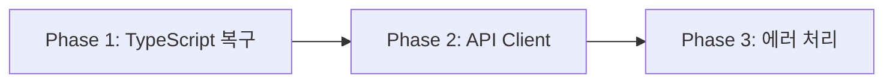

# 🚨 CRITICAL FIXES - 완전 해결 프로젝트

## ⚠️ 중요: 3번의 실패 후 작성된 최종 지시서
**이번엔 반드시 성공해야 합니다. 임시방편 절대 금지!**

## 📊 현재 상황 (2025-08-25 검증 결과)

### 🔴 긴급 해결 필요 (프로덕션 블로커)
| 문제 | 현재 상태 | 목표 | 심각도 |
|------|----------|------|--------|
| TypeScript any 타입 | 23개 | 0개 | 🔴 CRITICAL |
| TypeScript 컴파일 에러 | 24개 | 0개 | 🔴 CRITICAL |
| API Client 미구현 | 0개 사용 | 30+ 사용 | 🔴 CRITICAL |
| 직접 fetch 사용 | 7개 | 0개 | 🔴 CRITICAL |

### 🟡 추가 해결 필요
| 문제 | 현재 상태 | 목표 | 심각도 |
|------|----------|------|--------|
| Silent failures | 231개 | <10개 | 🟡 HIGH |
| 미보호 API routes | 2개 | 0개 | 🟡 HIGH |
| RLS 미적용 테이블 | 4개 | 0개 | 🟡 HIGH |

## 🚀 Phase별 실행 계획

| Phase | 작업 내용 | 예상 시간 | 우선순위 | 상태 |
|-------|----------|-----------|----------|------|
| **Phase 1** | TypeScript 완전 복구 | 3시간 | 🔴 CRITICAL | ⏳ 대기 |
| **Phase 2** | API Client 구현 및 적용 | 2시간 | 🔴 CRITICAL | ⏳ 대기 |
| **Phase 3** | 에러 처리 및 보안 강화 | 2시간 | 🟡 HIGH | ⏳ 대기 |

## 📋 Phase 간 의존성


**중요**: Phase 1이 완료되어야 Phase 2 시작 가능 (타입 안정성 필요)

## 🎯 성공 기준

### Phase 1 완료 조건
- [ ] any 타입 0개
- [ ] TypeScript 컴파일 에러 0개
- [ ] `npm run types:check` 성공
- [ ] `npm run build` 성공

### Phase 2 완료 조건
- [ ] API Client 구현 완료
- [ ] 30개 이상 API route에서 사용
- [ ] 직접 fetch 사용 0개
- [ ] 모든 API 호출 통일

### Phase 3 완료 조건
- [ ] Silent failures < 10개
- [ ] 모든 API routes 보호
- [ ] RLS 100% 적용
- [ ] 보안 검증 통과

## 🚦 실행 가이드

### 1️⃣ Phase 1 실행
```bash
# Phase 1 지시서 확인
cat tasks/20250825_critical_fixes_complete/PHASE_1_TYPESCRIPT_FIX.md

# 실행 후 검증
npm run types:check
npm run verify:types
```

### 2️⃣ Phase 2 실행
```bash
# Phase 2 지시서 확인
cat tasks/20250825_critical_fixes_complete/PHASE_2_API_CLIENT_IMPLEMENTATION.md

# 실행 후 검증
npm run verify:api
grep -r "apiClient\." src/ --include="*.ts" --include="*.tsx" | wc -l  # 30+ expected
```

### 3️⃣ Phase 3 실행
```bash
# Phase 3 지시서 확인
cat tasks/20250825_critical_fixes_complete/PHASE_3_ERROR_HANDLING_SECURITY.md

# 실행 후 검증
npm run verify:security
npm run verify:parallel
```

## ⚠️ 절대 금지사항 (재강조)

### 🚫 임시방편 금지
- ❌ `any` 타입으로 회피
- ❌ `// @ts-ignore` 사용
- ❌ 주석 처리하고 넘어가기
- ❌ TODO 남기고 넘어가기
- ❌ 빈 catch 블록
- ❌ console.log로 대충 처리

### ✅ 올바른 해결 방법
- ✅ 구체적 타입 정의
- ✅ 타입 가드 구현
- ✅ 완전한 에러 처리
- ✅ 실제 기능 구현
- ✅ 테스트 통과 확인

## 📊 진행 상황 추적

### 현재 상태 (2025-08-25)
```
총 오류: 54개 (any 23 + 컴파일 24 + fetch 7)
해결됨: 0개
남은 작업: 54개
진행률: 0%
```

### 목표 상태
```
총 오류: 0개
해결됨: 54개
남은 작업: 0개
진행률: 100%
```

## 🔄 롤백 계획

### 롤백 트리거 조건
- 빌드 실패 3회 연속
- TypeScript 에러 증가
- 테스트 실패율 > 20%

### 롤백 절차
```bash
# 현재 상태 백업
git add -A
git commit -m "backup: before critical fixes"

# 롤백 필요 시
git reset --hard HEAD~1
npm install
npm run build
```

## 💡 실행 팁

1. **Phase 순서 엄수**: 반드시 1 → 2 → 3 순서로 진행
2. **중간 검증 필수**: 각 Phase 완료 후 검증 명령어 실행
3. **문제 발견 시**: 임시방편 없이 즉시 완전 해결
4. **커밋 전략**: 각 Phase 완료 시 별도 커밋

## 📝 작업 기록

| 날짜 | Phase | 작업자 | 결과 | 비고 |
|------|-------|--------|------|------|
| 2025-08-25 | 준비 | - | 지시서 작성 | 4번째 시도 |
| - | Phase 1 | - | - | 대기 중 |
| - | Phase 2 | - | - | 대기 중 |
| - | Phase 3 | - | - | 대기 중 |

---

**⚠️ 중요**: 이 지시서는 3번의 실패 경험을 바탕으로 작성되었습니다. 
**반드시 임시방편 없이 완전한 해결을 목표로 하세요!**