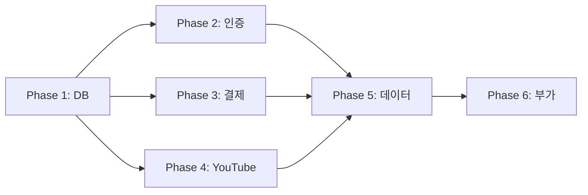

# 🎯 Dhacle 프로젝트 TODO 해결 마스터 플랜

## 📊 현재 진행 상황

| Phase | 작업 내용 | 우선순위 | 상태 | 예상 소요 | 완료일 |
|-------|----------|---------|------|-----------|--------|
| Phase 1 | 데이터베이스 구조 완성 | 🔴 CRITICAL | ⏳ | 2-3일 | - |
| Phase 2 | 인증/프로필 시스템 | 🔴 CRITICAL | ⏳ | 2일 | - |
| Phase 3 | 결제 시스템 활성화 | 🟠 HIGH | ⏳ | 1-2일 | - |
| Phase 4 | YouTube Lens 복원 | 🟠 HIGH | ⏳ | 3-4일 | - |
| Phase 5 | 더미 데이터 교체 | 🟡 MEDIUM | ⏳ | 2-3일 | - |
| Phase 6 | 부가 기능 구현 | 🟢 LOW | ⏳ | 3-4일 | - |

## 🚨 핵심 문제 요약

**발견된 HIGH priority TODO: 62개**
- 🔴 데이터베이스 테이블/필드 누락: 21개
- 🟡 더미 데이터 사용: 12개
- 🟠 미구현 기능: 15개
- 🔵 YouTube PubSub: 12개
- 🟢 환경 설정: 2개

## 🚀 빠른 시작 가이드

### 1️⃣ 즉시 시작 (Phase 1 필수)
```bash
# Phase 1 먼저 실행 - DB 기반이 없으면 다른 작업 불가
cat PHASE_1_DATABASE.md
```

### 2️⃣ 순차적 진행 필수
```
Phase 1 (DB) → Phase 2 (인증) → Phase 3 (결제) → Phase 4 (YouTube) → Phase 5 (데이터) → Phase 6 (부가)
```

### 3️⃣ 각 Phase 완료 검증
```bash
# Phase 완료 후 반드시 실행
npm run build
npm run types:check
npm run dev  # 브라우저에서 실제 기능 테스트
```

## 📋 Phase 간 의존성



## ⚠️ 필수 확인사항

### 프로젝트 금지사항 (절대 위반 불가)
- ❌ 자동 변환 스크립트 생성 금지
- ❌ any 타입 사용 금지
- ❌ 임시방편 해결책 금지 (TODO, 주석처리, 빈 배열)
- ❌ 실제 테스트 없이 완료 보고 금지

### 작업 전 필수 명령어
```bash
# 현재 TODO 상태 확인
grep -r "TODO" src/ --include="*.ts" --include="*.tsx" | wc -l

# 타입 에러 확인
npm run types:check

# 빌드 가능 여부 확인
npm run build
```

## 📊 성공 지표

### 정량적 목표
- TODO 주석: 62개 → 0개
- any 타입: 현재 수 → 0개
- 빌드 에러: 0개
- 타입 에러: 0개

### 정성적 목표
- 모든 기능 실제 브라우저에서 작동
- 데이터베이스 무결성 유지
- 사용자 경험 개선

## 🔄 위험 관리

### 주요 리스크
1. **데이터 마이그레이션 실패**
   - 백업 필수
   - 롤백 계획 수립

2. **기존 기능 파괴**
   - 단계별 테스트
   - Git 브랜치 분리

3. **타입 시스템 충돌**
   - 점진적 수정
   - 타입 체크 지속

## 📂 Phase별 상세 지시서

| Phase | 파일명 | 주요 내용 | 예상 결과 |
|-------|--------|-----------|-----------|
| 1 | [PHASE_1_DATABASE.md](./PHASE_1_DATABASE.md) | 테이블/필드 생성 SQL | DB 구조 완성 |
| 2 | [PHASE_2_AUTH.md](./PHASE_2_AUTH.md) | 인증 시스템 구현 | 프로필 완성 |
| 3 | [PHASE_3_PAYMENT.md](./PHASE_3_PAYMENT.md) | 결제 기능 활성화 | 쿠폰 시스템 |
| 4 | [PHASE_4_YOUTUBE.md](./PHASE_4_YOUTUBE.md) | YouTube 기능 복원 | 관리자 기능 |
| 5 | [PHASE_5_DATA.md](./PHASE_5_DATA.md) | 더미 데이터 교체 | 실제 데이터 |
| 6 | [PHASE_6_FEATURES.md](./PHASE_6_FEATURES.md) | 부가 기능 구현 | UX 개선 |

## ✅ 전체 완료 조건

### 🔴 필수 (모두 충족 필요)
- [ ] 모든 Phase 완료
- [ ] TODO 주석 0개
- [ ] any 타입 0개
- [ ] 빌드 성공
- [ ] 타입 체크 통과
- [ ] 실제 브라우저 테스트 통과

### 🟡 권장
- [ ] 성능 개선 확인
- [ ] 에러 처리 완성
- [ ] 문서 업데이트

### 🟢 선택
- [ ] 테스트 코드 작성
- [ ] Lighthouse 점수 개선

---
*작성일: 2025-08-26*
*작성자: Claude Code Assistant*
*버전: 1.0.0*