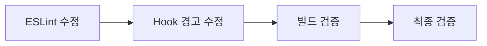

# 🔒 Vercel 빌드 에러 해결 프로젝트

## 🎯 프로젝트 개요

**목표**: pre-commit 및 Vercel 빌드 실패를 일으키는 ESLint 에러와 React Hook 경고를 해결하여 안정적인 배포 환경 구축

## 🚨 문제 현황

### 주요 빌드 실패 원인
- **ESLint 에러 (빌드 실패)**: `src/app/test-error/page.tsx`에서 `@ts-ignore` → `@ts-expect-error` 변경 필요 (3곳)
- **React Hook 경고**: useEffect 의존성 배열 누락, ref cleanup 경고

### 영향 범위
- **파일**: 3개 (test-error/page.tsx, AlertRules.tsx, use-youtube-lens-subscription.ts)
- **예상 시간**: 총 40분
- **복잡도**: Simple

## 📂 Phase 구조

```
tasks/20250827_vercel_build_errors/
├── README.md           # 전체 개요 (현재 파일)
├── PHASE_1_ESLINT_FIXES.md      # ESLint 에러 수정 (15분)
├── PHASE_2_HOOK_WARNINGS.md     # React Hook 경고 수정 (15분)
├── PHASE_3_BUILD_VERIFICATION.md # 빌드 및 검증 (10분)
└── VERIFICATION.md              # 최종 검증
```

## 🔄 Phase 간 관계



## ✅ 성공 기준

### 필수 조건
- [ ] ESLint 에러 0개
- [ ] React Hook 경고 해결
- [ ] `npm run build` 성공
- [ ] Vercel 배포 성공

### 검증 명령어
```bash
# 타입 체크
npm run types:check

# 빌드 테스트
npm run build

# 전체 검증
npm run verify:parallel
```

## ⚠️ 주의사항

1. **임시방편 절대 금지**
   - TODO 주석 추가 금지
   - any 타입 사용 금지
   - 에러 숨기기 금지

2. **검증 필수**
   - 각 Phase 완료 후 즉시 빌드 테스트
   - 실제 브라우저에서 동작 확인
   - Console 에러 0개 확인

---

*2025-08-27 작성 - Vercel 빌드 안정화*