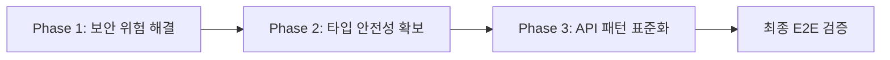

/sc:implement --seq --validate --evidence --no-speculation
"디하클(Dhacle) 530개 품질 경고 체계적 해결 - 3단계 30분 Phase"

# 디하클 품질 부채 체계적 해소 프로젝트

## 전체 작업 범위
- 영향 범위: 파일 373개, API 50개, 컴포넌트 103개
- 예상 시간: 총 1.5시간 (Phase별 30분)
- 복잡도: Complex (530개 경고 체계적 해결)

## 🔥 프로젝트 메인 정신
> **우리의 목표는 단순히 경고를 숫자적으로 줄이는 것이 아니라,**
> **실제로 안정적이게 사용이 가능한 사이트의 품질을 확보하는 것이 목표입니다.**
> 
> **단순히 타입 에러를 하나씩 순차적으로 잡아가는 것이 목표가 아니라,**
> **E2E workflow를 고려하여 문제를 하나하나 해결해가며**
> **아무런 문제 없이 사용자들이 사용할 수 있는 온전히 동작하는 사이트를 구현해야 합니다.**

## 현재 상황 분석

### 경고 현황 (기준선)
```
총 경고: 530개
├── API 경고: 258개 (세션 체크, 에러 처리 불일치)
├── Type 경고: 192개 (any 타입, 위험한 단언)
└── Security 경고: 80개 (인증 누락, RLS 적용)
```

### 빌드 상태
- ✅ Next.js 15 빌드: 성공
- ✅ TypeScript 컴파일: 통과
- ✅ Vercel 배포: 준비 완료

## Phase 구조 및 의존성



## Phase별 상세 계획

### Phase 1: 고위험 보안 패턴 해결 (30분)
**목표**: 80개 보안 경고 → 20개 이하
- 대상: API Routes 세션 체크 누락
- 파일: `src/app/api/*/route.ts` (약 15개 파일)
- 방법: 표준 인증 패턴 적용

### Phase 2: 고위험 타입 안전성 확보 (30분) 
**목표**: 192개 타입 경고 → 100개 이하
- 대상: `any` 타입 및 위험한 타입 단언
- 파일: 우선순위 높은 15개 파일
- 방법: 구체적 타입 정의 및 적용

### Phase 3: API 패턴 표준화 (30분)
**목표**: 258개 API 경고 → 150개 이하  
- 대상: 에러 응답 형식 불일치
- 파일: 핵심 API Routes 10개
- 방법: 표준 응답 패턴 적용

### 최종 검증: E2E 워크플로우 (30분)
- 전체 사용자 시나리오 테스트
- 성능 영향도 측정
- 실제 기능 작동 확인

## 성공 기준

### 정량적 목표
- 총 경고: 530개 → 270개 이하 (50% 감소)
- 고위험 경고: 0개
- 빌드 시간: 현재 16초 → 18초 이하 유지

### 정성적 목표
- 실제 사용자 워크플로우 100% 정상 동작
- Console 에러 0개
- 개발 생산성 유지 (과도한 엄격함 회피)

## 위험 관리

### 주요 위험 요소
1. **빌드 실패 위험**: Phase별 검증으로 조기 발견
2. **기능 정지 위험**: 실제 브라우저 테스트 필수
3. **성능 저하 위험**: 빌드 시간 모니터링

### 롤백 계획
- 각 Phase 시작 전 git checkpoint 생성
- 실패 시 이전 상태로 즉시 복구

## 다음 Phase 진행 조건

각 Phase는 다음 조건을 **모두** 충족해야 다음으로 진행:

1. ✅ **컴파일 성공**: `npm run types:check` 통과
2. ✅ **빌드 성공**: `npm run build` 통과  
3. ✅ **실제 동작**: 브라우저에서 기능 확인
4. ✅ **목표 달성**: Phase별 경고 감소 목표 달성

**⚠️ 하나라도 실패 시 다음 Phase 진행 금지**